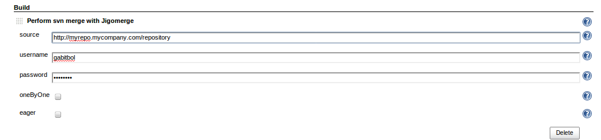

This plugin adds the ability to directly merge Subversion branches in
Jenkins. See http://code.google.com/p/jigomerge/

[[Jigomergeplugin-Configuration]]
== Configuration

Configure your Subversion repository in the *Source Code
Management* section : this is the branch you want to merge to.

In the *Build Triggers* section, set a value in *Build periodically*. Do
not use *Poll SCM* !  

_Advice_ : The merge to be effective should be run as often as possible.
For exemple set the Build periodically to _every hour_. This will
prevent conflicts as much as possible.

In the *Build* section, choose *Perform svn merge with Jigomerge*.

[.confluence-embedded-file-wrapper]##

3 fields are mandatory :

* source : the repository you want to merge from
* username : the username to merge with
* password

Optional fields :

* one by one : if checked, one commit per revision merge
* eager : if checked, try to merge revisions even if a previous one is
conflicting. Use with caution !

[[Jigomergeplugin-Usage]]
== Usage

TBD

[[Jigomergeplugin-Roadmap]]
== *Roadmap*

* add the ability, from the report view, when a conflict occurs, to
choose to
** ignore a revision
** choose which revision to keep to resolve the conflict

[[Jigomergeplugin-Changelog]]
== *Changelog*

[[Jigomergeplugin-Release0.8(2015-08-18)]]
=== *Release 0.8 (2015-08-18)*

* Fix the groovy.lang.MissingMethodException while doing one-by-one
merge https://code.google.com/p/jigomerge/issues/detail?id=23

[[Jigomergeplugin-Release0.7(2011-07-08)]]
=== *Release 0.7 (2011-07-08)*

* display error stacktraces
http://code.google.com/p/jigomerge/issues/detail?id=9
* if conflicts remains, build is unstable and not in error anymore
http://code.google.com/p/jigomerge/issues/detail?id=10
* ability to declare a svn commit comment prefix
http://code.google.com/p/jigomerge/issues/detail?id=15
* update to jigomerge script 2.2.6

[[Jigomergeplugin-Release0.6(2011-04-30)]]
=== *Release 0.6 (2011-04-30)*

* ability to specify dryRun and verbose
http://code.google.com/p/jigomerge/issues/detail?id=8
* ability to configure ignore merge patterns
http://code.google.com/p/jigomerge/issues/detail?id=5
* update to jigomerge script 2.2.5

[[Jigomergeplugin-Release0.5(2011-04-26)]]
=== *Release 0.5 (2011-04-26)*

* update to jigomerge script 2.2.4

[[Jigomergeplugin-Release0.3and0.4(2011-04-19)]]
=== *Release 0.3 and 0.4 (2011-04-19)*

* validation script was not persisted

[[Jigomergeplugin-Release0.2(2011-03-19)]]
=== *Release 0.2 (2011-03-19)*

* handle unbreakable merge feature with parameter "validation script"

[[Jigomergeplugin-Release0.1(2011-03-13)]]
=== *Release 0.1 (2011-03-13)*

* initial release
* jigomerge-plugin 0.1 uses jigomerge in version 2.2.3 
