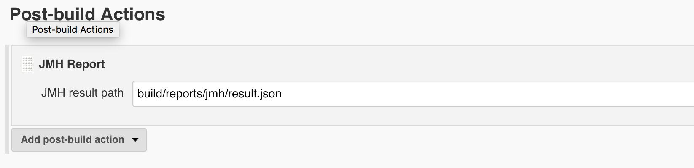

[.conf-macro .output-inline]#Visually explore
your http://openjdk.java.net/projects/code-tools/jmh/[JMH] benchmarks
on https://jenkins.io/[Jenkins]!#

 +

[[JMHReportPlugin-Features]]
== Features

* Visualize the results of
your http://openjdk.java.net/projects/code-tools/jmh/[JMH] benchmarks
via embedded http://jmh.morethan.io/[jmh-visualizer]
** Project page report
** Run page report

[[JMHReportPlugin-Changelog]]
== Changelog

* 0.9 On pair with jmh-visualizer-0.9.1 
** https://github.com/jzillmann/jmh-visualizer/milestone/6?closed=1
** Support for Job DSL
* 0.8 On pair with jmh-visualizer-0.8
** Revamped Summary page
* 0.7 On pair with jmh-visualizer-0.7
** Support multiple runs in project view
* 0.6 On pair with jmh-visualizer-0.6
* 0.5.1 Add support for folder jobs
* 0.5 On pair with jmh-visualizer-0.5
* 0.4.3.3 Support for using JMH-Report on pipeline projects (Upgraded
minimum Jenkins version from 2.0 to 2.4)
* 0.4.3.1 Fix erroneous context path handling which prevented the proper
load of the reports
* 0.4.2 Initial Release

http://updates.jenkins-ci.org/download/plugins/jmh-report/[Version
Archive]

 +

[.aui-icon .aui-icon-small .aui-iconfont-info .confluence-information-macro-icon]#
#

The plugin makes use
of https://github.com/jzillmann/jmh-visualizer[jmh-visualizer project].
The version number correspond to its releases. So jmh-report-plugin
0.4.2 makes use of jmh-visualizer 0.4.2.

[[JMHReportPlugin-Requirements]]
== Requirements

* Jenkins 2.4 or newer is required.
* The project you want the reporting on should:
** Execute the JMH benchmarks
** Store the benchmarks results in JSON format in any folder

[[JMHReportPlugin-Howto's]]
== How to's

[[JMHReportPlugin-Setupinpipelineproject]]
=== Setup in pipeline project

You can setup jmh-report as a pipeline step:

[source,syntaxhighlighter-pre]
----
jmhReport 'build/reports/jmh/result.json'
----

OR

[source,syntaxhighlighter-pre]
----
step([$class: 'RunPublisher', resultPath: 'build/reports/jmh/result.json'])
----

 +

A complete pipeline could look as simple as that:

....
node {
    checkout([$class: 'GitSCM', branches: [[name: '*/master']], doGenerateSubmoduleConfigurations: false, extensions: [], submoduleCfg: [], userRemoteConfigs: [[url: 'https://github.com/ben-manes/caffeine.git']]])
    sh './gradlew jmh -PincludePattern=".*DelegationBenchmark.*"'
    jmhReport 'caffeine/build/reports/jmh/results.json'
}
....

 +

[[JMHReportPlugin-SetupwithJobDSL]]
=== Setup with Job DSL

 +

....
jmhReport { resultPath('build/reports/jmh/result.json') }
....

 +

A complete job-dsl example could look like that:

....
job('example-1') {
    steps {
        scm {
            git("https://github.com/ben-manes/caffeine.git", "master")
        }
        shell('./gradlew jmh -PincludePattern=".*DelegationBenchmark.*"')
        publishers {
            jmhReport {
                resultPath('build/reports/jmh/result.json')
            }
        }
    }
}
....

 +

 +

[[JMHReportPlugin-Setupinregularproject]]
=== Setup in regular project

You can setup jmh-report - i.e. in a freestyle project - by adding it as
a post-build action.

[.confluence-embedded-file-wrapper .confluence-embedded-manual-size]##
