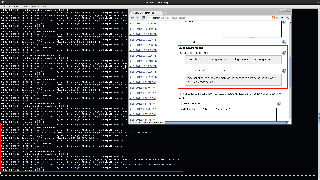

[[JobLogLoggerPlugin-JobLogLoggerPlugin]]
== Job Log Logger Plugin

 +

Write the job log to the underlying logging system.

 +

[cols="",options="header",]
|===
|Plugin Configuration and Exploitation
|[.confluence-embedded-file-wrapper]##
|===

 +

'''''

 +

[[JobLogLoggerPlugin-Changelog]]
=== Changelog

[[JobLogLoggerPlugin-1.0(released2012-01-16)]]
==== 1.0 (released 2012-01-16)

* fully I18N
* initial implementation
