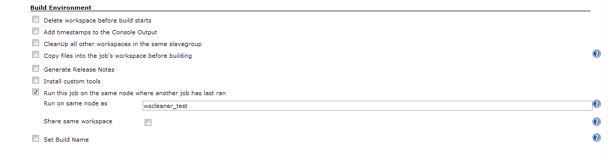
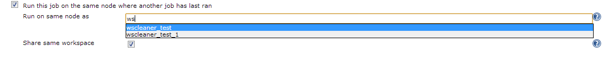
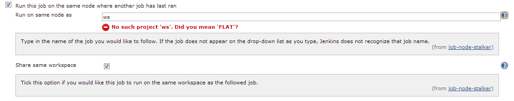

[.conf-macro .output-inline]# #

[.aui-icon .aui-icon-small .aui-iconfont-warning .confluence-information-macro-icon]#
#

*This plugin is up for adoption.* Want to help improve this plugin?
https://wiki.jenkins-ci.org/display/JENKINS/Adopt+a+Plugin[Click here to
learn more]!

[.confluence-embedded-file-wrapper .confluence-embedded-manual-size]##

Developed by http://www.datalex.com/[Datalex] Infrastructure Team.

This plugin lets you configure jobs to run on the same node, and if
desired the same workspace, as another job.

[[NodeStalkerPlugin-Description]]
== Description

This plugin lets you configure a job to build on the same node as
another job, with an option to also build on the same workspace as that
job. Having an option to set a job to always build on the same node as
another can be necessary when you have jobs that rely on each other, on
a Jenkins instance with multiple slaves that lets Jenkins decide where
to build jobs. The Parameterized Trigger plugin allows you to set a
downstream job to build on the same node as its upstream job, but to use
that function you must launch the downstream job through the upstream
one, however you may want certain jobs to build on the same node as
another job without having to build that job again. With this plugin ,
any job may be configured to use the same node (and if desired the same
workspace) as another job.

[[NodeStalkerPlugin-Usage]]
== Usage

 The plugins configuration is located in the ‘Build Environment’ section
of the job configuration UI. 

[.confluence-embedded-file-wrapper]##

Only one job may be entered as the job to be followed and the job name
must be valid. Node Stalker will try to help you pick a valid jobname by
populating a drop-down list with all possible options.

[.confluence-embedded-file-wrapper]##

 If the ‘_Share Workspace_’ option of the plugin is enabled, the
‘_Custom Workspace_’ field will be overwritten with the path to the
workspace of the followed job.

[.confluence-embedded-file-wrapper]##

Node Stalker plugin synergises well with the
https://wiki.jenkins-ci.org/display/JENKINS/Prerequisite+build+step+plugin[Prerequisite
Build Step Plugin]  as  Node Stalker plugin does not stop the job from
trying to build while the followed job is building or has failed its
most recent build, which would lead to unreliable errors. The
prerequisite build step plugin allows you to ensure that another job has
successfully completed and is not currently running before letting your
job run.

[[NodeStalkerPlugin-Incompatibilities]]
== Incompatibilities

If the 'build on same node' parameter of the Parameterized Trigger
plugin is used while triggering a job that has Node Stalker enabled for
the upstream job, no custom workspace will be set and the triggered job
will build on it's default workspace.

[[NodeStalkerPlugin-Changelog]]
== *Changelog*

[[NodeStalkerPlugin-Version1.0.5]]
=== Version 1.0.5

* Re-release of 1.0.4, no changes

[[NodeStalkerPlugin-Version1.0.4]]
=== Version 1.0.4

* Merged pull request that makes nodestalker compatible with item
folders.

[[NodeStalkerPlugin-Version1.0.3]]
=== Version 1.0.3

* Merged pull request that fixes the use of plugin with maven jobs.

[[NodeStalkerPlugin-Version1.0.2]]
=== Version 1.0.2

* Fixed bug where custom workspace value would not be restored if it was
empty.

[[NodeStalkerPlugin-Version1.0.1]]
=== *Version 1.0.1*

* Edited help text to better reflect plugin functionality. 
* Changed code to restore original Custom Workspace configuration of job
if 'Share Workspace' option of Node Stalker plugin is enabled.
* Fixed ClassCastException when the plugin was used within a maven
project.

[[NodeStalkerPlugin-Version1.0]]
=== Version 1.0 

Initial release.
