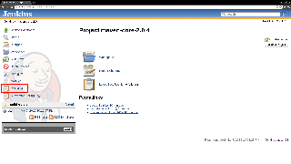

[[JobPollActionPlugin-JobPollActionPlugin]]
== Job Poll Action Plugin

Provides an easy mechanism to force a job to poll for SCM changes.

 +

'''''

 +

[cols=",,",]
|===
|Job Poll Action
|[.confluence-embedded-file-wrapper]##
|The job action to launch SCM polling
|===

 +

'''''

 +

[[JobPollActionPlugin-Changelog]]
=== Changelog

[[JobPollActionPlugin-1.0(released2012-03-07)]]
==== 1.0 (released 2012-03-07)

* fully I18N
* initial implementation
