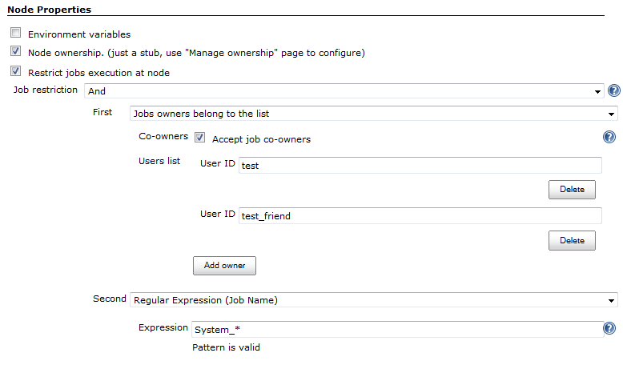

[.conf-macro .output-inline]##

[cols="",options="header",]
|===
|Plugin Information
|View Job Restrictions https://plugins.jenkins.io/job-restrictions[on
the plugin site] for more information.
|===

[.aui-icon .aui-icon-small .aui-iconfont-warning .confluence-information-macro-icon]##

*This plugin is up for adoption.* Want to help improve this plugin?
https://wiki.jenkins.io/display/JENKINS/Adopt+a+Plugin[Click here to
learn more]!

The plugin allows restricting job executions in order to change their
behavior or to harden the security. With this plugin it is possible to
configure nodes to accept only particular jobs. It is also possible to
prevent job triggering by users and other jobs using various conditions.

[[JobRestrictionsPlugin-Abouttheplugin]]
== About the plugin

Features:

* Execution restrictions on the node level
** Example 1: Take jobs according to the specified name pattern (e.g.
allow running only "QA_.*" jobs on a node)
** Example 2: Prevent execution of user jobs on the Jenkins master node
* Restrictions of jobs triggering by external causes
** Example 1: Prohibit manual builds
** Example 2: Allow triggering only by a job with the
specified https://wiki.jenkins.io/display/JENKINS/Ownership+Plugin[owner].
* Several built-in restrictions + JobRestriction extension point

Contributors:

. hhttp://www.linkedin.com/in/onenashev[Oleg Nenashev] (maintainer)
* Initial plugin version has been sponsored by Synopsys Inc.,
http://www.synopsys.com/[www.synopsys.com]

[[JobRestrictionsPlugin-Usage]]
== Usage

[[JobRestrictionsPlugin-Jobrestrictionsfornodes]]
=== Job restrictions for nodes

These restrictions can be configured in node's configuration page.

* Node won't accept jobs, which violate the specified restrictions
* Other requirements (executors, labels, etc.) will be checked as well

[.confluence-embedded-file-wrapper]##

[[JobRestrictionsPlugin-Jobrestrictionsforprojects]]
=== Job restrictions for projects

This type of restrictions allows to prevent execution of jobs by the
launch cause. +
If the cause does not satisfy requirements, job fails before running of
SCM (the job cannot be aborted due to
https://issues.jenkins-ci.org/browse/JENKINS-19497[JENKINS-19497]).

The current version supports the following checks:

* *Apply Job restrictions to upstream build* - prohibits the invocation
from specific builds, which do not satisfy the specified requirements
* Prohibit manual launch of the job (since 0.2)

[[JobRestrictionsPlugin-Extensionpoints]]
== Extension points

Plugin provides a JobRestriction extension point, which allows
implementation of new restrictions.

Built-in extensions:

* Logic operations (and, or, not)
* Started by user/group restrictions
** Restrictions support upstream projects (UpstreamCause)
** https://wiki.jenkins.io/display/JENKINS/Rebuild+Plugin[Rebuild
Plugin] and other specific causes are not supported
* Regex restriction - check the jobs name by a regular expression

The following plugins produce additional job restrictions:

* {blank}
+
[.icon .aui-icon .content-type-page]#Page:#
+
https://wiki.jenkins.io/display/JENKINS/Ownership+Plugin[Ownership
Plugin]
* {blank}
+
[.icon .aui-icon .content-type-page]#Page:#
+
https://wiki.jenkins.io/display/JENKINS/Priority+Sorter+Plugin[Priority
Sorter Plugin] [.smalltext]#— This plugin allows Jobs to be prioritised
based on _Queue Strategies_ and _Priority Strategies_.#

If your plug-in is not listed here, then simply add the label
*job-restriction-producer* to your plug-in wiki page and it will be
automatically listed.

[[JobRestrictionsPlugin-JIRAissues]]
== JIRA issues

If you have any proposals/bug reports, please create an issue on Jenkins
JIRA.

[[refresh-module--459950368]]
[[refresh--459950368]][[jira-issues--459950368]]
T

Key

Summary

Assignee

Reporter

P

Status

Resolution

Created

Updated

Due

[.refresh-action-group]# #

[[refresh-issues-loading--459950368]]
[.aui-icon .aui-icon-wait]#Loading...#

[#refresh-issues-button--459950368]##
[#refresh-issues-link--459950368]#Refresh#
[#error-message--459950368 .error-message .hidden]# #

[[JobRestrictionsPlugin-Versionhistory]]
== Version history

[[JobRestrictionsPlugin-Version0.8(Oct06,2018)]]
=== Version 0.8 (Oct 06, 2018)

* https://issues.jenkins-ci.org/browse/JENKINS-51359[image:docs/images/error.svg[(error)] JENKINS-51359]
- Fix Form validation issue for classname restrictions when a class
belongs to another plugin
* image:docs/images/information.svg[(info)] Jenkins
core requirement is updated to 2.60.3

[[JobRestrictionsPlugin-Version0.7(May16,2018)]]
=== Version 0.7 (May 16, 2018)

* image:docs/images/information.svg[(info)] Jenkins
core requirement is updated to 2.7.3
* image:docs/images/information.svg[(info)] https://github.com/jenkinsci/job-restrictions-plugin/pull/19[PR
#19] - Performance: use new core API to speedup user retrieval in the
plugin
* image:docs/images/add.svg[(plus)] https://github.com/jenkinsci/job-restrictions-plugin/pull/22[PR
#22] - Add Chinese localization for top-level entries

[[JobRestrictionsPlugin-Version0.6(10/14/2016)]]
=== Version 0.6 (10/14/2016)

* image:docs/images/error.svg[(error)]
Get full names for queue items when they're available. Solves the issue
with restricting Pipelines within Folders
(https://issues.jenkins-ci.org/browse/JENKINS-36626[JENKINS-36626])
* image:docs/images/add.svg[(plus)]
Add Job Class Restriction
(https://issues.jenkins-ci.org/browse/JENKINS-38644[JENKINS-38644])
* image:docs/images/information.svg[(info)]
Update core dependency to 1.609.3 due to Pipeline autotest requirements

[[JobRestrictionsPlugin-Version0.5(08/03/2016)]]
=== Version 0.5 (08/03/2016)

* image:docs/images/information.svg[(info)]
Upgraded the core baseline to 1.580.x in order to support Pipeline in
near future
* image:docs/images/information.svg[(info)]
Upgrade to the new parent POM
* image:docs/images/information.svg[(info)]
Change the display name of AnyJobRestriction to "No restriction (take
any)"
(https://issues.jenkins-ci.org/browse/JENKINS-36960[JENKINS-36960])

[[JobRestrictionsPlugin-Version0.4(01/18/2015)]]
=== Version 0.4 (01/18/2015)

* image:docs/images/add.svg[(plus)]
Support of "Started by user" restriction
(https://issues.jenkins-ci.org/browse/JENKINS-25726[JENKINS-25726])
* image:docs/images/add.svg[(plus)]
Support of "Started by user from the group" restriction
(https://issues.jenkins-ci.org/browse/JENKINS-25726[JENKINS-25726]) -
thanks to https://wiki.jenkins.io/display/~csms[Unknown User (csms)]
* image:docs/images/error.svg[(error)]
Avoid NPEs for deleted builds in UpstreamCauseRestriction for jobs
(https://issues.jenkins-ci.org/browse/JENKINS-26374[JENKINS-26374])

[[JobRestrictionsPlugin-Version0.3(06/29/2013)]]
=== Version 0.3 (06/29/2013)

* image:docs/images/information.svg[(info)]
Added support of full names for all items: support of Folders Plugin and
Maven modules
(https://issues.jenkins-ci.org/browse/JENKINS-23597[JENKINS-23597])

[[JobRestrictionsPlugin-Version0.2.2(12/08/2013)]]
=== Version 0.2.2 (12/08/2013)

* image:docs/images/error.svg[(error)]
Missing jelly file causes errors on job configuration pages
(https://issues.jenkins-ci.org/browse/JENKINS-20357[JENKINS-20357])

[[JobRestrictionsPlugin-Version0.2.1(11/13/2013)]]
=== Version 0.2.1 (11/13/2013)

* image:docs/images/information.svg[(info)]
Broken release, equals to *0.2*

[[JobRestrictionsPlugin-Version0.2(10/26/2013)]]
=== Version 0.2 (10/26/2013)

* image:docs/images/add.svg[(plus)]
AND and OR expressions with multiple entries
(https://issues.jenkins-ci.org/browse/JENKINS-20207[JENKINS-20207])
* image:docs/images/add.svg[(plus)]
Restriction of manual build's execution
(https://issues.jenkins-ci.org/browse/JENKINS-20281[JENKINS-20281])
+
Warning!

[.aui-icon .aui-icon-small .aui-iconfont-info .confluence-information-macro-icon]#
#

This version has corrupted resources, which may affect Jenkins
installations on several platforms. +
Use job-restrictions 0.2.2 to avoid this issue

[[JobRestrictionsPlugin-Version0.1(08/26/2013)]]
=== Version 0.1 (08/26/2013)

* image:docs/images/add.svg[(plus)]
Initial version with basic restrictions for nodes and jobs
