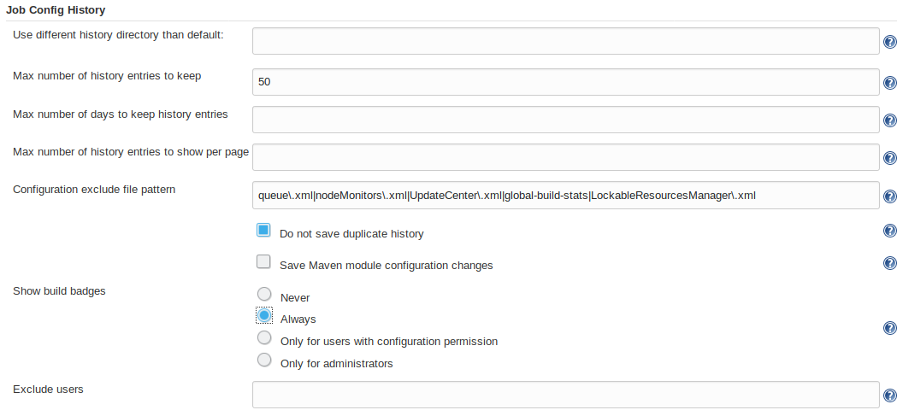

Saves copies of all job and system
configurations.[.conf-macro .output-inline]# #

[.aui-icon .aui-icon-small .aui-iconfont-info .confluence-information-macro-icon]##

Older versions of this plugin may not be safe to use. Please review the
following warnings before using an older version:

* https://jenkins.io/security/advisory/2018-09-25/#SECURITY-1130[Reflected
Cross Site Scripting vulnerability]

This plugin saves *a copy of the configuration file* of jobs and agents
(`+config.xml+`) for every change made and of the system configuration
(`+<config-name>.xml+`). +
You can also see what changes have been made by which user if you
configured a security policy.

It is also possible to get a *side-by-side view* of the differences
between two configurations and to restore an old version of a job's
configuration. (The latter is only available for jobs, not for system
changes.) +
However, if you restore an older version of the config file and the new
version contains fields that were not present in the older version, the
restored version will still contain these fields, although they were not
present in the original.

The plugin also provides an *overview page* of all changes. You can find
it under `+<jenkins_url>/jobConfigHistory+` or reach it via links in the
sidepanel of the main and the system configuration pages. +
The overview page initially only lists system configuration changes (for
performance reasons), but there are links to view either all job
configuration histories or just the deleted jobs or all kinds of
configuration history entries together (which may take some time to
load, depending on the number of jobs in your instance).

'''''

[[JobConfigHistoryPlugin-Pictures]]
== Pictures

[[JobConfigHistoryPlugin-JobConfigHistoryRevisionOverview]]
=== Job Config History Revision Overview +
[.confluence-embedded-file-wrapper .image-left-wrapper]#image:docs/images/image2019-9-12_13-28-44.png&effects=border-simple,blur-border[image]#

[[JobConfigHistoryPlugin-JobDiffSide-By-SideView]]
=== Job Diff Side-By-Side View

[.confluence-embedded-file-wrapper .image-left-wrapper]#image:docs/images/image2019-9-12_13-27-24.png&effects=border-simple,blur-border[image]#

[[JobConfigHistoryPlugin-ConfigOverviewPage]]
=== Config Overview Page

[.confluence-embedded-file-wrapper .image-left-wrapper]#image:docs/images/image2019-9-12_13-33-15.png&effects=border-simple,blur-border[image]#

 +

 +

 +

 +

 +

 +

 +

 +

 +

 +

 +

 +

 +

 +

'''''

[[JobConfigHistoryPlugin-InterdependencieswithotherPlugins/Excludingconfigpathparts(jobs,folders,...)]]
== Interdependencies with other Plugins/ Excluding config path parts (jobs, folders, ...)

If you use other plugins, that are (automatically) changing the
configuration, you might end up with a lot of unwanted change
detections.

It's recommended to use the given ability, to exclude such changes by
patterns. This can be done in the System Configuration or via
<jenkins-link>/configure. Just add the corresponding pattern (e.g.
cluster-stats) in the Input *Configuration exclude file pattern*:

 +

[.confluence-embedded-file-wrapper .image-center-wrapper]##

This functionality also allows you to exclude jobs, folders or other
parts of your job hierarchy: +
The pattern is attempted to be found in a config file's file path.
Adding "|__test__" to the pattern will also cause "testFolder/jobs/job1"
to be excluded. +
So if you want to exclude jobs, only, it might be better to enter
something like "|__testJob/config\.xml".__

 +

[.aui-icon .aui-icon-small .aui-iconfont-warning .confluence-information-macro-icon]#
#

If you use this plugin together with the
https://wiki.jenkins.io/display/JENKINS/Global+Build+Stats+Plugin[Global
Build Stats Plugin] you should add `+global-build-stats+` to the
excludes in the *Configuration exclude file pattern* section of this
plugin in *Configure System* page. Fixed in version 1.9 of the plugin.

[.aui-icon .aui-icon-small .aui-iconfont-warning .confluence-information-macro-icon]#
#

If you use this plugin together with the
https://wiki.jenkins.io/display/JENKINS/Cluster+Statistics+Plugin[Cluster
Statistics Plugin] you should add `+cluster-stats+` to the excludes in
the *Configuration exclude file pattern* section of this plugin in
*Configure System* page. Otherwise it might exceed your storage.

'''''

[[JobConfigHistoryPlugin-Openissues]]
== Open issues

[[refresh-module-284377533]]
[[refresh-284377533]][[jira-issues-284377533]]
Key

Summary

T

Created

Updated

Due

Assignee

Reporter

P

Status

Resolution

[.refresh-action-group]# #

[[refresh-issues-loading-284377533]]
[.aui-icon .aui-icon-wait]#Loading...#

[#refresh-issues-button-284377533]##
[#refresh-issues-link-284377533]#Refresh#
[#error-message-284377533 .error-message .hidden]# #

'''''

[[JobConfigHistoryPlugin-Changelog]]
== Changelog

[[JobConfigHistoryPlugin-Version2.24(September92019)]]
=== Version 2.24 (September 9 2019)

* (https://github.com/jenkinsci/jobConfigHistory-plugin/pull/96[PR #96])
Modernize overall design (mostly adjust it to
https://wiki.jenkins.io/display/JENKINS/Pipeline+Configuration+History[Pipeline
Configuration History]).
* (https://github.com/jenkinsci/jobConfigHistory-plugin/pull/100[PR
#100])
[https://issues.jenkins-ci.org/browse/JENKINS-58601[JENKINS-58601]]
Allow deletion of config revisions in the respective config history
overview.
* https://github.com/jenkinsci/jobConfigHistory-plugin/pull/101[(PR
#101])
[https://issues.jenkins-ci.org/browse/JENKINS-58316[JENKINS-58316]]
Improve error message for XmlFile::write RuntimeExceptions.
* (https://github.com/jenkinsci/jobConfigHistory-plugin/pull/102[PR
#102])
** Fix empty nodes not being displayed in diff view.
** Add xml indentation.
** Update DiffUtils.
* (https://github.com/jenkinsci/jobConfigHistory-plugin/pull/105[PR
#105]) [https://issues.jenkins-ci.org/browse/JENKINS-55787[JENKINS-55787]]
Switch labels from entry to
checkbox (Thanks,  https://wiki.jenkins.io/display/~jsoref[Unknown User
(jsoref)])

[[JobConfigHistoryPlugin-Version2.23.1(August62019)]]
=== Version 2.23.1 (August 6 2019)

* (https://github.com/jenkinsci/jobConfigHistory-plugin/pull/97[PR #97])
Bugfix: System configs were not persisted (regression of
https://github.com/jenkinsci/jobConfigHistory-plugin/commit/8e2d9ddd9c5e93a6e24a4ec9e93c537b98349e1f[8e2d9dd])

[[JobConfigHistoryPlugin-Version2.23(July232019)]]
=== Version 2.23 (July 23 2019)

* (https://github.com/jenkinsci/jobConfigHistory-plugin/pull/90[PR #90])
Allow user to use ignore job config history by regex. (Thanks,
https://wiki.jenkins.io/display/~fengxx[Unknown User (fengxx)])
* (https://github.com/jenkinsci/jobConfigHistory-plugin/pull/91[PR #91])
Trim numeric form values (incl. validation) (Thanks,
https://wiki.jenkins.io/display/~renescheibe[René Scheibe])

[[JobConfigHistoryPlugin-Version2.22(June32019)]]
=== Version 2.22 (June 3 2019)

* (https://github.com/jenkinsci/jobConfigHistory-plugin/pull/88[PR #88])
Code Improvements. (Thanks,
https://wiki.jenkins.io/display/~renescheibe[René Scheibe])
* (https://github.com/jenkinsci/jobConfigHistory-plugin/pull/89[PR #89])
Init Level below COMPLETED might use SYSTEM (Thanks,
https://wiki.jenkins.io/display/~escoem[Emilio Escobar] )

[[JobConfigHistoryPlugin-Version2.21(May22019)]]
=== Version 2.21 (May 2 2019)

* (https://github.com/jenkinsci/jobConfigHistory-plugin/pull/87[PR #87])
Modernize (parent pom and Jenkins). (Thanks,
https://wiki.jenkins.io/display/~renescheibe[René Scheibe])

[[JobConfigHistoryPlugin-Version2.20(April52019)]]
=== Version 2.20 (April 5 2019)

* (https://issues.jenkins-ci.org/browse/JENKINS-41177[JENKINS-41177]) Identical
job configuration can have different config.xml based on edit method.
* (PR https://github.com/jenkinsci/jobConfigHistory-plugin/pull/81[#81])
Hide version changes
* (https://issues.jenkins-ci.org/browse/JENKINS-56023[JENKINS-56023],
https://github.com/jenkinsci/jobConfigHistory-plugin/pull/83[PR #83])
Display folder jobs in root history overview correctly.
* (https://issues.jenkins-ci.org/browse/JENKINS-45821[JENKINS-45821],
https://github.com/jenkinsci/jobConfigHistory-plugin/pull/74[PR #74])
[.js-issue-title]#Add the MilestoneStep file by default#
* [.js-issue-title]#(https://issues.jenkins-ci.org/browse/JENKINS-49301[JENKINS-49301],
https://github.com/jenkinsci/jobConfigHistory-plugin/pull/84[PR #84])
Move job config history when a job is moved. +
#

[[JobConfigHistoryPlugin-Version2.19(December52018)]]
=== Version 2.19 (December 5 2018)

* (https://issues.jenkins-ci.org/browse/JENKINS-53998[JENKINS-53998])
Job Config History plugin should not call User.current() during startup
* (https://github.com/jenkinsci/jobConfigHistory-plugin/pull/72[PR #72])
[.js-issue-title]#Use canonical user identify in case change initiator
is unknown#
* [.js-issue-title]#(https://github.com/jenkinsci/jobConfigHistory-plugin/pull/67[PR
#67]) [.js-issue-title]#Fix root URL##
* [.js-issue-title]#[.js-issue-title]#Findbugs fixes # +
#
* [.js-issue-title]#Minor changes (Jenkinsfile, Link fixes) +
#

[[JobConfigHistoryPlugin-Version2.18.3(October252018)]]
=== Version 2.18.3 (October 25 2018)

* (https://issues.jenkins-ci.org/browse/JENKINS-54223[JENKINS-54223]) Job
configurations displayed incorrectly (raw)

[[JobConfigHistoryPlugin-Version2.18.2(September282018)]]
=== Version 2.18.2 (September 28 2018)

* (https://issues.jenkins-ci.org/browse/JENKINS-53819[JENKINS-53819])
Job configurations displayed incorrectly

[[JobConfigHistoryPlugin-Version2.18.1(September252018)]]
=== Version 2.18.1 (September 25 2018)

* https://jenkins.io/security/advisory/2018-09-25/#SECURITY-1130[Fix
security issue]

[[JobConfigHistoryPlugin-Version2.18(September252017)]]
=== Version 2.18 (September 25 2017)

* (https://issues.jenkins-ci.org/browse/JENKINS-47089[JENKINS-47089])
Wiki page for JobConfigHistory has circular link
* (https://github.com/jenkinsci/jobConfigHistory-plugin/pull/65[PR #65])
[.js-issue-title]#Also exclude files from the lockable resources plugin#

[[JobConfigHistoryPlugin-Version2.17(August222017)]]
=== Version 2.17 (August 22 2017)

* (https://issues.jenkins-ci.org/browse/JENKINS-21600[JENKINS-21600])
Fixed max number of history entries issue.
* (https://issues.jenkins-ci.org/browse/JENKINS-19141[JENKINS-19141])
Make maven-plugin optional.

[[JobConfigHistoryPlugin-Version2.16(April212017)]]
=== Version 2.16 (April 21 2017)

* (https://issues.jenkins-ci.org/browse/JENKINS-42464[JENKINS-42464])
Job Configuration History not accessible from public IP address
* Switched unit tests from HudsonTestCase to JenkinsRule.

[[JobConfigHistoryPlugin-Version2.15(July212016)]]
=== Version 2.15 (July 21 2016)

* (https://issues.jenkins-ci.org/browse/JENKINS-34802[JENKINS-34802])
Exclude history collection for selected users (Note: All changes will be
assigned to the next, not excluded user!)

[[JobConfigHistoryPlugin-Version2.14(May092016)]]
=== Version 2.14 (May 09 2016)

* (https://issues.jenkins-ci.org/browse/JENKINS-33641[JENKINS-33641])
Showing old and new job name if hovering over info image beneath
operation renamed (for jobs and nodes)
* (https://issues.jenkins-ci.org/browse/JENKINS-25654[JENKINS-25654])
Fixed: Restore Project option for Job Config History gets Oops! page
* Merged pull request #49 (thanks to Brandon Koepke)
* (https://issues.jenkins-ci.org/browse/JENKINS-34151[JENKINS-34151])
Add support for Pipeline projects to display config changes in build
history
* (https://issues.jenkins-ci.org/browse/JENKINS-30578[JENKINS-30578])
Error when trying to view job config history

[[JobConfigHistoryPlugin-Version2.13(March182016)]]
=== Version 2.13 (March 18 2016)

* (https://issues.jenkins-ci.org/browse/JENKINS-33289[JENKINS-33289])
NPE when clicking showDiffs (Jenkins Core 1.650 or higher)
* SECURITY-140 XSS vulnerability

[[JobConfigHistoryPlugin-Version2.12(July232015)]]
=== Version 2.12 (July 23 2015)

* (https://issues.jenkins-ci.org/browse/JENKINS-29063[JENKINS-29063])
Switch default for per-Maven modules to false (Thanks to Andrew Bayer)
* (https://issues.jenkins-ci.org/browse/JENKINS-24930[JENKINS-24930])
Alternating row bg colors (Thanks to Daniel Beck)

[[JobConfigHistoryPlugin-Version2.11(April172015)]]
=== Version 2.11 (April 17 2015)

* Avoid calling User.current() during Jenkins initialization (Thanks to
Thomas de Grenier de Latour)
* Avoid tracking changes for cloud slave as well (Thanks to Ryan
Campbel)

[[JobConfigHistoryPlugin-Version2.10(November122014)]]
=== Version 2.10 (November 12 2014)

* Fix proposal for NPE in ComputerHistoryListener.onConfigurationChange
method (Thanks to William Bernardet)
* (https://issues.jenkins-ci.org/browse/JENKINS-22639[JENKINS-22639])
Don't record changes to AbstractCloudSlaves or Ephemeral Nodes (Thanks
to Ryan Campbell and Jesse Click)

[[JobConfigHistoryPlugin-Version2.9(September022014)]]
=== Version 2.9 (September 02 2014)

* Fixed: Do not save config for matrix configurations
(https://issues.jenkins-ci.org/browse/JENKINS-24412[JENKINS-24412])
(Thanks to Oliver Gondža)
* Fixed: Job config change not saved for maven and matrix projects
(https://issues.jenkins-ci.org/browse/JENKINS-24410[JENKINS-24410])
(Thanks to Oliver Gondža)

[[JobConfigHistoryPlugin-Version2.8(July172014)]]
=== Version 2.8 (July 17 2014)

* Default for global configuration "saveModuleConfiguration" changed to
false
* Fixed history could not saved for some job types if in the system
configuration "Save folder configuration changes" wasn't set (Thanks to
Jesse Glick)
* Rely on Jenkins 1.548+ so we can use TransientActionFactory (Thanks to
Jesse Glick)
* Added Rest Api
(https://issues.jenkins-ci.org/browse/JENKINS-22796[JENKINS-22796])
(https://issues.jenkins-ci.org/browse/JENKINS-22895[JENKINS-22895])
(https://issues.jenkins-ci.org/browse/JENKINS-22937[JENKINS-22937])
(Thanks to cfs pure))
* Fixed Building plugin in Windows environment (Testing only) (Thanks to
Oleg Nenashev)
* Fixed wrong user link in diff page
* Fixed: Suppress the targetType loading issue
(https://issues.jenkins-ci.org/browse/JENKINS-20511[JENKINS-20511])
(Thanks to Oleg Nenashev)

[[JobConfigHistoryPlugin-Version2.7(Releasefailed)]]
=== Version 2.7 (Release failed)

[[JobConfigHistoryPlugin-Version2.6(Apr142014)]]
=== Version 2.6 (Apr 14 2014)

* Diff view: easily review changes sequentially (Next/Previous links)
(https://issues.jenkins-ci.org/browse/JENKINS-21411[JENKINS-21411])
* Show Config Versions in Diff View
(https://issues.jenkins-ci.org/browse/JENKINS-21406[JENKINS-21406])
* Add config history for slaves too (Thanks to Lucie Votypkova)
* Folder integration
(https://issues.jenkins-ci.org/browse/JENKINS-20990[JENKINS-20990])
(Thanks to Jesse Glick)

[[JobConfigHistoryPlugin-Version2.5(Oct312013)]]
=== Version 2.5 (Oct 31 2013)

* Add button for restoring deleted projects
* Add view that only contains 'Created' entries
* Change purging (by quantity as well as by age) so that 'Created'
entries of a project are not deleted
* Fix links so that last existing config file of a deleted job is shown
(instead of an error)
* Always save system changes. (Remove configuration option for it.)
* Fix for 'Change History consumes extreme amounts of CPU'
(https://issues.jenkins-ci.org/browse/JENKINS-17124[JENKINS-17124])
(Thanks to Stephan Pauxberger)
* Lazy loading bug fixed. (Thanks to Jesse Glick)

[[JobConfigHistoryPlugin-Version2.4(Apr252013)]]
=== Version 2.4 (Apr 25 2013)

* Make build badges optional (Improvement
https://issues.jenkins-ci.org/browse/JENKINS-16793[JENKINS-16793])
* Fix link to wrong config version in build badges
(https://issues.jenkins-ci.org/browse/JENKINS-17119[JENKINS-17119])
* Add traditional Chinese translations (Thanks to tan9!)
* Fix showDiffs bug that does not show all changes to the configuration
file (https://issues.jenkins-ci.org/browse/JENKINS-17124[JENKINS-17124])
* Make saving of Maven module config files optional
(https://issues.jenkins-ci.org/browse/JENKINS-16471[JENKINS-16471])
* Fix sort order that was changed by a
https://github.com/jenkinsci/jenkins/commit/26b15e139c5042f4ef93658858061c670be22961[Jenkins
core bug fix] for
https://issues.jenkins-ci.org/browse/JENKINS-17039[JENKINS-17039]

[[JobConfigHistoryPlugin-Version2.3(Feb252013)]]
=== Version 2.3 (Feb 25 2013)

* Add option to automatically delete configuration histories based on
their age (Feature request
https://issues.jenkins-ci.org/browse/JENKINS-12233[JENKINS-12233]).
* Fix bug that throws NPE when building a new project
(https://issues.jenkins-ci.org/browse/JENKINS-16496[JENKINS-16496]).
* Set "skip duplicate history" enabled by default
(https://issues.jenkins-ci.org/browse/JENKINS-14303[JENKINS-14303]).

[[JobConfigHistoryPlugin-Version2.2(Jan302013)]]
=== Version 2.2 (Jan 30 2013)

* Catch NPE which appears when copying recently created job (Workaround
for https://issues.jenkins-ci.org/browse/JENKINS-16499[JENKINS-16499]).

[[JobConfigHistoryPlugin-Version2.1.1(Jan222013)]]
=== Version 2.1.1 (Jan 22 2013)

* Fix bug that prevents building a job which has no config history
entries.

[[JobConfigHistoryPlugin-Version2.1(Jan182013)]]
=== Version 2.1 (Jan 18 2013)

* Add badges which appear in the build history when the configuration of
the respective job has changed since it was build the last time.
* Change the URL parameters so that not entire paths but just timestamps
and job/system configuration names are passed (Fix for
https://issues.jenkins-ci.org/browse/JENKINS-16375[JENKINS-16375]).

[[JobConfigHistoryPlugin-Version2.0(Nov192012)]]
=== Version 2.0 (Nov 19 2012)

* Save and list config info for deleted jobs (Fix for
https://issues.jenkins-ci.org/browse/JENKINS-13069[JENKINS-13069])
* Add button for restoring a previous job configuration (Fix for
https://issues.jenkins-ci.org/browse/JENKINS-9616[JENKINS-9616])
* Improve loading time of global jobConfigHistory page
* Change access control so that system changes can only be viewed by
users with system configure permission
* Add support for hierachical job model (ItemGroup) (Thanks to ndeloof)
+
Warning

[.aui-icon .aui-icon-small .aui-iconfont-error .confluence-information-macro-icon]#
#

With this version the plugin changes the location where the
configuration history data is stored. This means that some data might
not be found by the plugin any longer and has to be moved manually. See
above for more information.

[.aui-icon .aui-icon-small .aui-iconfont-warning .confluence-information-macro-icon]#
#

With the 1.x versions of this plugin, the job configuration history data
used to be stored with each job
(_JENKINS_HOME/jobs/JOBNAME/config-history_), whereas the system
configuration history was stored in an extra directory under
_JENKINS_HOME_. As of version 2.0, both types of configuration history
data are now to be found in one directory under _JENKINS_HOME_. The
default location for this folder is _JENKINS_HOME/config-history_. +
Now there are two possible scenarios: +
If you did not use the default root history directory of the 1.x
version, but set it to an individual path on the Jenkins configuration
page, the 2.x versions of the plugin should still be able to find and
display the data correctly. +
However, if you did not change the path and used the default root
history directory, your job configuration data is stored with each job,
where the 2.x versions of the plugin will not find it any longer. If you
want the plugin to list the job configuration history again, you have to
move the data manually from _JENKINS_HOME/jobs/JOBNAME/config-history_
to _JENKINS_HOME/config-history/jobs/JOBNAME_. +
This can be done with a script like the following:

[source,syntaxhighlighter-pre]
----
#!/bin/bash -e

src=/var/lib/jenkins/jobs
target=/var/lib/jenkins/config-history/jobs

cd "$src"
# Make sure we support jobs containing space in names
dirs=( * )
for f in "${dirs[@]}"
do
        mv "$f/config-history" "$target/$f" || true
done
----

[[JobConfigHistoryPlugin-Version1.13(Jan312012)]]
=== Version 1.13 (Jan 31 2012)

* Fix for
https://issues.jenkins-ci.org/browse/JENKINS-12596[JENKINS-12596]: Make
plug-in compatible with LTS version.

[[JobConfigHistoryPlugin-Version1.12(Nov182011)]]
=== Version 1.12 (Nov 18 2011)

* Side-by-Side difference view
(https://github.com/jenkinsci/jobConfigHistory-plugin/pull/2[pull
request 2]).

[[JobConfigHistoryPlugin-Version1.11(May082011)]]
=== Version 1.11 (May 08 2011)

* `+pom.xml+` now references correct github repository.

[[JobConfigHistoryPlugin-Version1.10(May082011)]]
=== Version 1.10 (May 08 2011)

* Include japanese translation provided by tyuki39.
* Update to maven3 and newest plugin parent (1.409)
* Fix for
https://issues.jenkins-ci.org/browse/JENKINS-9617[JENKINS-9617]: Include
an easy way to see the last diff.

[[JobConfigHistoryPlugin-Version1.9(Dec202010)]]
=== Version 1.9 (Dec 20 2010)

* Workaround for
https://issues.jenkins-ci.org/browse/JENKINS-6774[JENKINS-6774],
https://issues.jenkins-ci.org/browse/JENKINS-6943[JENKINS-6943] provided
by John Borghi: http 500 error thrown whilst saving a job configuration
although the changes are actually persisted, Save config results in
IOException: Unable to delete....config.xml when "Do not save duplicate
history" is selected, mostly a Windows/NFS problem.
* Fix for
https://issues.jenkins-ci.org/browse/JENKINS-6924[JENKINS-6924]: Add
`+global-build-stats+` to DEFAULT_EXCLUDE in
`+JobConfigHistoryConsts.java+`.
* Added Spanish translation (release #33152)

[[JobConfigHistoryPlugin-Version1.5(May312010)]]
=== Version 1.5 (May 31 2010)

* Fix for
https://issues.jenkins-ci.org/browse/JENKINS-6655[JENKINS-6655]: JDK 1.5
compatibility. (Thanks to vlatombe)
* Bugfix in exception handling

[[JobConfigHistoryPlugin-Version1.4(May112010)]]
=== Version 1.4 (May 11 2010)

* Fix for
https://issues.jenkins-ci.org/browse/JENKINS-5864[JENKINS-5864]: Plugin
requires admin rights.
* Provide the following additional features.  The configurations are
optional and can be set via the "Manage Hudson"->"Configure System"
link. (Many thanks to John Borghi and his team for this enhancement)
**  Alternative root folder for storing history. This option must be
used if interested in preserving configurations for deleted jobs.
**  Setting for the maximum number of history configurations to keep
(per item).  Leave blank or zero to keep all entries (no maximum).
**  Option to not create a new history entry if it is the same as the
last saved entry for that item.
**  Allow saving of 'system' configurations - defined as those stored
directly in HUDSON_ROOT.
**  Regexp pattern for excluding system configuration files to save.
Useful because some system configurations are not interesting to save. A
recommended default value is provided.
**  Enhanced UI for selecting versions to compare.
**  Allow system configuration diffs to be viewed via the UI.

[[JobConfigHistoryPlugin-Version1.3(Apr052010)]]
=== Version 1.3 (Apr 05 2010)

* Fix for
https://issues.jenkins-ci.org/browse/JENKINS-6163[JENKINS-6163]: Job
Config History badge is lost with newer versions of hudson.

[[JobConfigHistoryPlugin-Version1.2(Feb122010)]]
=== Version 1.2 (Feb 12 2010)

* Replaced the homegrown version of diff with gnu unified diff.
* Fix for
https://issues.jenkins-ci.org/browse/JENKINS-5534[JENKINS-5534]: Access
permissions are not taken into account when getting files via
jobConfigHistory.
* Fix for
https://issues.jenkins-ci.org/browse/JENKINS-5607[JENKINS-5607]: table
entry for username was empty.

[[JobConfigHistoryPlugin-Version1.1(Feb012010)]]
=== Version 1.1 (Feb 01 2010)

* First version of this plugin as described in
https://issues.jenkins-ci.org/browse/JENKINS-2765[JENKINS-2765].

 +
