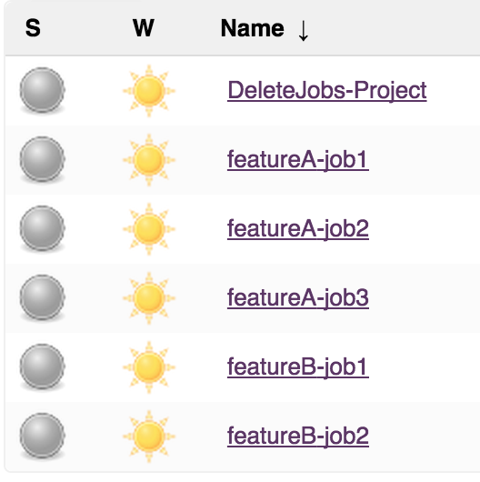
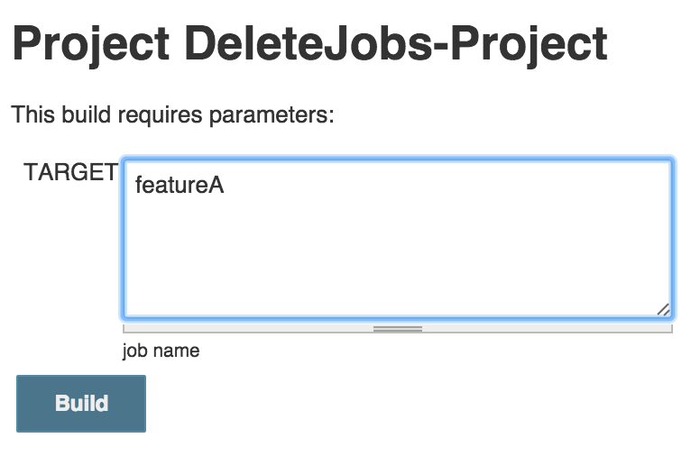
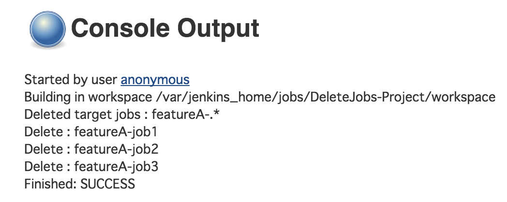
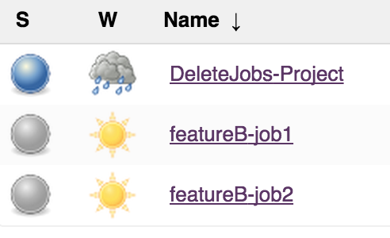
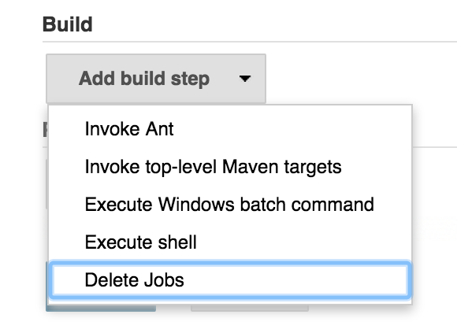
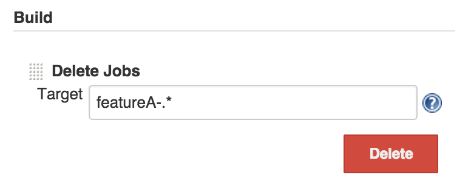
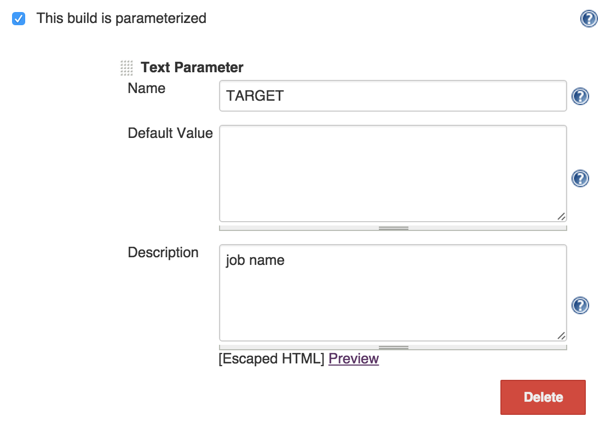
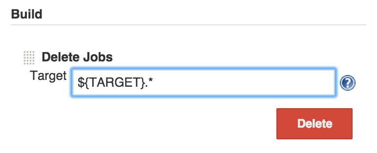

 +
This plugin to "delete jobs" in a build step.

[[JobDeleteBuilderPlugin-Executeexample]]
== Execute example

[[JobDeleteBuilderPlugin-DeletefeatureAjobs]]
=== Delete featureA jobs

. before delete +
[.confluence-embedded-file-wrapper]##
. Execute job +
[.confluence-embedded-file-wrapper]## +
[.confluence-embedded-file-wrapper]##
. after delete +
[.confluence-embedded-file-wrapper]##

[[JobDeleteBuilderPlugin-ConfigandUsage]]
== Config and Usage

[[JobDeleteBuilderPlugin-Simplebuild]]
=== Simple build

. Add "Delete Jobs" build step +
[.confluence-embedded-file-wrapper]##
. Set target job name with Regular Expression +
[.confluence-embedded-file-wrapper]##

[[JobDeleteBuilderPlugin-Buildwithparameters]]
=== Build with parameters

. Set parameters +
[.confluence-embedded-file-wrapper]##
. Add a build step, and set environment value +
[.confluence-embedded-file-wrapper]##
. Build and input parameters +
[.confluence-embedded-file-wrapper]##

[[JobDeleteBuilderPlugin-ChangeLog]]
== Change Log

[[JobDeleteBuilderPlugin-Version1.0(Sep23,2015)]]
=== Version 1.0 (Sep 23, 2015)

Initial release
