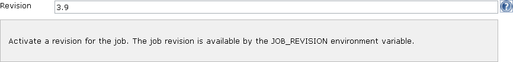

This plugin enables users to set a revision (a version) for the Jenkins
job.

[[JobRevisionPlugin-Features]]
== Features

The job revision sets the JOB_REVISION as an environment variable in the
Jenkins job.

[[JobRevisionPlugin-Someusecases]]
== Some use cases

* To bring traceability when there are multiple branches of a product.

[[JobRevisionPlugin-Configuration]]
== Configuration

[.confluence-embedded-file-wrapper]##

[[JobRevisionPlugin-Combinationwithotherplugins]]
== Combination with other plugins

It is suggested to use the
https://wiki.jenkins-ci.org/display/JENKINS/EnvInject+Plugin[EnvInject
Plugin] to manage all job environment variables. +
EnvInject plugin retrieves the job revision variable (JOB_REVISION).

[[JobRevisionPlugin-Roadmap]]
== Roadmap

* Retrieve the revision from the main build step stored in your build
descriptor (Maven, Ivy, Gradle, ...)

[[JobRevisionPlugin-Changelog]]
== Changelog

[[JobRevisionPlugin-Version0.6(2012-01-03)]]
=== Version 0.6 (2012-01-03)

* Add an optionalBlock

[[JobRevisionPlugin-Version0.5(2011-05-16)]]
=== Version 0.5 (2011-05-16)

* Built for Jenkins 1.410 (company target)

[[JobRevisionPlugin-Version0.4(2011-02-17)]]
=== Version 0.4 (2011-02-17)

* Workaround issue in IBM JVM causing intermittent
ClassNotFoundException.
(https://issues.jenkins-ci.org/browse/JENKINS-5141[JENKINS-5141])

[[JobRevisionPlugin-Version0.3(2010-07-02)]]
=== Version 0.3 (2010-07-02)

* Added a dedicated page to display the revision; the revision is also
exposed by API (XML, JSON and Python).

[[JobRevisionPlugin-Version0.2(2009-11-08)]]
=== Version 0.2 (2009-11-08)

* Added an Hudson ParameterValue to keep track of the revision through
the builds.

[[JobRevisionPlugin-Version0.1(2009-11-02)]]
=== Version 0.1 (2009-11-02)

* Initial release
