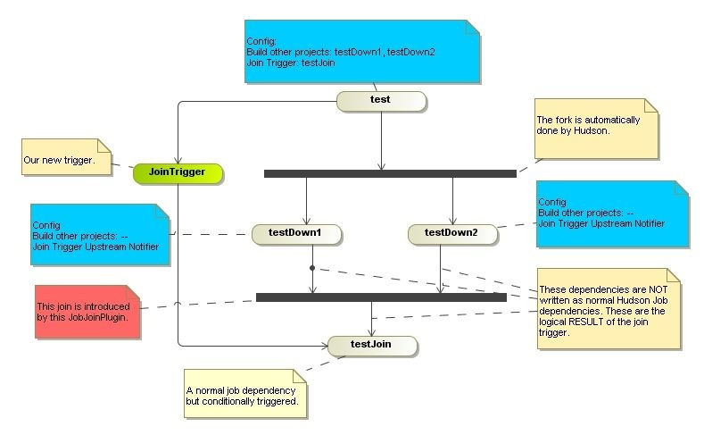
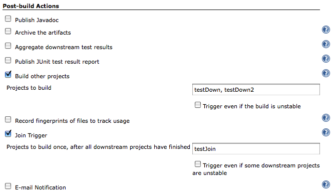
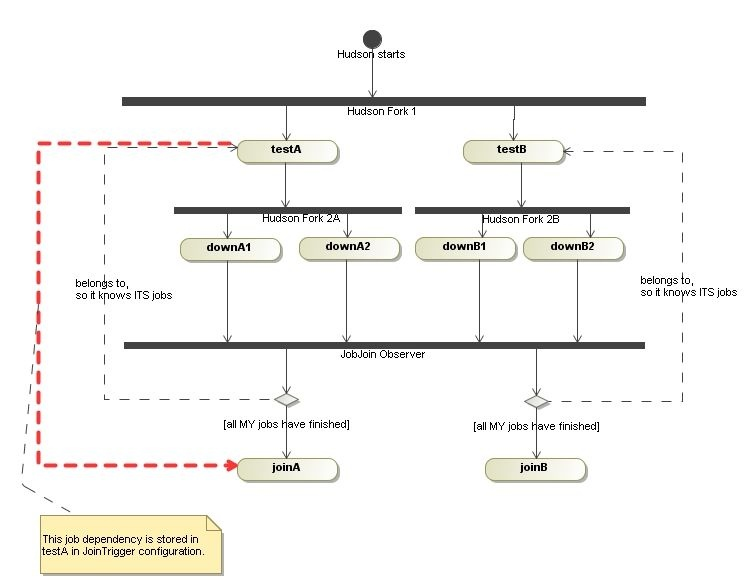
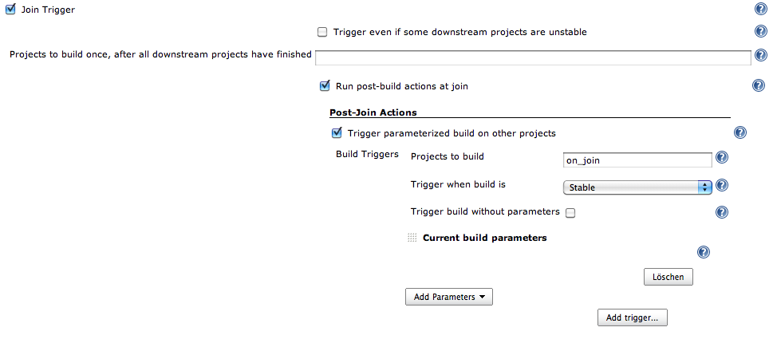

 +
This plugin allows a job to be run after all the immediate downstream
jobs have completed.   In this way,  the execution can branch out and
perform many steps in parallel, and then run a final aggregation step
just once after all the parallel work is finished. +
The plugin is useful for creating a 'diamond' shape project dependency.
  This means there is a single parent job that starts several downstream
jobs.   Once those jobs are finished, a single aggregation job runs.  
More complex interactions are not possible with this plugin. +
 +
The downstream projects are specified using Hudson's normal project
relationship mechanism.  +

 +
 +

[[JoinPlugin-Example:]]
== Example:

Our build consists of four jobs - test, testDown1, testDown2 and
testJoin. Basically they have to run in sequence, but testDown1 and
testDown2 could be run in parallel.(Maybe something like build - run
tests - metrics - release). The logical overview of our jobs would be: +
[.confluence-embedded-file-wrapper]## +
First we have to define our four jobs. With normal Hudson job dependency
("_Build other projects_") we add testDown1 and testDown2 to test. This
is the fork in the diagram.

Adding the testJoin in that way is not possible, because would start it
immediately after finishing the test-job. This is where this plugin
jumps into: the test-job configures the Join Trigger and specifies the
job to run after the join. The plugin is now able to start the testJoin
job - but it needs to know when the forked jobs have finished. That's
why we add the Join Trigger Upstream Notifier to these jobs.

Now the plugin gets the list of all forked jobs by its base job (test),
gets informed by all forked jobs, waits for all "own" jobs to be
completed and then starts the final job (testJoin).

[[JoinPlugin-Configurationofthebasejob(test):]]
=== Configuration of the base job (test):

 +
[.confluence-embedded-file-wrapper]## +

[[JoinPlugin-Configurationofforkedjobs-testDown1+testDown2:]]
=== Configuration of forked jobs - testDown1 + testDown2:

No configuration required. +

[[JoinPlugin-Havingmultipleforks&joinsinHudson]]
=== Having multiple forks&joins in Hudson

The first example shows the use of this plugin for creating one
'diamond' job dependency. Having multiple diamonds is also easy (I
whished it would be in real world
image:docs/images/wink.svg[(wink)]
) But the resulting logical overview is a little bit different:
[.confluence-embedded-file-wrapper]## +
You have two base jobs (testA and testB) and Hudson forks them in the
first step. Each of the diamonds has its own fork (2A and 2B). But ALL
forked jobs inform the SAME observer (here shown as join bar _JobJoin
Observer_). This ONE observer has two joins configured: the A-diamond
and the B-diamond. And each fragment waits for recieving all the
notifications it needs.

[[JoinPlugin-Example:.1]]
=== Example:

. Hudson starts
. Hudson starts testB
. Hudson starts testA
. testA finishes
. Hudson starts downA1
. Hudson starts downA2
. testB finishes
. Hudson starts downB2
. Hudson starts downB1
. downA2 finishes
. downA2 notifies the plugin
. PlugIn: downA2 belongs to diamond A
. PlugIn: diamond A requires downA1 and downA2
. PlugIn: diamond A is missing downA1, so do nothing
. downB2 finishes
. downB2 notifies the plugin
. PlugIn: downB2 belongs to diamond B
. PlugIn: diamond B requires downB1 and downB2
. PlugIn: diamond B is missing downB1, so do nothing
. downB1 finishes
. downB1 notifies the plugin
. PlugIn: downB1 belongs to diamond B
. PlugIn: diamond B requires downB1 and downB2
. PlugIn: all notifications recieved, so start joinB
. downA1 finishes
. downA1 notifies the plugin
. PlugIn: downA1 belongs to diamond A
. PlugIn: diamond A requires downA1 and downA2
. PlugIn: all notifications recieved, so start joinA

[[JoinPlugin-BuildParameters]]
=== Build Parameters

By default, parameters of the current build will not be passed to the
join project (like the default build trigger). If you want to do this,
choose "Post-Join Action" -> "Trigger parameterized build on other
project" and then choose "Current Build Parameters" (or other parameters
you want to use). +
For example:

[.confluence-embedded-file-wrapper]##

Although you can specify in your Post-Join Actions build triggers other
than "Stable", only "Stable" seems to work.

[[JoinPlugin-Changelog]]
== Changelog

[[JoinPlugin-Version1.16-August2,2015]]
=== Version 1.16 - August 2, 2015

* Removed integration with deprecated
https://wiki.jenkins-ci.org/display/JENKINS/CopyArchiver+Plugin[CopyArchiver
Plugin] (pull #6)
* Pick up job renames properly
* JENKINS-16201 - Handle cache reloads correctly.  Previous behavior may
not see all downstream jobs as completed, and so would never start the
join job
* JENKINS-25710 - Work with folders

[[JoinPlugin-Version1.15-May3,2012]]
=== Version 1.15 - May 3, 2012

* Supported hierarchical projects (even more)

[[JoinPlugin-Version1.14-April5,2012]]
=== Version 1.14 - April 5, 2012

* Supported hierarchical projects

[[JoinPlugin-Version1.13-September18,2011]]
=== Version 1.13 - September 18, 2011

* Add a method fromSameSplitProject to JoinDependency for use in other
plugins - e.g. the Build Pipeline View.

[[JoinPlugin-Version1.12-August28,2011]]
=== Version 1.12 - August 28, 2011

* Add support for downstream-ext plugin
* Fix https://issues.jenkins-ci.org/browse/JENKINS-9903[9903]:
Downstream projects include the "join" project when using the
downstream-ext plugin

[[JoinPlugin-Version1.11-July11,2011]]
=== Version 1.11 - July 11, 2011

* Fix https://issues.jenkins-ci.org/browse/JENKINS-10301[10301]: Jenkins
does not start when the parameterized trigger plugin with version 2.10
and the join plugin with version 1.10.1 are installed.
+
[.aui-icon .aui-icon-small .aui-iconfont-error .confluence-information-macro-icon]#
#

Join Plugin does not work with versions of the
https://wiki.jenkins-ci.org/display/JENKINS/Parameterized+Trigger+Plugin[Parameterized
Trigger Plugin] prior to 2.10.

[[JoinPlugin-Version1.10.1-April11,2011]]
=== Version 1.10.1 - April 11, 2011

* Fix https://issues.jenkins-ci.org/browse/JENKINS-8443[8443]
* Added autocompletion and form validation to join projects text field
+
[.aui-icon .aui-icon-small .aui-iconfont-error .confluence-information-macro-icon]#
#

Jobs in the join projects field which don't exist will be pruned on save

[[JoinPlugin-Version1.10-April11,2011]]
=== Version 1.10 - April 11, 2011

* Failure when publishing artifacts

[[JoinPlugin-Version1.9-September13,2010]]
=== Version 1.9 - September 13, 2010

* Fix NPE on newer versions of Hudson when adding a post-build action
like the copy-archiver or the parameterized-trigger plugin
(https://issues.jenkins-ci.org/browse/JENKINS-7344[7344])
* Run parametrized-trigger after join should work again on Hudson
version newer than 1.341
(https://issues.jenkins-ci.org/browse/JENKINS-5602[5602])
* Respect disabled projects: Start join projects when all non-disabled
downstream projects are finished
(https://issues.jenkins-ci.org/browse/JENKINS-5972[5972]).

[[JoinPlugin-Version1.7-January16,2010]]
=== Version 1.7 - January 16, 2010

* Avoid error if
https://wiki.jenkins-ci.org/display/JENKINS/Parameterized+Trigger+Plugin[parameterized-trigger]
plugin is installed, but current project doesn't use a parameterized
BuildTrigger. (https://issues.jenkins-ci.org/browse/JENKINS-5159[5159])

[[JoinPlugin-Version1.6-September30,2009]]
=== Version 1.6 - September 30, 2009

* The join plugin will now wait for downstream builds triggered by the
parameterized-trigger plugin, in addition to the built-in downstream
projects, before performing the join actions.
* Implement the `+getRequiredMonitorService+` method to indicate no
dependency on the previous build. This should allow more parallelism
when using concurrent builds.

[[JoinPlugin-Version1.5-September18,2009]]
=== Version 1.5 - September 18, 2009

* Fix problem where email recipients were cleared on job save
(https://hudson.dev.java.net/issues/show_bug.cgi?id=4384[4384])

[[JoinPlugin-Version1.4-September2,2009]]
=== Version 1.4 - September 2, 2009

* Fix NPE for builds that are automatically upgraded from version 1.2 or
earlier (https://hudson.dev.java.net/issues/show_bug.cgi?id=4370[4370])
* Re-add Maven projects as applicable for the Join plugin. Matrix
(multi-config) projects remain incompatible.  Feedback of using this
plugin with Maven projects is sought.

[[JoinPlugin-Version1.3-August31,2009]]
=== Version 1.3 - August 31, 2009

* Remove console log warnings from builds that are not using the join
plugin
(http://www.nabble.com/Join-notifier-cannot-find-upstream-JoinAction-tt25077029.html[report])
* Provide initial support for running arbitrary post-build actions as
part of the join process. The parameterized-build plugin is the first
candidate
(https://hudson.dev.java.net/issues/show_bug.cgi?id=3959[3959])
* Only offer Join plugin with Freestyle builds, due to report of Matrix
build incompatibility.
(http://www.nabble.com/Regarding-build-td24848107.html#a24868203[report])

[[JoinPlugin-Version1.2-June28,2009]]
=== Version 1.2 - June 28, 2009

* Downstream failure detection was broken previous to this version.
Previously, the join projects were started no matter what the result of
the downstream builds. With this fix, failed downstream builds block the
join projects from being started
(http://www.nabble.com/Join-plugin-1.1-released-td23796412.html#a23872626[report])

[[JoinPlugin-Version1.1-May30,2009]]
=== Version 1.1 - May 30, 2009

* Fix a NPE that occurs when the join plugin is enabled, but no
downstream jobs are specified
(http://www.nabble.com/Join-plugin-1.0-released-td23680165.html#a23741501[report])
* Start the join projects immediately if there are no downstream jobs
specified.

[[JoinPlugin-Version1.0-May23,2009]]
=== Version 1.0 - May 23, 2009

* Basic support for joining. After the downstream jobs finish, a comma
separated list of jobs can be started as the join jobs.
