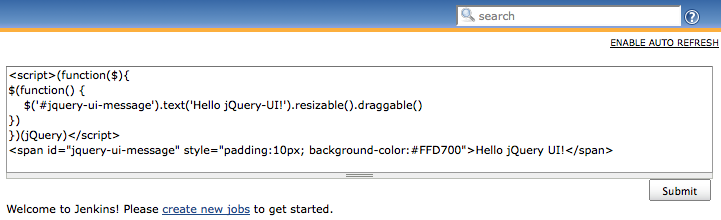

[.conf-macro .output-inline]# #

[.aui-icon .aui-icon-small .aui-iconfont-warning .confluence-information-macro-icon]##

*This plugin is up for adoption.* Want to help improve this plugin?
https://wiki.jenkins-ci.org/display/JENKINS/Adopt+a+Plugin[Click here to
learn more]!

This plugin allows you to use jQuery UI on each view descriptions.

[.confluence-embedded-file-wrapper]##

Warning

[.aui-icon .aui-icon-small .aui-iconfont-error .confluence-information-macro-icon]#
#

This plugin has been replaced with the
https://wiki.jenkins-ci.org/display/JENKINS/jQuery+Plugin[jQuery
Plugin]. Please remove this plugin from your installation.

[[jQueryUIPlugin-VersionHistory]]
== Version History

[[jQueryUIPlugin-Version1.0.2(Feb27,2011)]]
=== Version 1.0.2 (Feb 27, 2011)

* Rerelease 1.0.1 to properly set required Jenkins version.

[[jQueryUIPlugin-Version1.0.1(Feb22,2011)]]
=== Version 1.0.1 (Feb 22, 2011)

* Upgrade
https://wiki.jenkins-ci.org/display/JENKINS/jQuery+Plugin[jQuery Plugin]
(1.0 -> 1.0.1)

[[jQueryUIPlugin-Version1.0(Feb20,2011)]]
=== Version 1.0 (Feb 20, 2011)

* Initial release
