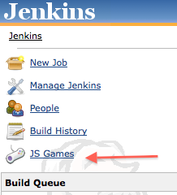
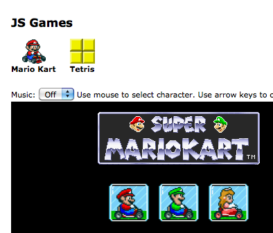

Play some JavaScript games from the comfort of your Jenkins instance.

[[JSGamesPlugin-Download&Installation]]
== Download & Installation

You can download the
http://updates.jenkins-ci.org/latest/jsgames.hpi[latest .hpi] and
install it from the Manage Plugins menu, or install this plugin directly
from the Plugins Update Center.

[[JSGamesPlugin-Usage]]
== Usage

. After installing the plugin, go to Jenkins dashboard, a menu 'JS
Games' should appear.
. Click 'JS Games' menu, it will then display the list of games
available. The first game will be displayed by default.
. Select other games from the menu.

[[JSGamesPlugin-AddingNewGame]]
== Adding New Game

. Create a class implementation of Game interface.
. Add the class to games list in JsGamesRootAction.
. Add <game_id>.jelly in
src/main/resources/hudson/plugins/jsgames/JsGamesRootAction/ .
. Add game icon to src/main/webapp/<game_id>/icon.png .
. Add static files (javascript, images, etc) to
src/main/webapp/<game_id>/resources/ .

[[JSGamesPlugin-Credits]]
== Credits

* Jacob Seidelin of http://blog.nihilogic.dk/[Nihilogic Games] for
creating JavaScript MarioKart and Tetris, and for giving permission to
bundle those games in this plugin.

[[JSGamesPlugin-Screenshots]]
== Screenshots

[.confluence-embedded-file-wrapper]## +
[.confluence-embedded-file-wrapper]##

[[JSGamesPlugin-Changelog]]
== Changelog

[[JSGamesPlugin-Version0.2(Aug5,2011)]]
=== Version 0.2 (Aug 5, 2011)

* Update for Jenkins

[[JSGamesPlugin-Version0.1(Aug1,2010)]]
=== Version 0.1 (Aug 1, 2010)

* Initial release
