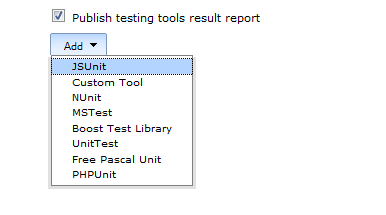
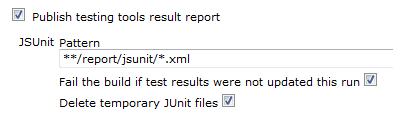

[.conf-macro .output-inline]#This plugin allows you publish
http://www.jsunit.net/[JSUnit] test results # +
This plugin makes it possible to import JSUnit reports from each build
into Hudson so they are displayed with a trend graph and details about
which tests that failed.

[[JSUnitplugin-Configuration]]
== Configuration

* Step 1: Setup an ant task to run jsUnit's 'standalone_test' target
(and configure logsDirectory where the reports (xml) are stored) 
* Step 2: Configure your Hudson job to execute this ant task
* Step 3: Configure the JSUnit plugin:  

[.confluence-embedded-file-wrapper]##
[.confluence-embedded-file-wrapper]## +

 +
 +

[[JSUnitplugin-Roadmap]]
=== Roadmap

[[JSUnitplugin-Changelog]]
=== Changelog

[[JSUnitplugin-Version1.6]]
==== Version 1.6

* Upgrade to xUnit 1.90

[[JSUnitplugin-Version1.5]]
==== Version 1.5

* Upgrade to xUnit 1.17 +
* Built for Jenkins 1.410 +
* Changed packaging

[[JSUnitplugin-Version1.4.2]]
==== Version 1.4.2

* Upgraded to the dependency xUnit plugin 1.16.2

[[JSUnitplugin-Version1.4.1]]
==== Version 1.4.1

* Upgraded to the dependency xUnit plugin 1.16.1 for fixing slave mode

[[JSUnitplugin-Version1.3]]
==== Version 1.3

* Upgraded to latest xUnit API 1.16 +
* Built for Jenkins 1.398 +
* Fixed https://issues.jenkins-ci.org/browse/JENKINS-8228[JENKINS-8228]
- Parsing error on some JSUnit reports

[[JSUnitplugin-Version1.2]]
==== Version 1.2

* JSUnit is now
http://wiki.jenkins-ci.org/display/HUDSON/xUnit+Plugin[xUnit plugin]
V1.8

[[JSUnitplugin-Version1.1]]
==== Version 1.1

* JSUnit is now
http://wiki.jenkins-ci.org/display/HUDSON/xUnit+Plugin[xUnit plugin]
V1.6 compatible (Fixed error message: "Attribute 'hostname' is not
allowed to appear in element 'testsuite'")
* Added jsunit xml input validation

[[JSUnitplugin-Version1.0]]
==== Version 1.0

* Updated to the new
https://wiki.jenkins-ci.org/display/JENKINS/xUnit+Plugin[xUnit plugin]
architecture. +
Gallio Hudson plugin uses xUnit 1.6

[[JSUnitplugin-Version0.4]]
==== Version 0.4

* Changed plugin to handle latest JSUnit (2.2) reporting format. Old
format is not supported anymore.
(http://issues.jenkins-ci.org/browse/JENKINS-5333[Issue 5333]). +
Many thanks to
http://issues.jenkins-ci.org/secure/ViewProfile.jspa?name=mrobinet[mrobinet]
for supplying the patch and Jeffrey Erikson for doing some research as
well.

[[JSUnitplugin-Version0.3]]
==== Version 0.3

* Using JSUnit plugin without the
http://wiki.jenkins-ci.org/display/HUDSON/xUnit+Plugin[xUnit plugin] is
no longer possible. JSUnit plugin doesn't work standalone anymore (it is
fully dependent on the xUnit plugin).

[[JSUnitplugin-Version0.2]]
==== Version 0.2

* Added an extension for the
http://wiki.jenkins-ci.org/display/HUDSON/xUnit+Plugin[xUnit plugin].

[[JSUnitplugin-Version0.1]]
==== Version 0.1

* First version. Many  thanks to
http://wiki.jenkins-ci.org/display/~redsolo[Erik Ramfelt]. This version
of the plugin is based on his
http://wiki.jenkins-ci.org/display/HUDSON/NUnit+Plugin[NUnit plugin].
