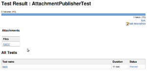

[.conf-macro .output-inline]##

[cols="",options="header",]
|===
|Plugin Information
|View JUnit Attachments https://plugins.jenkins.io/junit-attachments[on
the plugin site] for more information.
|===

[.aui-icon .aui-icon-small .aui-iconfont-warning .confluence-information-macro-icon]##

*This plugin is up for adoption.* Want to help improve this plugin?
https://wiki.jenkins.io/display/JENKINS/Adopt+a+Plugin[Click here to
learn more]!

This plugin can archive certain files (attachments) together with your
JUnit
results.[.confluence-embedded-file-wrapper]##
 
[.confluence-embedded-file-wrapper]##

To activate this plugin, configure your job with "Additional test report
features" and select "Publish test attachments".

[[JUnitAttachmentsPlugin-Howtoattachfiles]]
== How to attach files

[[JUnitAttachmentsPlugin-Byputtingthemintoaknownlocation]]
=== By putting them into a known location

One way to do this is to produce files from your tests into a known
location.

* Jenkins looks for the JUnit XML report.
* Then it looks for a directory with the name of the test class, in the
same directory as the XML report.
* Every file in this directory will be archived as an attachment to that
test class.

[[JUnitAttachmentsPlugin-Example:]]
==== Example:

* test report in .../target/surefire-reports/TEST-foo.bar.MyTest.xml
* test class is foo.bar.MyTest
* test attachment directory: .../target/surefire-reports/foo.bar.MyTest/

[[JUnitAttachmentsPlugin-ByprintingoutthefilenameinaformatthatJenkinswillunderstand]]
=== By printing out the file name in a format that Jenkins will understand

The above mechanism has a problem that your test needs to know about
where your test driver is producing reports to. This 2nd approach
eliminates that problem by simply letting you print out arbitrary file
names to stdout/stderr in the following format:

....
[[ATTACHMENT|/absolute/path/to/some/file]]
....

Each "ATTACHMENT" should be on its own line, without any text before or
after. +
See http://kohsuke.org/?s=junit+attachment[Kohsuke's post] for more
details.

[[JUnitAttachmentsPlugin-Changelog]]
== Changelog

[[JUnitAttachmentsPlugin-Version1.6andlater]]
=== Version 1.6 and later

See https://github.com/jenkinsci/junit-attachments-plugin/releases[GitHub
releases].

[[JUnitAttachmentsPlugin-Version1.5(2018Feb22)]]
=== Version 1.5 (2018 Feb 22)

* [.jira-issue .conf-macro .output-block]#
https://issues.jenkins-ci.org/browse/INFRA-1310[[.aui-icon .aui-icon-wait .issue-placeholder]##
##INFRA-1310] - [.summary]#Getting issue details...#
[.aui-lozenge .aui-lozenge-subtle .aui-lozenge-default .issue-placeholder]#STATUS#
#
* [.jira-issue .conf-macro .output-block]#
https://issues.jenkins-ci.org/browse/JENKINS-37026[[.aui-icon .aui-icon-wait .issue-placeholder]##
##JENKINS-37026] - [.summary]#Getting issue details...#
[.aui-lozenge .aui-lozenge-subtle .aui-lozenge-default .issue-placeholder]#STATUS#
#
* Do not even try to attach a directory.

[[JUnitAttachmentsPlugin-Version1.4.2(Jul6,2016)]]
=== Version 1.4.2 (Jul 6, 2016)

* https://issues.jenkins-ci.org/browse/JENKINS-36504[JENKINS-36504]
Fixed display of case results with attachments on Pipeline builds.

[[JUnitAttachmentsPlugin-Version1.4.1(Jul5,2016)]]
=== Version 1.4.1 (Jul 5, 2016)

* Inadvertently released off the wrong branch - contents were as
intended but tagging/commits went onto wrong branch. Re-releasing from
master.

[[JUnitAttachmentsPlugin-Version1.4(Jul5,2016)]]
=== Version 1.4 (Jul 5, 2016)

* https://issues.jenkins-ci.org/browse/JENKINS-28784[JENKINS-28784]
Added Pipeline support.

[[JUnitAttachmentsPlugin-Version1.3(Dec2,2012)]]
=== Version 1.3 (Dec 2, 2012)

* Clicking on attachments ending with gif, jpeg, jpg or png
(case-insensitive) are now shown inline in a "lightbox"
** If there are multiple image attachments, you can navigate between
them with the left and right arrow keys
* Attachments are now tracked per individual test method, rather than
just per test class
(https://issues.jenkins-ci.org/browse/JENKINS-7056[JENKINS-7056])
** This means all attachments for a class aren't repeated on the page
for every test method
* Improved parsing of files where the `+<testsuite>+` tag has stdout/err
data (https://issues.jenkins-ci.org/browse/JENKINS-13115[JENKINS-13115])
* Parsing of "ATTACHMENT" lines is now slightly more lenient

[[JUnitAttachmentsPlugin-Version1.2(Dec19,2011)]]
=== Version 1.2 (Dec 19, 2011)

* Added a mechanism to specify attachments via stdout/stderr.

[[JUnitAttachmentsPlugin-Version1.1(Jan3,2011)]]
=== Version 1.1 (Jan 3, 2011)

* Fix https://issues.jenkins-ci.org/browse/JENKINS-5634[JENKINS-5634]:
Save redirected stdout/stderr output of junit-tests when using
maven.test.redirectTestOutputToFile as additional attachments.

[[JUnitAttachmentsPlugin-Version1.0(Nov27,2009)]]
=== Version 1.0 (Nov 27, 2009)
