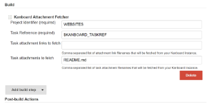

[.conf-macro .output-inline]##

[cols="",options="header",]
|===
|Plugin Information
|View Kanboard https://plugins.jenkins.io/kanboard[on the plugin site]
for more information.
|===

[.aui-icon .aui-icon-small .aui-iconfont-info .confluence-information-macro-icon]##

Older versions of this plugin may not be safe to use. Please review the
following warnings before using an older version:

* https://jenkins.io/security/advisory/2019-01-28/#SECURITY-818[CSRF
vulnerability]

[.conf-macro .output-inline]##Allows users to create or update a
https://kanboard.net/[Kanboard] task as a post-build action, trigger a
build when a task is created or moved, and fetch a task and its
attachments as a build step.##https://kanboard.net/[Kanboard] is an open
source tool to manage projects using a Lean
https://en.wikipedia.org/wiki/Kanban_(development)[Kanban] approach.

*Requires Kanboard version >= 1.0.36.*

[[KanboardPlugin-ChangeLog]]
== Change Log

[[KanboardPlugin-Versions1.5.9-1.5.11(Sep25,2018)]]
=== Versions 1.5.9-1.5.11 (Sep 25, 2018)

* Security fixes.

[[KanboardPlugin-Version1.5.8(Mar13,2017)]]
=== Version 1.5.8 (Mar 13, 2017)

* The plugin now allows task tags management. You can add new tags (or
remove existing ones) using a comma separated string of tags. Prefix a
tag with "-" to remove it.

[[KanboardPlugin-Version1.5.7(Dec20,2016)]]
=== Version 1.5.7 (Dec 20, 2016)

* A Kanboard task attachment maximum allowed size can be defined in the
global configuration, attachments of a bigger size won't be sent to the
Kanboard server.

[[KanboardPlugin-Version1.5.6(Dec18,2016)]]
=== Version 1.5.6 (Dec 18, 2016)

* Renamed from kanboard-publisher-plugin to kanboard-plugin.

[[KanboardPlugin-Version1.5.4(Dec17,2016)]]
=== Version 1.5.4 (Dec 17, 2016)

* Trigger now also fires on task move (column change), it was only
available on task creation before.

[[KanboardPlugin-Version1.5.1(Dec16,2016)]]
=== Version 1.5.1 (Dec 16, 2016)

* A new build step is now available that allows to fetch a Kanboard task
and some of its attachments available through the KANBOARD_TASKJSON and
a few others environment variables.

[[KanboardPlugin-Version1.4(Dec16,2016)]]
=== Version 1.4 (Dec 16, 2016)

* Can trigger a build when a Kanboard task is created, the corresponding
task reference is exported to the KANBOARD_TASKREF build environment
variable.

[[KanboardPlugin-Version1.3.3(Dec15,2016)]]
=== Version 1.3.3 (Dec 15, 2016)

* Allow to define task color via the KANBOARD_TASKCOLOR environment
variable.

[[KanboardPlugin-Version1.3.1(Dec14,2016)]]
=== Version 1.3.1 (Dec 14, 2016)

* Internationalization and french translation added.

[[KanboardPlugin-Version1.2(Dec09,2016)]]
=== Version 1.2 (Dec 09, 2016)

* Debug mode now globally configurable and disabled by default.

[[KanboardPlugin-Version1.1(Dec08,2016)]]
=== Version 1.1 (Dec 08, 2016)

* Export Kanboard task URL as KANBOARD_TASKURL environment variable.

[[KanboardPlugin-Version1.0(Dec06,2016)]]
=== Version 1.0 (Dec 06, 2016)

* Initial version (requires Kanboard version >= 1.0.31).

[[KanboardPlugin-Screenshots]]
== Screenshots

[.confluence-embedded-file-wrapper]##

[.confluence-embedded-file-wrapper]##

[.confluence-embedded-file-wrapper]##

[.confluence-embedded-file-wrapper]##
