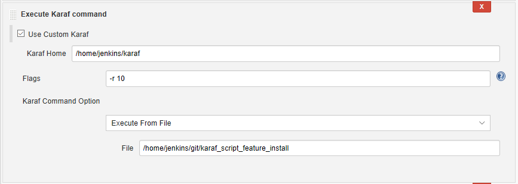
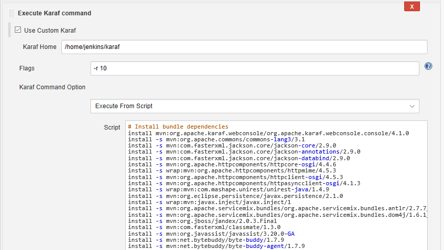

 

 

The Karaf Build Step plugin allows the user to run Karaf commands from
either a script or a file.

[[KarafBuildStepPlugin-UserGuide]]
=== User Guide

[[KarafBuildStepPlugin-ExecuteFromFile]]
== Execute From File

[.confluence-embedded-file-wrapper]##

[[KarafBuildStepPlugin-ExecuteFromScript]]
== Execute From Script

[.confluence-embedded-file-wrapper]##
