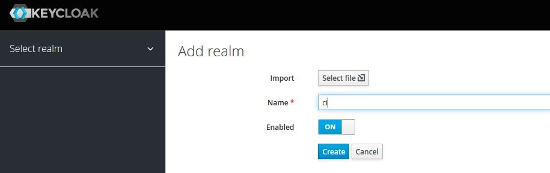
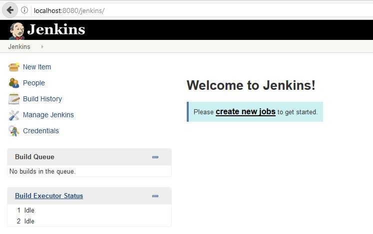
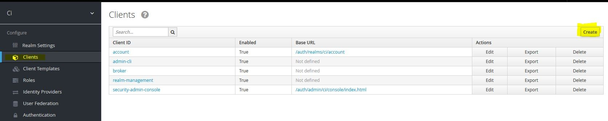
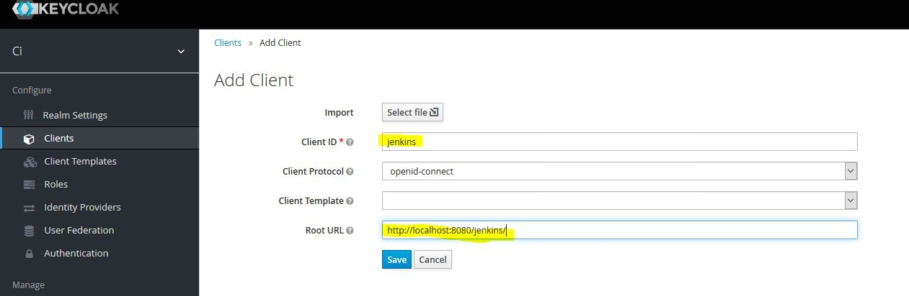
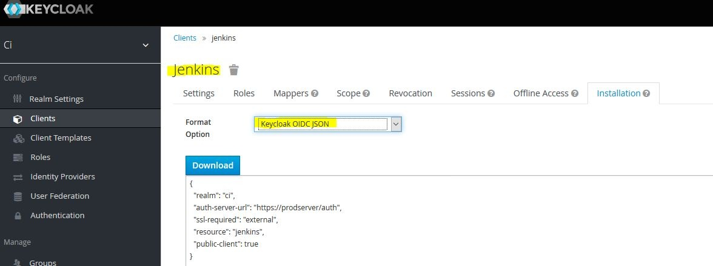
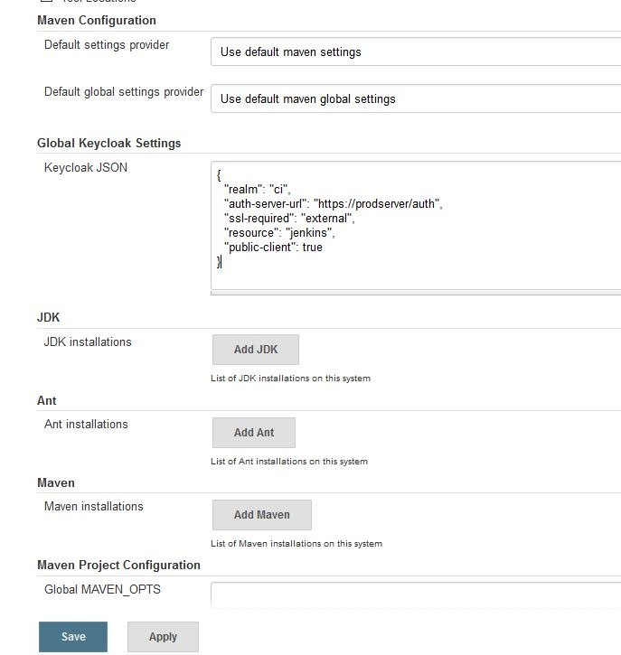
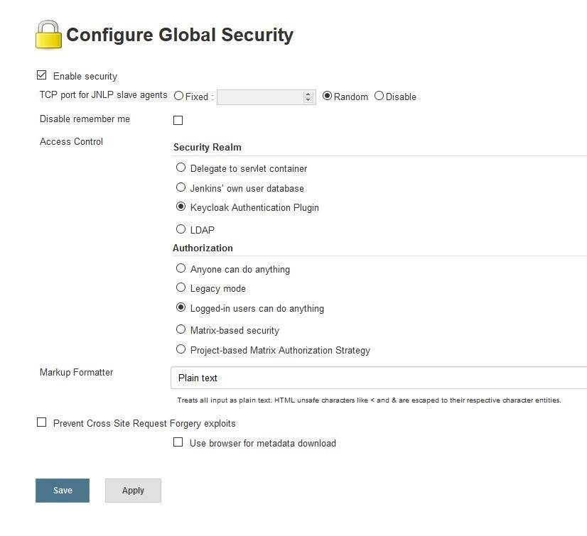
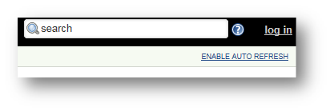
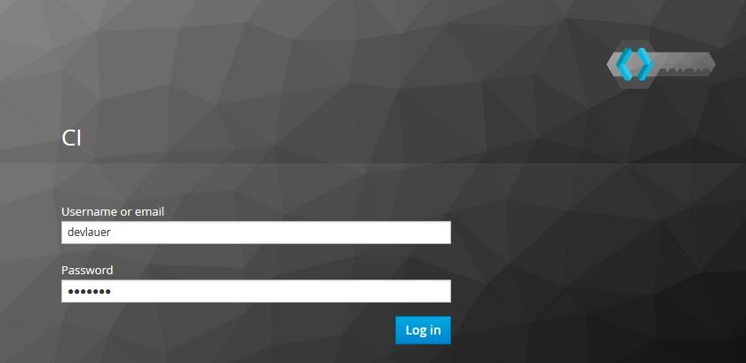
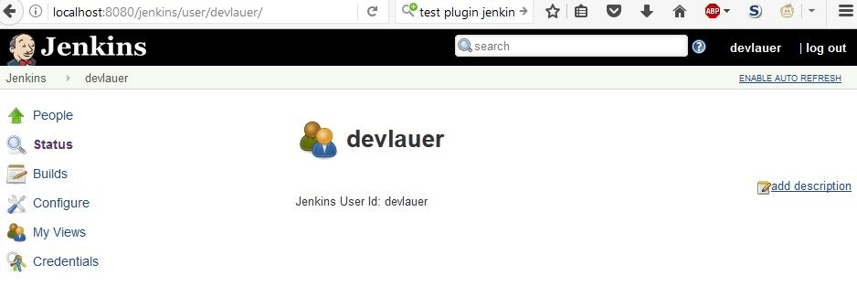

https://github.com/keycloak/jenkins-keycloak-plugin[Home page]
[.confluence-embedded-file-wrapper]##

(a fork with a newer keycloak version and a separate update-site can be
found at this https://github.com/devlauer/jenkins-keycloak-plugin[Home
page])

[[keycloak-plugin-Usage]]
== Usage

You can watch the screencast in
*https://vimeo.com/116429910[Vimeo]**/**https://www.youtube.com/watch?v=_WAFuOa53R0[YouTube]*** ***(You
may have to put the speaker in high volume)*

*(applies only to the older plugin version)*

*Usage of the newer version:*

[[keycloak-plugin-Step1:Createakeycloakclientinarealm]]
=== Step 1 : Create a keycloak client in a realm

Lets call the realm *'ci'* and the client *'jenkins'* +
[.confluence-embedded-file-wrapper]##

Jenkins is running on port *8080*

[.confluence-embedded-file-wrapper]##

Create the client accordingly

[.confluence-embedded-file-wrapper]##

[.confluence-embedded-file-wrapper]##

Also make sure sample users are also created, in this case I have
created 'devlauer'.

[[keycloak-plugin-Step2:Copythekeycloak.json]]
=== Step 2 : Copy the keycloak.json

[.confluence-embedded-file-wrapper]##

[[keycloak-plugin-Step3:IntheJenkinsglobalsettingspagepastethecontent]]
=== Step 3 : In the Jenkins global settings page paste the content

[.confluence-embedded-file-wrapper]##

[[keycloak-plugin-Step4:IntheSecurityRealmactivatethesecurityrealmoftheplugin]]
=== Step 4 : In the Security Realm activate the security realm of the plugin

[.confluence-embedded-file-wrapper]##

[[keycloak-plugin-Step5:Loginintojenkins]]
=== Step 5 : Login into jenkins

[.confluence-embedded-file-wrapper]##

User would be redirected to keycloak for authentication

[.confluence-embedded-file-wrapper]##

[[keycloak-plugin-Step7:Keycloakwouldredirectbacktojenkins]]
=== Step 7 : Keycloak would redirect back to jenkins

User would be redirected back to callback URL

[.confluence-embedded-file-wrapper]## +
===========================================================================================================================

[[keycloak-plugin-Youwouldalsoliketointegratekeyclcoakwithsonar]]
==== You would also like to https://reachmnadeem.wordpress.com/2015/01/22/integrating-keycloak-with-sonarqube/[integrate keyclcoak with sonar]

[[keycloak-plugin-TODO]]
== TODO

[[keycloak-plugin-Authorization]]
=== Authorization
