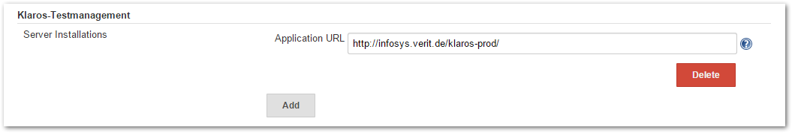
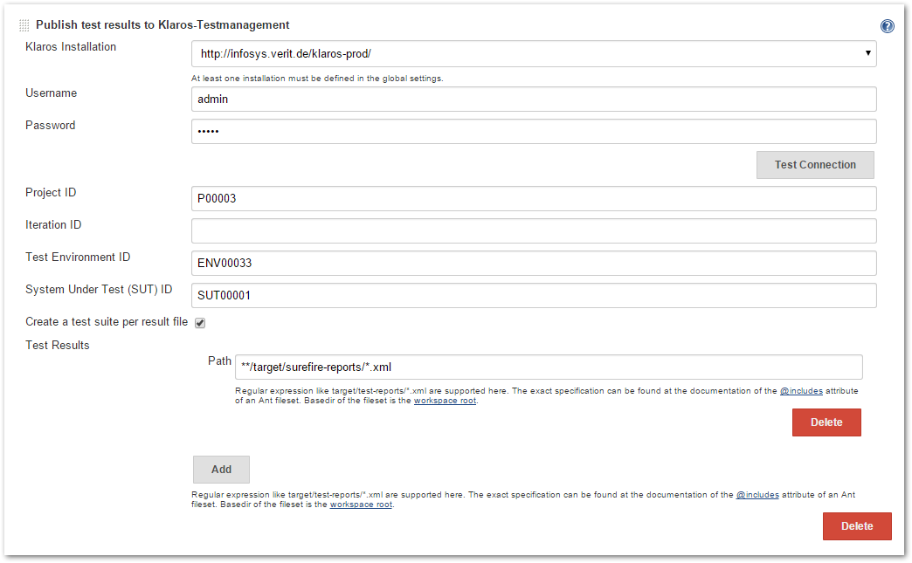

[.conf-macro .output-inline]# #

[.aui-icon .aui-icon-small .aui-iconfont-info .confluence-information-macro-icon]##

Older versions of this plugin may not be safe to use. Please review the
following warnings before using an older version:

* https://jenkins.io/security/advisory/2019-04-03/#SECURITY-843[Credentials
stored in plain text]

[.conf-macro .output-inline]#Integrates Jenkins with
http://www.klaros-testmanagement.com/[Klaros-Testmanagement] by
publishing the test results of a build to the
http://www.klaros-testmanagement.com/[Klaros-Testmanagement]
application. +
The test results will be stored in the
http://www.klaros-testmanagement.com/[Klaros-Testmanagement] database
for further evaluation and reporting purposes.#

[[Klaros-TestmanagementPlugin-Howtoinstallthisplugin]]
== How to install this plugin

[[Klaros-TestmanagementPlugin-Usingtheinterface]]
=== Using the interface

The simplest way is by going to your installation's management screen
and clicking there "Manage Plugins".
(`+http:+``+//yourhost/jenkins/pluginManager+`). The web interface will
then download `+*.hpi+` files from here, you will just need to restart
your Jenkins instance to pick up the changes.

[[Klaros-TestmanagementPlugin-ManualInstallation]]
=== Manual Installation

http://updates.jenkins-ci.org/download/plugins/klaros-testmanagement/[Download
Site]

Save the downloaded `+*.hpi+` file into the `+$JENKINS_HOME/plugins+`
directory. You will need then to restart Jenkins (many containers let
you do this without restarting the container).

[[Klaros-TestmanagementPlugin-Configuration]]
== Configuration

In the Jenkins system configuration you are able to specify one or more
http://www.klaros-testmanagement.com/[Klaros-Testmanagement]
installations which you may publish test results to. The only
configuration option is the URL of the application.

[.confluence-embedded-file-wrapper]##

In the Jenkins project configuration (under Post-build Actions) you can
define the following parameters:

* *Username*: Specify this if Klaros is configured to require
authentication for test results imports
* *Password*: Specify this if Klaros is configured to require
authentication for test results imports
* *Project ID*: The ID of the Klaros Project to store to
* *Iteration ID*: The optional ID of the Klaros project iteration to
which the test results should belong.
* *Test Environment ID*: The ID of the Klaros test environment (OS etc.)
* *System Under Test ID*: The ID of the Klaros system under test
(Software version etc.)
* *Create a test suite per result file*: If enabled, there will be a
test suite and corresponding +
test suite result created in Klaros for each result file imported
* *Test Report files*: Multiple Ant FileSet includes to the result files
to be published

[.confluence-embedded-file-wrapper]##

[[Klaros-TestmanagementPlugin-Notes]]
== Notes

If the exported test cases are not yet present in
http://www.klaros-testmanagement.com/[Klaros-Testmanagement] they are
created automatically for the given project.

This plugin requires
http://www.klaros-testmanagement.com/[Klaros-Testmanagement] version
2.2.1 or later. User authentication is supported starting from Klaros
version 2.6.

Starting with version 2.0.0 this plugin is no longer supporting Hudson.

[[Klaros-TestmanagementPlugin-VersionHistory]]
== Version History

[[Klaros-TestmanagementPlugin-Version2.0.0(Jan21,2017)]]
=== Version 2.0.0 (Jan 21, 2017)

* java.io.NotSerializableException when plugin is executed on a slave
node (https://issues.jenkins-ci.org/browse/JENKINS-34334[JENKINS-34334])

[[Klaros-TestmanagementPlugin-Version1.7(Feb16,2016)]]
=== Version 1.7 (Feb 16, 2016)

* Extend the list of supported result file formats to the supported list
of Klaros-Testmanagement 4.4
(https://issues.jenkins-ci.org/browse/JENKINS-32973[JENKINS-32973])
* NullpointerException in KlarosTestResultPublisher:752
(https://issues.jenkins-ci.org/browse/JENKINS-32972[JENKINS-32972])

[[Klaros-TestmanagementPlugin-Version1.6(Feb15,2016)]]
=== Version 1.6 (Feb 15, 2016)

* Support specifying result file formats during result publishing
(https://issues.jenkins-ci.org/browse/JENKINS-30369[JENKINS-30369])
* Send additional build information while exporting test results
(https://issues.jenkins-ci.org/browse/JENKINS-30338[JENKINS-30338])
* Support build environment and build parameter variables
(https://issues.jenkins-ci.org/browse/JENKINS-30337[JENKINS-30337])

[[Klaros-TestmanagementPlugin-Version1.5.1(May31,2015)]]
=== Version 1.5.1 (May 31, 2015)

* Add proper migration of test result path settings for existing
projects
(https://issues.jenkins-ci.org/browse/JENKINS-28659[JENKINS-28659])

[[Klaros-TestmanagementPlugin-Version1.5(May30,2015)]]
=== Version 1.5 (May 30, 2015)

* Add support for iteration assignment of imported test runs
(https://issues.jenkins-ci.org/browse/JENKINS-28296[JENKINS-28296])
* Support the creation of test suites on test result import
(https://issues.jenkins-ci.org/browse/JENKINS-27596[JENKINS-27596])
* Do not try to export test results for canceled or broken builds
(https://issues.jenkins-ci.org/browse/JENKINS-27593[JENKINS-27593])
* Support multiple test result set specifications for uploading
(https://issues.jenkins-ci.org/browse/JENKINS-27592[JENKINS-27592])
* Whitespace at the end of input fields leads to bogus file upload
(https://issues.jenkins-ci.org/browse/JENKINS-15744[JENKINS-15744])

[[Klaros-TestmanagementPlugin-Version1.4(Apr15,2011)]]
=== Version 1.4 (Apr 15, 2011)

* No longer tries to authenticate with an empty username when no name
was specified
* Remote Slave execution finally works

[[Klaros-TestmanagementPlugin-Version1.3(Apr08,2011)]]
=== Version 1.3 (Apr 08, 2011)

* Fixes a problem when executed on a slave node

[[Klaros-TestmanagementPlugin-Version1.2(Feb14,2011)]]
=== Version 1.2 (Feb 14, 2011)

* Update link in help

[[Klaros-TestmanagementPlugin-Version1.1(Mar19,2010)]]
=== Version 1.1 (Mar 19, 2010)

* Support for the user authentication introduced in version 2.6

[[Klaros-TestmanagementPlugin-Version1.0(Oct6,2009)]]
=== Version 1.0 (Oct 6, 2009)

* Initial Release
