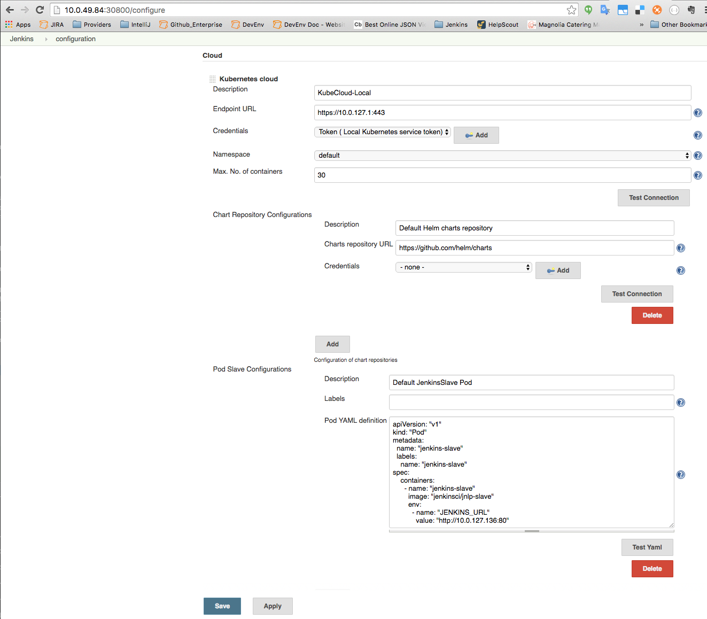
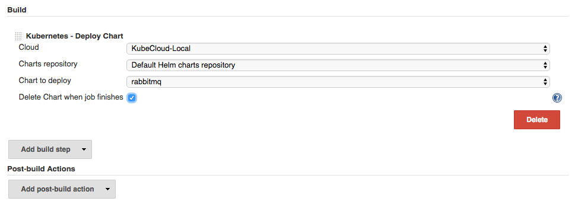

[.conf-macro .output-inline]# #

[.aui-icon .aui-icon-small .aui-iconfont-error .confluence-information-macro-icon]##

The current version of this plugin may not be safe to use. Please review
the following warnings before use:

* https://jenkins.io/security/advisory/2019-10-23/#SECURITY-1005%20(1)[CSRF
vulnerability and missing permission checks allowed capturing
credentials]
* https://jenkins.io/security/advisory/2019-10-23/#SECURITY-1005%20(2)[Users
with Overall/Read access could enumerate credential IDs]

Provides integration between Jenkins and Kubernetes for CI/CD scenarios
based on charts

[[KubernetesCIPlugin-Features]]
== Features

Kubernetes CI Plugin simplifies the integration of Kubernetes and
Jenkins in order to provide an easy way to implement CI/CD scenarios.

It will autodiscover the credentials and endpoint of the kube-api server
if running inside a Kubernetes cluster, and configure a Kubernetes cloud
object to manage it, with a default Chart repository configuration
pointing to Helm charts and a default Jenkins slave Yaml definition to
provision slaves into the Kubernetes cluster.

Users can add additional slave configurations or chart repositories, as
well as external Kubernetes cluster configurations.

* Slave configurations consist of a list of labels and a YAML pod
definition
* Chart repository configurations consist of a repository URL and the
credentials (if required).

The plugin enables the deployment of charts from any chart repository
configured (and its further deletion) to the local Kubernetes cloud, or
to any configured Kubernetes cluster.

[[KubernetesCIPlugin-Screenshots]]
== Screenshots

[[KubernetesCIPlugin-Cloudconfiguration:]]
=== Cloud configuration:

[.confluence-embedded-file-wrapper]##

[[KubernetesCIPlugin-DeployChartbuildstepconfiguration:]]
=== Deploy Chart build step configuration:

[.confluence-embedded-file-wrapper]##
