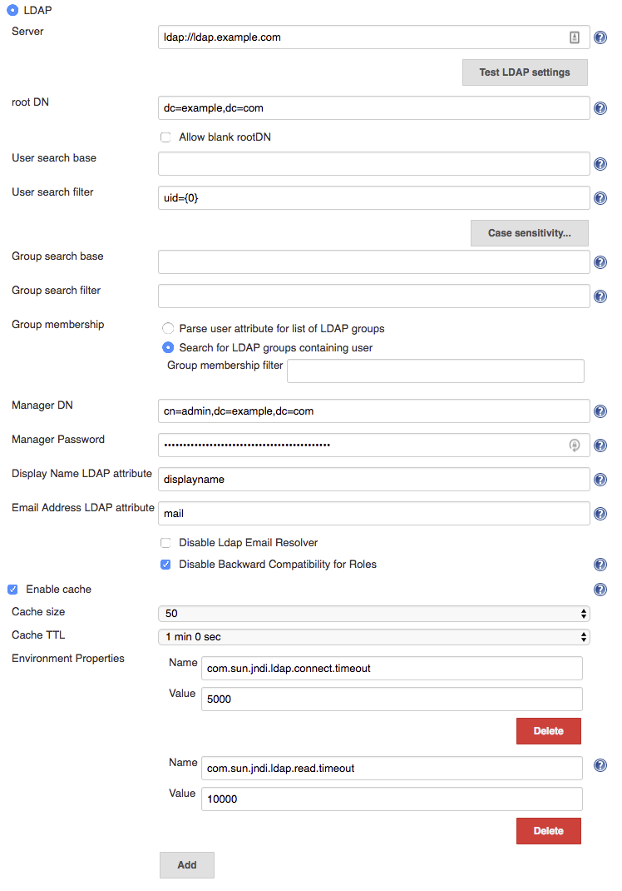
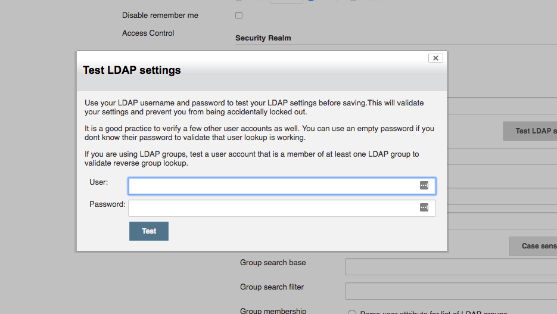
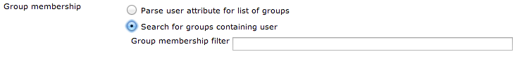
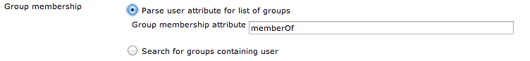

_Note_: This plugin was part of the Jenkins core until 1.468. After
that, it was split out into a separately-updateable plugin. However, for
backwards compatibility purposes, subsequent core releases still bundle
it. If you do not use this plugin at all, you can simply disable it.

[[LDAPPlugin-Description]]
== Description

This plugin provides yet another way of authenticating users using LDAP.
It can be used with LDAP servers like Active Directory or OpenLDAP among
others. Supported configuration can be found below these lines. 

[.aui-icon .aui-icon-small .aui-iconfont-info .confluence-information-macro-icon]#
#

It is *strongly* encouraged that you upgrade to at least version 1.15 of
the LDAP plugin as that version includes the `+Test LDAP settings+`
button which contains a number of important diagnostic checks to
validate subtle issues with your LDAP configuration.

Existing LDAP users are strongly encouraged to upgrade to this version
and use the button to ensure that their existing configuration does not
have subtle issues (most common subtle issues revolve around group
resolution and user lookup and typically surface for users as issues
with API token or Jenkins CLI access but can also appear with features
such as the
https://wiki.jenkins-ci.org/display/JENKINS/Authorize+Project+plugin[Authorize
Project plugin] or other plugins that require details of user
permissions or group membership outside of a user's web session)

 

[[LDAPPlugin-Configuration]]
== Configuration

Select LDAP for the Security Realm. You will most likely need to
configure some of the Advanced options. There is on-line help available
for each option. 
[.confluence-embedded-file-wrapper]##

[[LDAPPlugin-Server]]
=== Server

Specify the name of the LDAP server host name (like `+ldap.acme.org+`).

If your LDAP server uses a port other than `+389+` (which is the
standard for LDAP), you can also append a port number here, like
`+ldap.acme.org:1389+`.

To connect to LDAP over SSL (AKA LDAPS), specify it with the
`+ldaps://+` protocol, like `+ldaps://ldap.acme.org+` or
`+ldaps://ldap.acme.org:1636+` (if the port is other than the default
`+636+`).

As of version 1.6, you can specify a list of servers separated by
whitespace to provide a fallback if the first server is unavailable,
e.g. `+ldap1.acme.org ldap2.acme.org:1389+` or
`+ldaps://ldap1.acme.org:1636 ldap1.acme.org:1389 ldap://ldap2.acme.org ldap3.acme.org+`

[[LDAPPlugin-TestLDAPSettings]]
=== Test LDAP Settings

This button will allow you to check the full LDAP configuration settings
which you have defined (as compared with the field validation which only
verifies a subset of the configuration)

Clicking this button will display a modal dialog to prompt you to
provide a username and password:

[.confluence-embedded-file-wrapper]##

There are a number of tests that you should perform before saving a new
/ modified security configuration:

* Enter your own username & password to validate that you will still be
able to login after the security settings have been applied => _You do
not want to lock yourself out_
* Ideally get a couple of other users to try their username & password
to ensure that other users can login. If you cannot get other users to
come to your computer, you can at least verify that Jenkins can resolve
their accounts by using their username and an empty password => _You do
not want to lock legitimate users out_
* In most cases, you will be using LDAP groups, so ensure that you
verify reverse group lookup by testing with a user account that is a
member of at least one group (do not forget the empty password trick to
perform lookup). If there are important groups for your Jenkins
instance, try using at least one user for each important group => You
want to ensure that group lookup functions correctly.

image:docs/images/warning.svg[(warning)] *NOTE*
it is quite likely that existing installations may have subtle issues
with group resolution, it is recommended that you validate your group
resolution with the new button functionality after upgrading the LDAP
plugin to 1.15 as there is a good chance that it will catch problems you
didn't really know you had!

[[LDAPPlugin-RootDN]]
=== Root DN

For authenticating user and determining the roles given to this user,
Jenkins performs multiple LDAP queries.

Since an LDAP database is conceptually a big tree and the search is
performed recursively, in theory if we can start a search starting at a
sub-node (as opposed to root), you get a better performance because it
narrows down the scope of a search.

This field specifies the DN of such a subtree.

But in practice, LDAP servers maintain an extensive index over the data,
so specifying this field is rarely necessary — you should just let
Jenkins figure this out by talking to LDAP.

If you do specify this value, the field normally looks something like
`+dc=acme,dc=org+`

[[LDAPPlugin-Usersearchbase]]
=== User search base

One of the searches Jenkins does on LDAP is to locate the user record
given the user name.

If you specify a relative DN (from the root DN) here, Jenkins will
further narrow down searches to the sub-tree.

But in practice, LDAP servers maintain an extensive index over the data,
so specifying this field is rarely necessary.

If you do specify this value, the field normally looks something like
`+ou=people+`

[[LDAPPlugin-Usersearchfilter]]
=== User search filter

One of the searches Jenkins does on LDAP is to locate the user record
given the user name.

 This field determines the query to be run to identify the user record.

The query is almost always `+uid={0+`} as per defined in RFC 2798, so in
most cases you should leave this field empty and let this default kick
in.

If your LDAP server doesn't have `+uid+` or doesn't use a meaningful
`+uid+` value, try `+mail={0+`}, which lets people login by their e-mail
address.

If you do specify a different query, specify an LDAP query string with
marker token \{`+0+`}, which is to be replaced by the user name string
entered by the user.

[[LDAPPlugin-Groupsearchbase]]
=== Group search base

One of the searches Jenkins does on LDAP is to locate the list of groups
for a user.

This field determines the query to be run to identify the organizational
unit that contains groups.

The query is almost always `+ou=groups+` so try that first, though this
field may be left blank to search from the root DN.

If login attempts result in "Administrative Limit Exceeded" or similar
error, try to make this setting as specific as possible for your LDAP
structure, to reduce the scope of the query.

If the error persists, you may need to change the Group membership
filter from the default of
`+(| (member={0}) (uniqueMember={0}) (memberUid={1}))+` to a query only
of the field used in your LDAP for group membership, such as:
`+(member={0})+`.

You will need to login and logout in order to verify that your group
membership is retained with a modified group membership filter.

[[LDAPPlugin-Groupsearchfilter]]
=== Group search filter

When Jenkins is asked to determine if a named group exists, it uses a
default filter of: +
`+(& (cn={0}) (| (objectclass=groupOfNames) (objectclass=groupOfUniqueNames) (objectclass=posixGroup)))+`

relative to the Group search base to determine if there is a group with
the specified name (\{`+0+`} is substituted by the name being searched
for.)

If you know your LDAP server only stores group information in one
specific object class, then you can improve group search performance by
restricting the filter to just the required object class.

Note: if you are using the LDAP security realm to connect to Active
Directory (as opposed to using the Active Directory plugin's security
realm) then you will need to change this filter to: +
`+(& (cn={0}) (objectclass=group) )+`

Note: if you leave this empty, the default search filter will be used.

[[LDAPPlugin-Groupmembership]]
=== Group membership

When Jenkins resolves a user, the next step in the resolution process is
to determine the LDAP groups that the user belongs to.

There is an extension point for providing a strategy to resolve the LDAP
groups that the user belongs to. There are two implementations provided
in the LDAP plugin:

* Search for groups containing user (default)
* Parse user attribute for list of groups

[[LDAPPlugin-Searchforgroupscontaininguser]]
==== Search for groups containing user

[.confluence-embedded-file-wrapper]##

The group membership filter field controls the search filter that is
used to determine group membership.

If left blank, the default filter will be used. The default default
filter is: `+(| (member={0}) (uniqueMember={0}) (memberUid={1}))+`.
Irrespective of what the default is, setting this filter to a non-blank
value will determine the filter used.

You are normally safe leaving this field unchanged, however for large
LDAP servers where you are seeing messages such as
"OperationNotSupportedException - Function Not Implemented",
"Administrative Limit Exceeded" or similar periodically when trying to
login, then that would indicate that you should change to a more optimum
filter for your LDAP server, namely one that queries only the required
field, such as: `+(member={0})+`

The LDAP server may be able to use query hints to optimize the search.
For example:

* If all the groups you are interested in are within a specific subtree,
adding the subtree information to the filter should improve performance.

* Active Directory's query optimizer can make significant optimizations
if it knows that the object category is
group: `+(&(objectCategory=group)(member={0}))+` this may be relevant if
using Active Directory's matching rule in chain extension, e.g.
`+(&(objectCategory=group)(member:1.2.840.113556.1.4.1941:={0}))+`

Note: in this field there are two available substitutions: +
\{`+0+`} - the fully qualified DN of the user +
\{`+1+`} - the username portion of the user

[[LDAPPlugin-Parseuserattributeforlistofgroups]]
==== Parse user attribute for list of groups

[.confluence-embedded-file-wrapper]## +
Some LDAP servers can provide a `+memberOf+` attribute within the User's
record:

* Active Directory
* OpenLDAP with the
http://www.openldap.org/doc/admin24/overlays.html#Reverse%20Group%20Membership%20Maintenance[memberof
overlay] active (untested, and as memberof is an operational attribute
in OpenLDAP it must be explicitly requested, so likely some hacking of
LDAPSecurityRealm.groovy required)
* (If you know of others please provide details here)

This attribute can be used to simplify the group search and return the
group membership immediately without a second LDAP query. Note, however,
that this may result in only direct group membership being supported.

The `+group membership attribute field+` controls the attribute name
that is used to determine the groups to which a user belongs.

[[LDAPPlugin-ManagerDNandManagerPassword]]
=== Manager DN and Manager Password

If your LDAP server doesn't support anonymous binding (IOW, if your LDAP
server doesn't even allow a query without authentication), then Jenkins
would have to first authenticate itself against the LDAP server, and
Jenkins does that by sending "manager" DN and password.

A DN typically looks like `+CN=MyUser,CN=Users,DC=mydomain,DC=com+`
although the exact sequence of tokens depends on the LDAP server
configuration.

It can be any valid DN as long as LDAP allows this user to query data.

This configuration is also useful when you are connecting to Active
Directory from a Unix machine, as AD doesn't allow anonymous bind by
default. But if you can't figure this out, you can also change AD
setting to allow anonymous bind. 

[[LDAPPlugin-DisableLDAPEmailresolver]]
=== Disable LDAP Email resolver

Controls whether LDAP will be used to try and resolve the email
addresses of users.

[[LDAPPlugin-Enablecache]]
=== Enable cache

Some LDAP servers may be slow, or rate limit client requests.

In such cases enabling caching may improve performance of Jenkins with
the risk of delayed propagation of user changes from LDAP and increased
memory usage on the master.

Note: The default configuration is to leave the cache turned off.

[[LDAPPlugin-EnvironmentProperties]]
=== Environment Properties

As of 1.7 of the LDAP plugin, you can now specify additional Environment
Properties to provide the backing Java LDAP client API.
See http://docs.oracle.com/javase/7/docs/technotes/guides/jndi/jndi-ldap.html[Oracle's
documentation] for details of what properties are available and what
functionality they provide. As a minimum you should strongly consider
providing the following

[cols=",",options="header",]
|===
|Property Name |Description
|`+com.sun.jndi.ldap.connect.timeout+` |This is the socket connection
timeout in milliseconds. If your LDAP servers are all close to your
Jenkins server you can probably set a small value, e.g. 5000
milliseconds. Setting a value smaller that this may result in excessive
timeouts due to the TCP/IP connection establishment retry mechanism.

|`+com.sun.jndi.ldap.read.timeout+` |This is the socket read timeout in
milliseconds. If your LDAP queries are all fast you can probably set a
low value. The value is ignored if the Jenkins Master is running on Java
1.5. A reasonable default is 60000 milliseconds.
|===

[[LDAPPlugin-Troubleshooting]]
=== Troubleshooting

The following
https://wiki.jenkins-ci.org/display/JENKINS/Jenkins+Script+Console[Groovy
script] can be useful when trying to determine whether you have group
search configured correctly:

[source,syntaxhighlighter-pre]
----
    String[] names = ["a group name","a user name","a name that does not exist"];
    for (name in names) {
      println("Checking the name '" + name + "'...")
      try {
        println("  It is a USER: " + Jenkins.instance.securityRealm.loadUserByUsername(name))
        println("  Has groups/authorities: " + Jenkins.instance.securityRealm.loadUserByUsername(name).getAuthorities())
      } catch (Exception e) {
          try {
            println("  It is a GROUP: " + Jenkins.instance.securityRealm.loadGroupByGroupname(name))
            println("")
            continue
          } catch (Exception e1) {
            println("  It is NOT a group, reason: " + e1.getMessage())
          }
        println("  It is NOT a user, reason: " + e.getMessage())
      }
      println("");
    }
----

* If login attempts result in "OperationNotSupportedException - Function
Not Implemented", "Administrative Limit Exceeded" or similar error, the
LDAP query to determine the group membership for the user may be
triggering this. First try setting the "Group search base" setting as
specific as possible for your LDAP structure, to reduce the scope of the
query. If the error persists, you may need to edit the
`+WEB-INF/security/LDAPBindSecurityRealm.groovy+` file that is included
in `+jenkins.war+`. Change the line with
`+groupSearchFilter = "(| (member={0}) (uniqueMember={0}) (memberUid={1}))";+`
to query only of the field used in your LDAP for group membership, such
as `+groupSearchFilter = "(member={0})";+` (then restart Jenkins).
* The LDAP groups were available in Jenkins in the format of
ROLE_Uppercasedgroupname, so the developers ldap group would be
ROLE_Developers in Jenkins, but since 1.404 they are available as is: no
prefix or upper casing,
* Since Jenkins 1.468, this has been moved to a plugin. The
`+LDAPBindSecurityRealm.groovy+` file is therefore part of the
`+ldap.jpi+` file. You can find the default template at
`+$JENKINS_HOME/plugins/ldap/WEB-INF/classes/hudson/security/LDAPBindSecurityRealm.groovy+`.
That file will be recreated from the `+ldap.jpi+` file every time
Jenkins starts, so if you need to override the defaults, the correct way
is to just copy the template file to
`+$JENKINS_HOME/LDAPBindSecurityRealm.groovy+`. The
`+$JENKINS_HOME/LDAPBindSecurityRealm.groovy+` file is re-read every
time the security components are reconfigured, so it should just be a
case of re-saving the security configuration to force the file to be
re-read.
* If you are using this plugin and not
the https://wiki.jenkins-ci.org/display/JENKINS/Active+Directory+plugin[Active
Directory plugin] to connect to Active Directory, you will need to
change the Group Search Filter to filter
to: `+(& (cn={0}) (objectclass=group) )+` and change the Group
Membership Filter to: `+(member={0})+`. If you want AD to return nested
group membership then change the Group Membership Filter to:
`+(member:1.2.840.113556.1.4.1941:={0})+`

[[LDAPPlugin-PerformanceTuning]]
=== Performance Tuning

Here is a checklist to help improve performance:

* Ensure you are using the very latest version of the LDAP plugin
* Ensure you have enabled caching. Start with the cache size to just
greater than your anticipated maximum concurrent users and set the TTL
to the longest time interval you are comfortable with... (i.e. how long
before a password change gets picked up... in most cases 5 or 10 minutes
is a good TTL)

Those two changes should give you an immediate significant performance
boost (even with a TTL of 30s as long as the cache size is larger than
max anticipated concurrent users... but a longer TTL is better)

* Next up is to ensure that you have got the correct most specific
`+user search base+` and `+group search base+` defined for your LDAP
tree. Getting this right has two side-effects... you get faster results
to your queries; and your LDAP server admin people will thank you for
reducing the load on their server by a significant amount.
* Finally, you should ensure that you have defined specific queries for
the `+user search filter+` and `+group search filter+`... the user one
is usually fine as is... the group one is, by default, a combination of
typical queries. A significant performance improvement can be achieved
by switching from the default `+or+` filter of
`+(& (cn={0}) (| (objectclass=groupOfNames) (objectclass=groupOfUniqueNames) (objectclass=posixGroup)))+`
to the correct for your LDAP tree query, i.e. it would be one of
`+(& (cn={0}) (objectclass=groupOfNames))+`,`+(& (cn={0}) (objectclass=groupOfUniqueNames))+`
or `+(& (cn={0}) (objectclass=posixGroup))+`. (...and if it is not one
of them then your LDAP server is most likely Active Directory and
Kohsuke makes me ask why you are using the LDAP plugin and not the
Active Directory plugin in that case! Note that
https://issues.jenkins-ci.org/browse/JENKINS-16429[JENKINS-16429] might
be a good reason to favour the LDAP plugin over the Active Directory
plugin, but if that issue is resolved by the time you are reading this
then there should be no reason to pick the LDAP plugin over the Active
Directory plugin)

[[LDAPPlugin-TipsandTricks]]
==== Tips and Tricks

If you are using the LDAP plugin to connect to Active Directory you
should probably read this page of
http://social.technet.microsoft.com/wiki/contents/articles/5392.active-directory-ldap-syntax-filters.aspx[AD
syntax notes]. Pay special attention to Notes 10 and 19. The following
settings are reported to work with Active Directory and nested groups,
though they should carry a warning that they may impact login
performance and they have not been tested for completeness:

* User search filter: `+sAMAccountName={0+`}
* Group search filter: `+(&(objectclass=group)(cn={0}))+`
* Group membership, one of
** _Search for groups containing user_ (if nested group membership
required)
*** Group membership
filter: `+(&(objectCategory=group)(member:1.2.840.113556.1.4.1941:={0}))+`
** _Parse user attribute for list of groups_ (if nested group membership
not required this will be faster)
***  Group membership attribute: `+memberOf+`

[[LDAPPlugin-VersionHistory]]
=== Version History

[[LDAPPlugin-Version1.20(19thFeb2018)]]
==== Version 1.20 (19th Feb 2018)

* https://issues.jenkins-ci.org/browse/JENKINS-48917[JENKINS-48917]: Add
option to ignore specific LDAP domains in the event of a connection
failure.
* Add compatibility warning when upgrading from 1.15 or older due to
configuration format changes in 1.16.

[[LDAPPlugin-Version1.19(31stJan2018)]]
==== Version 1.19 (31st Jan 2018)

* https://issues.jenkins-ci.org/browse/JENKINS-21784[JENKINS-21784]: Add
support for querying membership of LDAP groups.
* Log communication failures with LDAP servers as warnings in the
`+hudson.security.LDAPSecurityRealm+` logger.

[[LDAPPlugin-Version1.18(9thNov2017)]]
==== Version 1.18 (9th Nov 2017)

* Upgrade to https://github.com/jenkinsci/plugin-pom[new parent
pom] (2.36).
* Update test text to match UI
* Updated baseline version of Jenkins to 1.651.3

[[LDAPPlugin-Version1.17(13thSep2017)]]
==== Version 1.17 (13th Sep 2017)

* https://issues.jenkins-ci.org/browse/JENKINS-45431[JENKINS-45431] Environment
properties stopped working in 1.16

[[LDAPPlugin-Version1.16(3rdJuly2017)]]
==== Version 1.16 (3rd July 2017)

* *https://issues.jenkins-ci.org/browse/JENKINS-21475[JENKINS-21475] Added
ability to configure multiple LDAP configurations to connect to LDAP
servers with *different schemes etc.**
* https://issues.jenkins-ci.org/browse/JENKINS-43994[JENKINS-43994] When
the user can login but lookup fails report this as a potential issue for
API tokens and SSH key base authentication of the user.

[[LDAPPlugin-Version1.15(2ndMay2017)]]
==== Version 1.15 (2nd May 2017)

* Updated baseline version of Jenkins to 1.625.3
* Added some tests that actually connect to an LDAP server to help
prevent regressions
* https://issues.jenkins-ci.org/browse/JENKINS-21374[JENKINS-21374]
Allow disabling ROLE_ prefixed role creation
* *https://issues.jenkins-ci.org/browse/JENKINS-43388[JENKINS-43388]
Added a validation button that allows for validation of the complete
LDAP configuration*
** Fixed a bug in authorities population identified by the new
validation button

[[LDAPPlugin-Version1.14(23rdJan2017)]]
==== Version 1.14 (23rd Jan 2017)

* Fixed
https://issues.jenkins-ci.org/browse/JENKINS-30588[JENKINS-30588]: Value
for "Group membership attribute" not saved.

[[LDAPPlugin-Version1.13(20thSep2016)]]
==== Version 1.13 (20th Sep 2016)

* Fixed https://issues.jenkins-ci.org/browse/JENKINS-8152[JENKINS-8152]:
The rootDN is now URI-encoded when included in the provider URL. If
upgrading from previous versions, please take this into account if the
value had been manually encoded.

[[LDAPPlugin-Version1.12(26thApr2016)]]
==== Version 1.12 (26th Apr 2016)

* Upgrade to https://github.com/jenkinsci/plugin-pom[new parent pom].
* Integrate Findbugs and fix potential errors discovered by the plugin.

[[LDAPPlugin-Version1.11(3rdOct2014)]]
==== Version 1.11 (3rd Oct 2014)

* Performance improvements especially in the presence of lots of
requests with HTTP basic auth.

[[LDAPPlugin-Version1.10.2(23rdMay2014)]]
==== Version 1.10.2 (23rd May 2014)

* Fixed another NPE in FromUserRecordLDAPGroupMembershipStrategy

[[LDAPPlugin-Version1.10.1(23rdMay2014)]]
==== Version 1.10.1 (23rd May 2014)

* Fixed NPE in FromUserRecordLDAPGroupMembershipStrategy.

[[LDAPPlugin-Version1.10(22ndMay2014)]]
==== Version 1.10 (22nd May 2014)

* Turned the group membership lookup into a strategy. There are now two
strategies, the default "look up groups containing the user" strategy
and an experimental new strategy which looks for an attribute in the
user's LDAP record that contains a list of DNs of the groups that the
user belongs to. *Rumour has it that this second strategy may actually
provide faster performance for Active Directory, but as the person who
wrote this code does not have an Active Directory instance to test
against - until some kind soul tests, confirms and edits this text to
remove the assertion that this is a rumour - using the new strategy is*
*_Caveat emptor_**.*

*[Update 23/05/2014] Some kind testers have confirmed that the new
strategy seems to work against Active Directory... but as those testers
did not have performance issues to start with, again it is just a rumour
that there is a performance increase! Version 1.10.2 is recommended to
fix two non-critical but annoying NPEs with the new strategy*

[[LDAPPlugin-Version1.9(9thMay2014)]]
==== Version 1.9 (9th May 2014)

* Added some interim hacks to work around
https://issues.jenkins-ci.org/browse/JENKINS-22247[JENKINS-22247].
Setting the temporary system properties 
+
....
hudson.security.LDAPSecurityRealm.forceUsernameLowercase=true
....
+
and 
+
....
hudson.security.LDAPSecurityRealm.forceGroupnameLowercase=true
....
+
will enable these hacks. These system properties will be removed in a
future version once the core issue has been resolved.
* Modernised the configuration screen Jelly to use current form-binding.
* The manager password is now correctly encrypted using Secret. This is
a downgrade breaking change. *WARNING! If you upgrade to 1.9 and then
downgrade, the manager password may be lost from your configuration. *

[[LDAPPlugin-Version1.8(17thJan2014)]]
==== Version 1.8 (17th Jan 2014)

* Fixed
https://issues.jenkins-ci.org/browse/JENKINS-18355[JENKINS-18355]

[[LDAPPlugin-Version1.7(9thDec2013)]]
==== Version 1.7 (9th Dec 2013)

* Fixed
https://issues.jenkins-ci.org/browse/JENKINS-16443[JENKINS-16443]
* Add ability to define LDAP environment properties.

[[LDAPPlugin-Version1.6(24thJul2013)]]
==== Version 1.6 (24th Jul 2013)

* Add support for multiple servers.

[[LDAPPlugin-Version1.5(14thJun2013)]]
==== Version 1.5 (14th Jun 2013)

* Add readme.
* Fixed
https://issues.jenkins-ci.org/browse/JENKINS-17281[JENKINS-17281]

[[LDAPPlugin-Version1.4(24thApr2013)]]
==== Version 1.4 (24th Apr 2013)

* Move userDetails caching into the user details service to avoid
callers bypassing the cache.

[[LDAPPlugin-Version1.3(24thApr2013)]]
==== Version 1.3 (24th Apr 2013)

* Add Chinese (traditional) translation.
* Update .gitignore.
* Add an optional caching mechanism for loadByUsername and
loadGroupByGroupName.

[[LDAPPlugin-Version1.2(6thDev2012)]]
==== Version 1.2 (6th Dev 2012)

* Added .gitignore.
* Update Surefire version.
* Add "Disable Ldap Mail Resolver" checkbox/functionality.

[[LDAPPlugin-Version1.1(11thJun2012)]]
==== Version 1.1 (11th Jun 2012)

* Explicitly set the classloader so that classes in the plugin do not
fail to resolve.
* Complete pom.xml.

[[LDAPPlugin-Version1.0(6thJun2012)]]
==== Version 1.0 (6th Jun 2012)

* Initial release.
