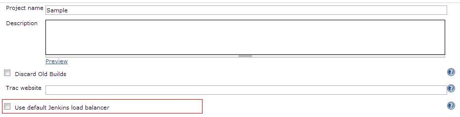

This plugin overrides the default Load Balancer behavior and assigns
jobs to nodes with the least load

[[LeastLoadPlugin-Overview]]
== Overview

By default Jenkins tries to allocate a jobs to the last node is was
executed on. This can result in nodes being left idle while other nodes
are overloaded. This plugin overrides the default behavior and assigns
jobs to nodes with the least load. The least load is defined as a node
that is idle or the one with the most available executors. It is
intended to provide the same functionality as the commercial plugin
http://jenkins-enterprise.cloudbees.com/docs/user-guide-bundle/even-scheduler.html[Even
Scheduler Plugin]

[[LeastLoadPlugin-Configuration]]
== Configuration

The plugin requires no global configuration it will just replace the
default load balancer at startup. Jobs can be configured to utilize the
default Jenkins load balancer if required.

[.confluence-embedded-file-wrapper]##

[[LeastLoadPlugin-Changelog]]
== Changelog

[[LeastLoadPlugin-Version2.0.1]]
=== Version 2.0.1

* Fix cast exception

[[LeastLoadPlugin-Version2.0.0]]
=== Version 2.0.0

* Bumped to latest version of 2.x Jenkins

[[LeastLoadPlugin-Version1.1.1]]
=== Version 1.1.1

* Fix cast exception

[[LeastLoadPlugin-Version1.1.0]]
=== Version 1.1.0

* Added pipeline support - Courtesy of https://github.com/maksonlee
* Bumped to latest versions of 1.x Jenkins

[[LeastLoadPlugin-Version1.0.3]]
=== Version 1.0.3

* Reduced required core version to 1.480

[[LeastLoadPlugin-Version1.0.2]]
=== Version 1.0.2

* Improve load balancing when jobs called from multi-configuration
project
https://issues.jenkins-ci.org/browse/JENKINS-18323[JENKINS-18323]

[[LeastLoadPlugin-Version1.0.1]]
=== Version 1.0.1

* Fixed issue with old job configurations defaulting back to default
Load Balancer

[[LeastLoadPlugin-Version1.0.0]]
=== Version 1.0.0

* Initial Release
