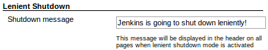
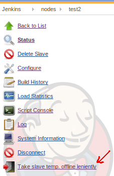

[[Lenientshutdownplugin-Features]]
== Features

This plugin lets you put Jenkins in shutdown mode but still allow any
downstream builds of those currently running to also complete. Similar
functionality for taking nodes temporarily offline.

[[Lenientshutdownplugin-Globallenientshutdown]]
=== Global lenient shutdown

[[Lenientshutdownplugin-Activation]]
==== Activation

The global lenient shutdown mode for taking the Jenkins master offline
is activated under "Manage Jenkins":

[.confluence-embedded-file-wrapper]##

[[Lenientshutdownplugin-Pagedecorator]]
==== Page decorator

After activating global lenient shutdown, all pages get the following
header:

[.confluence-embedded-file-wrapper]##

This message can be configured in the Jenkins global settings page:

[.confluence-embedded-file-wrapper]##

[[Lenientshutdownplugin-Lenientofflineforslaves]]
=== Lenient offline for slaves

A single slave can be taken offline leniently (letting slave specific
downstream builds finish) by going to the node's page and pressing the
button:

[.confluence-embedded-file-wrapper]##

[[Lenientshutdownplugin-Changelog]]
== Changelog

[[Lenientshutdownplugin-Version1.1.1(releasedMar072017)]]
=== Version 1.1.1 (released Mar 07 2017)

* Fixed a problem when security is enabled.
_(https://github.com/jenkinsci/lenient-shutdown-plugin/pull/4[pr #4])_

[[Lenientshutdownplugin-Version1.1.0(releasedNov282016)]]
=== Version 1.1.0 (released Nov 28 2016)

* Switch the required version of Jenkins 1.601; this allows to track the
Upstream causes via the queue id and not by matching the project names.
_(https://github.com/jenkinsci/lenient-shutdown-plugin/pull/2[pr #2])_
* Allow all items in the queue to finish, not just those that have been
started by an upstream project.
_(https://github.com/jenkinsci/lenient-shutdown-plugin/pull/2[pr #2])_
* You can maintain a list of white listed projects that are allowed to
run even though lenient shutdown is active.
_(https://github.com/jenkinsci/lenient-shutdown-plugin/pull/2[pr #2])_

[[Lenientshutdownplugin-Version1.0.0(releasedJul112014)]]
=== Version 1.0.0 (released Jul 11 2014)

Initial release
