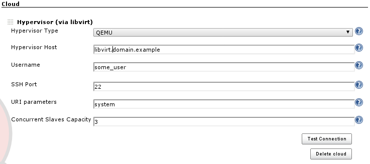
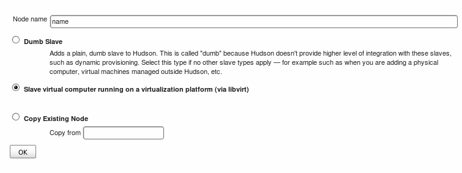
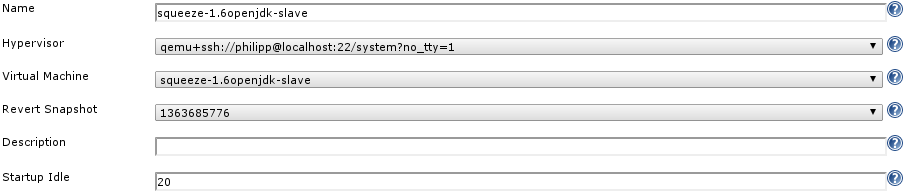

[.conf-macro .output-inline]# #

[.aui-icon .aui-icon-small .aui-iconfont-error .confluence-information-macro-icon]##

The current version of this plugin may not be safe to use. Please review
the following warnings before use:

* https://jenkins.io/security/advisory/2019-10-23/#SECURITY-1014%20(2)[Users
with Overall/Read access could enumerate credential IDs]
* https://jenkins.io/security/advisory/2019-10-23/#SECURITY-1014%20(1)[CSRF
vulnerability and missing permission checks allowed capturing
credentials]

Add Libvirt Hypervisor slave support to Jenkins

[.aui-icon .aui-icon-small .aui-iconfont-info .confluence-information-macro-icon]#
#

libvirt-slaves 1.8 uses a newer libvirt java binding. If you are
upgrading from an earlier version of this plugin, you will have to
reconfigure your hypervisor settings and thus also all
libvirt-controlled nodes! +
The least painful approach (especially for larger setups) is to properly
set up the Hypervisor first, followed by editing each node, pointing it
to the reconfigured Hypervisor. It is not necessary to delete node
configurations!

[[LibvirtSlavesPlugin-Description]]
== Description

This plugin for Jenkins CI adds a way to control guest domains hosted on
Xen or QEMU/KVM. You configure a Jenkins Slave, selecting the guest
domain and hypervisor. When you need to build a job on a specific Slave,
its guest domain is started, then the job is run. When the build process
is finished, the guest domain is shut down, ready to be used again as
required.

[[LibvirtSlavesPlugin-Requirements]]
== Requirements

For a communication with Hypervisors you need to install *libvirt*
library on Jenkins machine. This plugin comes with libvirt java binding,
but is just an interface to the "real" C libvirt library. In your
distribution you should have a package to install libvirt (ie _yum
install libvirt_ on RedHat/Fedora/Centos distributions).

[[LibvirtSlavesPlugin-Configuration]]
== Configuration

[[LibvirtSlavesPlugin-Hypervisor]]
=== Hypervisor

The first step is the Hypervisor configuration. To create a new
Hypervisor you need to add a new "Cloud" in the Jenkins "Manage Jenkins"
menu.

 
[.confluence-embedded-file-wrapper]##

The required parameters to setup are:

* *Hypervisor Type*: QEMU / XEN to respect the Hypervisor you have in
your system
* *Hypervisor Host*: Hostname or IP address to contact your hypervisor
* *Username*: username to use for connection.
* *Port*: ssh port, if in your hypervisor machine is different than 22
* *URI parameter*: by default xen and kvm expose the control API
using _system_. If, for any reasons, you don't have this default value
or need to provide further parameters, you can set those here
* *Concurrent Slaves Capacity*: If you are running a setup where slaves
are being shut down once they are idling and you want to control how
many concurrent slave can be run by Jenkins on the particular
hypervisor, you can set this threshold here. Providing 0, the default
value, disables the threshold. Please note that a threshold will not
fail build jobs, Jenkins will simply reissue the slave commissioning
once the hypervisor is again running below its threshold, thus delaying
the start up of slaves

The connection to Hypervisor will be done using ssh, so you don't need
to setup libvirt, exposing your services on tcp that could be a security
hole in your infrastructure. Here an example of connection string will
be used by Libvirt Slaves Plugin to create a connection with the
hypervisor:

....
 xen+ssh://username@hostname:port/system
....

you can test you connection typing, from your Jenkins Server:

....
 virsh connect xen+ssh://username@hostname:port/system
....

An important thing is the RSA public key exchange between Jenkins Server
and Hypervisor Machine: you need to add to .ssh/known_hosts file the
rsa.pub file of your jenkins user. This because, for an actual
limitation in libvirt java library, it's impossible to provide via code
the ssh password, that means Jenkins could not establish a connection if
password request will be prompted.

To verify all you parameters you can click on _Test Connection_ button
and check the output reported.

[[LibvirtSlavesPlugin-Slaves]]
=== Slaves

Now you can setup your nodes in Jenkins and use them to build your
projects.

[.confluence-embedded-file-wrapper]##

Once the node is created, you'll see the configuration page as shown
below:

[.confluence-embedded-file-wrapper]##

Here you can configure the following details:

* *Hypervisor*: here you select one of the clouds that you configuration
at the central Configure Jenkins page
* *Virtual Machine*: select one of the virtual machines that you want to
use as a slave
* *Revert Snapshot*: optionally you can select an existing snapshot of
the virtual machine that you want the slave to be reverted to once it is
being shut down
* *Startup Idle*: this optional value (default is 60) allows you specify
an idle timer in seconds. Once the virtual machine has been started,
Jenkins will wait that long before starting the actual slave service on
the virtual host. If your hypervisor is super quick, set a low value, if
it takes a while to get that VM up, increase the timer.

[[LibvirtSlavesPlugin-ChangeLog]]
== Change Log

[[LibvirtSlavesPlugin-Version1.8.5(Apr01,2015)]]
=== Version 1.8.5 (Apr 01, 2015)

* Fix https://issues.jenkins-ci.org/browse/JENKINS-12523[JENKINS-12523]:
Could not initialize class org.libvirt.Connect

[[LibvirtSlavesPlugin-Version1.8.1(Mar21,2013)]]
=== Version 1.8.1 (Mar 21, 2013)

* Increased robustness of the hypervisor session handling: explicit
disconnect upon Jenkins shutdown, auto-reconnect upon libvirtd restarts
* Various minor improvements to the logging, chattiness decreased

[[LibvirtSlavesPlugin-Version1.8(Mar20,2013)]]
=== Version 1.8 (Mar 20, 2013)

* Fix https://issues.jenkins-ci.org/browse/JENKINS-16889[JENKINS-16889]:
Fixed Hypervisor session management
* Feature https://issues.jenkins-ci.org/browse/JENKINS-17293[JENKINS-17293]:
Concurrent slave threshold, configurable per Hypervisor (Big thanks to
Bryan Dagnin for his contribution!)
* Feature https://issues.jenkins-ci.org/browse/JENKINS-16583[JENKINS-16583]:
Support for libvirt snapshot mechanism
* Feature https://issues.jenkins-ci.org/browse/JENKINS-16581[JENKINS-16581]:
Modernized maven groupId to org.jenkins-ci.plugins
* Various minor improvements, mostly help/documentation related
* Latest libvirt java binding. Note: upgrading users will have to
reconfigure their hypervisor and node settings!

[[LibvirtSlavesPlugin-Version1.7(Jan31,2013)]]
=== Version 1.7 (Jan 31, 2013)

* Fixed https://issues.jenkins-ci.org/browse/JENKINS-14617[JENKINS-14617]
* Fixed https://issues.jenkins-ci.org/browse/JENKINS-14468[JENKINS-14468]
* Fixed https://issues.jenkins-ci.org/browse/JENKINS-12523[JENKINS-12523]
* Fixed https://issues.jenkins-ci.org/browse/JENKINS-9471[JENKINS-9471]
* Improved JavaDoc
* Various minor improvements
* Bumped required core to 1.420

[[LibvirtSlavesPlugin-Version1.6(Apr2,2010)]]
=== Version 1.6 (Apr 2, 2010)

* Fixed problems with Libvirt on RedHat / Centos operating System
* Added control for machine without libvirt library installed

[[LibvirtSlavesPlugin-Version1.5(Mar30,2010)]]
=== Version 1.5 (Mar 30, 2010)

* Fixed problem on Null object after Hypervisor reconnection

[[LibvirtSlavesPlugin-Version1.4(Mar25,2010)]]
=== Version 1.4 (Mar 25, 2010)

* Improvements in Hypervisor connection using libvirt
* Added a missing help file

[[LibvirtSlavesPlugin-Version1.3(Mar20,2010)]]
=== Version 1.3 (Mar 20, 2010)

* Fixed problem with hypervisor reconnection after Hudson restart
* Add a wait time before launching slave agent

[[LibvirtSlavesPlugin-Version1.2(Mar10,2010)]]
=== Version 1.2 (Mar 10, 2010)

* Fixed problem in contextual help files-
* Catch exception on machine without libvirt installed

[[LibvirtSlavesPlugin-Version1.1(Mar08,2010)]]
=== Version 1.1 (Mar 08, 2010)

* No change in sources. A version just to fix a problem during release
process.

[[LibvirtSlavesPlugin-Version1.0(Mar07,2010)]]
=== Version 1.0 (Mar 07, 2010)

* First version published
