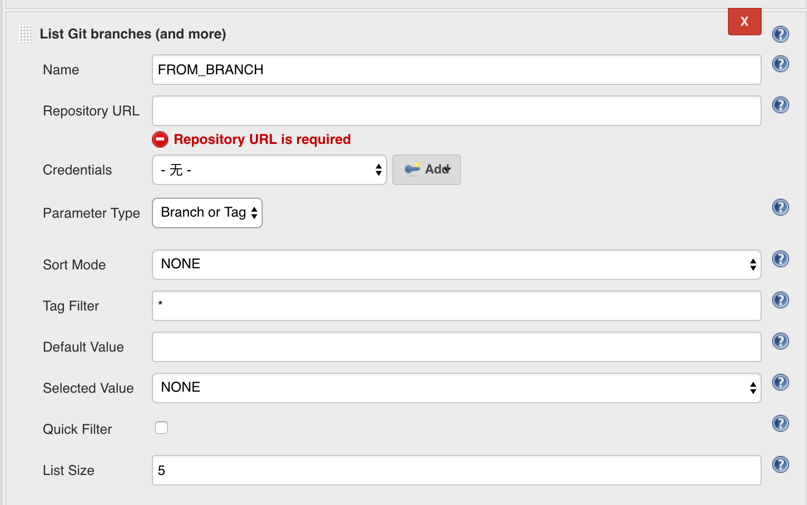
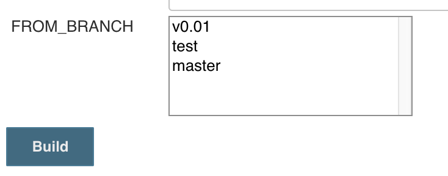

[.conf-macro .output-inline]#This plugin adds ability to choose
branches, tags or revisions from git repository configured as a
parameter in your builds. Unlike
https://wiki.jenkins.io/display/JENKINS/Git+Parameter+Plugin[Git
Parameter Plugin], this plugin requires a git repository defined instead
of reading GIT SCM configuration from your projects#

[[ListGitBranchesParameterPlugin-Quickusageguide]]
== Quick usage guide

* Install the plugin
* Go to your project, click *_This project is parameterized,_* click
*Add Parameter,* choose **_List Git Branches (and more) +
_**[.confluence-embedded-file-wrapper .confluence-embedded-manual-size]#### +
Brief description of the named fields: +
** *Name *- Name for the parameter, i.e. *FROM_BRANCH*
** *Repository URL* - git repository URL, i.e.
ssh://git@github.com:jenkinsci/list-git-branches-parameter-plugin.git
** *Credentials *- git credentials stored in jenkins
* Start a build and use the parameter +
[.confluence-embedded-file-wrapper .confluence-embedded-manual-size]##

[[ListGitBranchesParameterPlugin-Changelog]]
== *Changelog*

[[ListGitBranchesParameterPlugin-Release0.0.7(2019-4-25)]]
=== Release 0.0.7(2019-4-25)

* Fix some bugs

[[ListGitBranchesParameterPlugin-Release0.0.3(2019-1-3)]]
=== Release 0.0.3 (2019-1-3)

* Branch Name starts with "origin/"

[[ListGitBranchesParameterPlugin-Release0.0.1(2018-12-12)]]
=== Release 0.0.1 (2018-12-12)

* Initial release

* +
*
