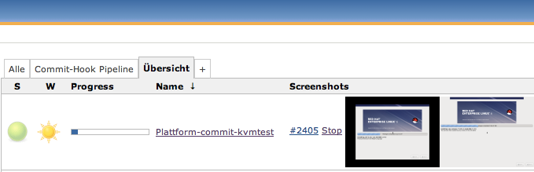
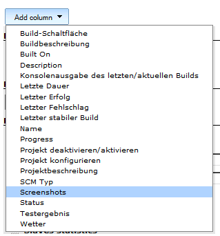
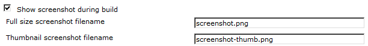
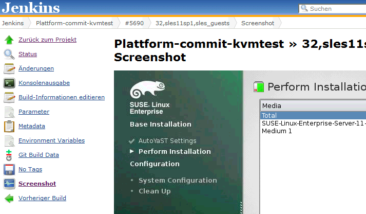

Show live screenshots of running jobs in the job list. 

 +

This plugin adds a column to the job list view to show a thumbnail of a
screenshot. Moreover, an "Screenshot" action is added to each build
which leads to a page with the fullsize screenshot.

The screenshot images are read from the workspace of a build, either
stored as png or jpeg files. These files must be updated by the running
build. The refresh mechanism of the Jenkins user interface makes sure
that you see an up to date screenshot on screen.

By default, the files are called screenshot.png and
screenshot-thumb.png. But, this can easily changed in the build wrapper
configuration of a job.

[[LiveScreenshotPlugin-]]
== [.confluence-embedded-file-wrapper]##

Add a column to the current view:

[.confluence-embedded-file-wrapper]##

And activate the screenshots for a job:

[.confluence-embedded-file-wrapper]##

The shown filenames are the default. Adapt your job to update these file
on a regular basis. If you are running kvm inside the job, create these
files using virsh or the kvm console every 5 seconds. The thumbnail file
should be small, like in the screenshot above. The file screenshot.png
is used for the full size screenshot action for a job:

[.confluence-embedded-file-wrapper]## +
 

The screenshot is also archived as an artefact.

[[LiveScreenshotPlugin-MajorKnownIssues]]
== Major Known Issues

[[LiveScreenshotPlugin-VersionHistory]]
== Version History

[[LiveScreenshotPlugin-v1.4.5]]
=== v1.4.5

* Fix non-matrix build job screenshot display
** don't show screenshots twice of non-matrix builds (Fixes
https://issues.jenkins-ci.org/browse/JENKINS-20801[JENKINS-20801])
** show stop link also for non-matrix jobs

[[LiveScreenshotPlugin-v1.4.4]]
=== *v1.4.4*

* Update meta information about the plugin. Now it is visible in the
update center.

[[LiveScreenshotPlugin-v1.4.3]]
=== v1.4.3

* Move plugin into org.jenkins.plugins namespace 

[[LiveScreenshotPlugin-v1.4.2]]
=== v1.4.2

* First version hosted by the jenkinsci project on github
