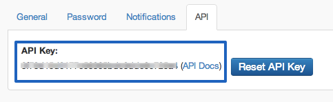
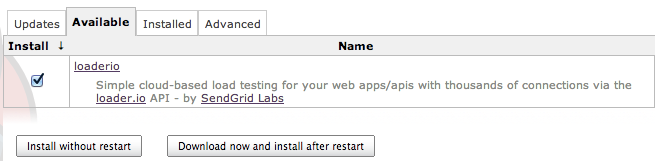
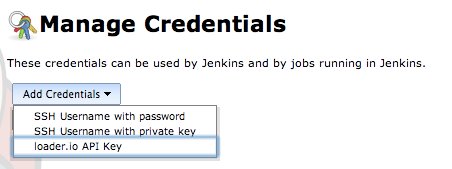
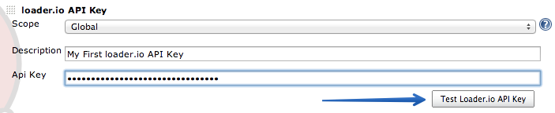
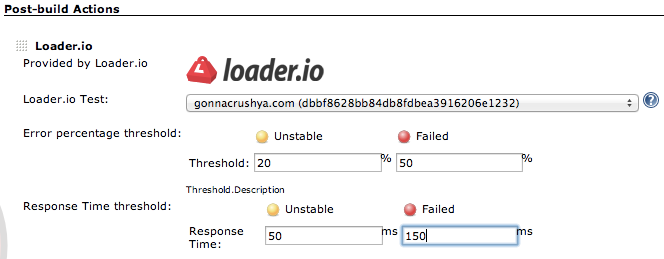
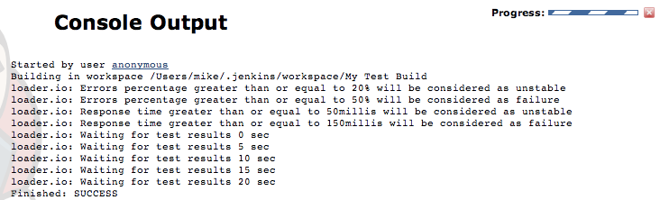
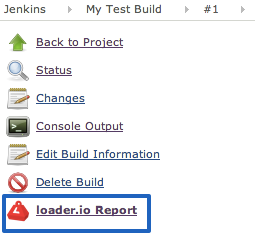
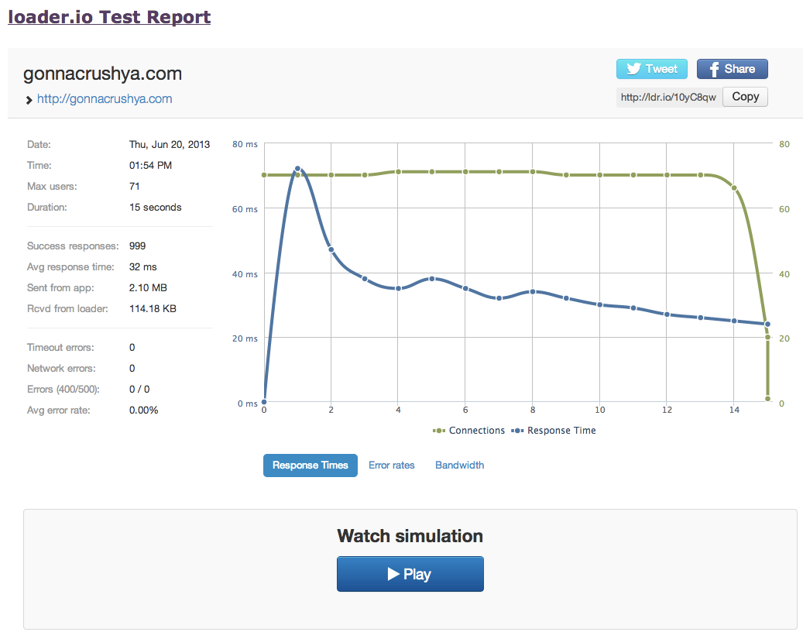

[[loaderio-loader.ioPlugin]]
== loader.io Plugin

Simple cloud-based load testing for your web apps/apis with thousands of
connections via the http://loader.io/[loader.io] API - by
http://labs.sendgrid.com/[SendGrid Labs]

[[loaderio-Installation]]
== Installation

{empty}1) Make sure you have all the latest plugins available: visit
/pluginManager/advanced, select 'check now'

{empty}2) Get your free loader.io account for load testing:
http://loader.io/[http://loader.io]

{empty}3) Make note of your loader.io API key: http://loader.io/settings

[.confluence-embedded-file-wrapper]## +
4) Goto Manage Jenkins > Manage Plugins > Available & locate the
loader.io plugin and install it

[.confluence-embedded-file-wrapper]##

{empty}5) Next, you need to add your loader.io API key to the stored
credentials (Manage Jenkins > Manage Credentials)

[.confluence-embedded-file-wrapper]##

Test your API key, Once verified, click Save.

[.confluence-embedded-file-wrapper]##

[[loaderio-Usingloader.ioforpostbuildloadtests]]
== Using loader.io for post build load tests

* Note: You'll need to first complete a successful test using your
loader.io acct (http://loader.io/[http://loader.io]), once completed
your load test config will be available in the plugin

{empty}1) In your build config, select the Post-build action "loader.io"

{empty}2) Select your test template, enter both the Error % & Response
time thresholds. Then click Save.

[.confluence-embedded-file-wrapper]##

[[loaderio-Viewingyourloader.ioloadtestresults]]
== Viewing your loader.io load test results

When load tests are running during your Post-build actions you can view
the Console output and monitor the progress
[.confluence-embedded-file-wrapper]##

When your build is complete, you can view the report of the loader.io
load test

[.confluence-embedded-file-wrapper]##

[.confluence-embedded-file-wrapper]##

[[loaderio-Changelog:]]
== *Changelog:*

[[loaderio-v1.0]]
=== *v1.0*

* Initial release
