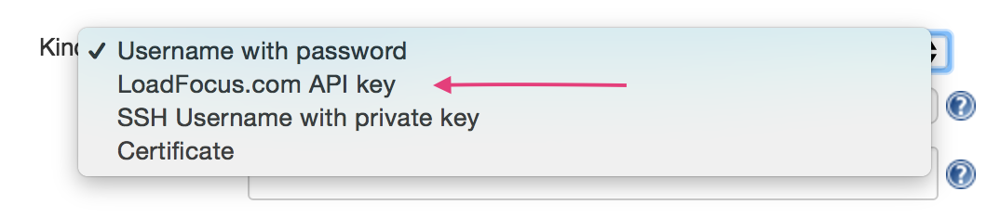
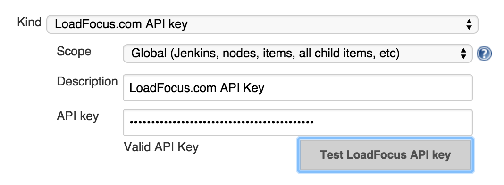
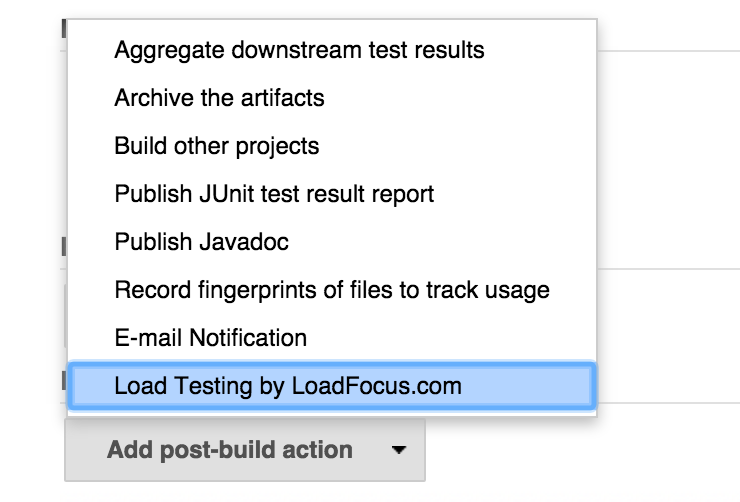
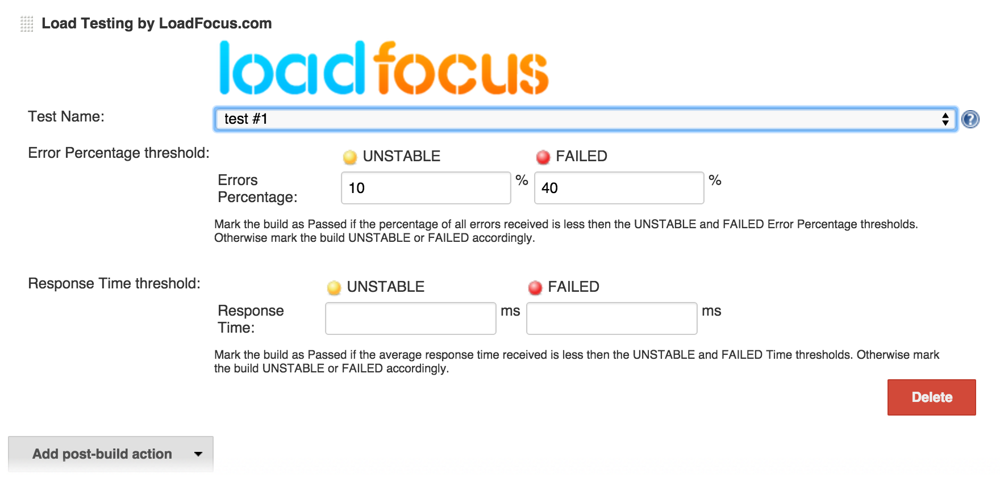
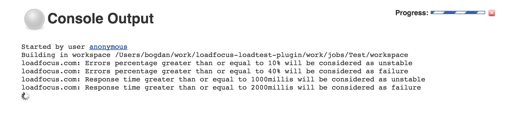
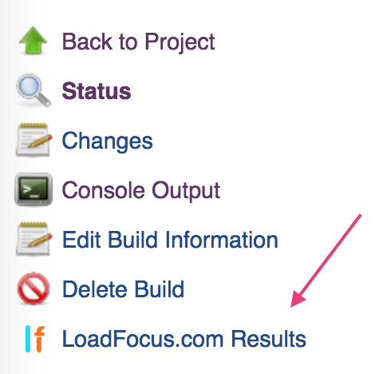
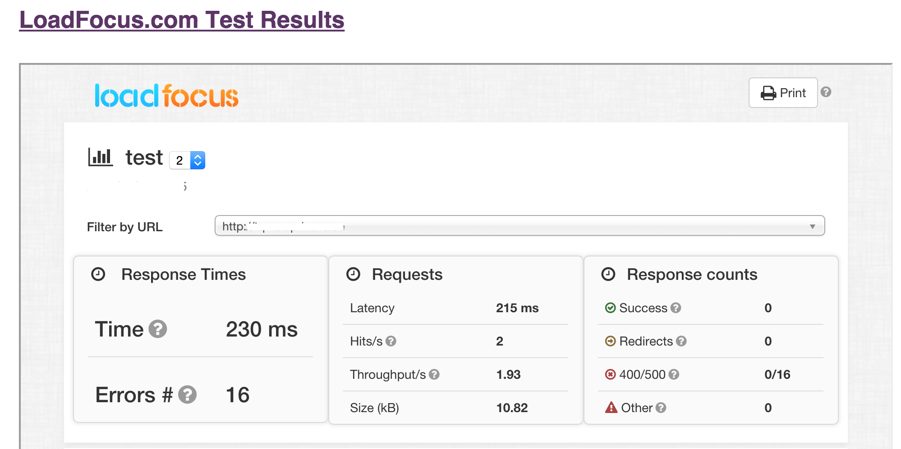
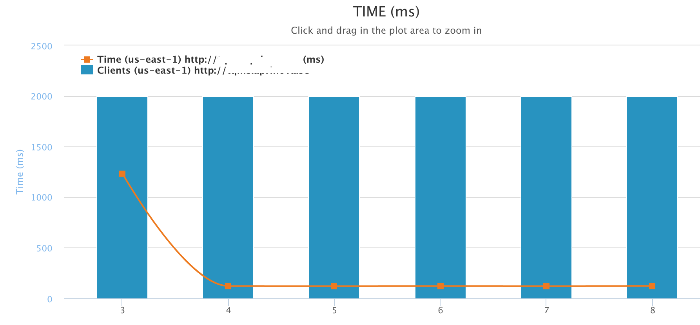

[[LoadFocusLoadTestingPlugin-LoadFocus.comLoadTestingPlugin]]
== LoadFocus.com Load Testing Plugin

Easy cloud load testing for your websites and APIs with thousands of
concurrent users from multiple locations via
https://loadfocus.com/[LoadFocus.com]'s APIs.

[.aui-icon .aui-icon-small .aui-iconfont-warning .confluence-information-macro-icon]#
#

Starting in versions 1.609.1.

[[LoadFocusLoadTestingPlugin-InstallationSteps:]]
=== Installation Steps:

{empty}1. Create your load testing account on
https://loadfocus.com/[https://loadfocus.com] +
2. Copy your LoadFocus.com API key from https://loadfocus.com/account +
3. Go to Jenkins Dashboard and click go to Manage Jenkins > Manage
Plugins > Available +
4. Locate and install LoadFocus Load Test plugin +
5. Go to Manage Jenkins > Manage Credentials and add your LoadFocus.com
API key to the stored credentials

[.confluence-embedded-file-wrapper .confluence-embedded-manual-size]##

{empty}6. Verify your API key, if API key is valid, click Save

[.confluence-embedded-file-wrapper .confluence-embedded-manual-size]##

[[LoadFocusLoadTestingPlugin-HowtouseLoadFocusLoadTestingPluginforPost-buildloadtests:]]
=== How to use LoadFocus Load Testing Plugin for Post-build load tests:

* Note: Completed load test using your LoadFocus.com account will be
available in the plugin

{empty}1. Click on the *Configure* option for your Jenkins job. +
2. In the Post build portion, look for the *Load Testing by
LoadFocus.com* option and select the checkbox. See the screen shot
below:

[.confluence-embedded-file-wrapper .confluence-embedded-manual-size]##

{empty}3. Choose load test, enter both the *Error %* and *Response Time*
thresholds. Then click *Save*.

[.confluence-embedded-file-wrapper .confluence-embedded-manual-size]##

[[LoadFocusLoadTestingPlugin-ViewingyourLoadFocus.comloadtestresults]]
=== Viewing your LoadFocus.com load test results

View the Console output and monitor the progress of your running load
tests during job's Post build actions.

[.confluence-embedded-file-wrapper .confluence-embedded-manual-size]##

View the complete load test report of the LoadFocus.com when the job has
finished.

[.confluence-embedded-file-wrapper .confluence-embedded-manual-size]##

[.confluence-embedded-file-wrapper .confluence-embedded-manual-size]##

[.confluence-embedded-file-wrapper .confluence-embedded-manual-size]##

[[LoadFocusLoadTestingPlugin-VersionHistory]]
== Version History

[[LoadFocusLoadTestingPlugin-Version1.0(February17th,2016)]]
=== *Version 1.0* (February 17th, 2016)

* Initial release from LoadFocus Load Testing plugin
