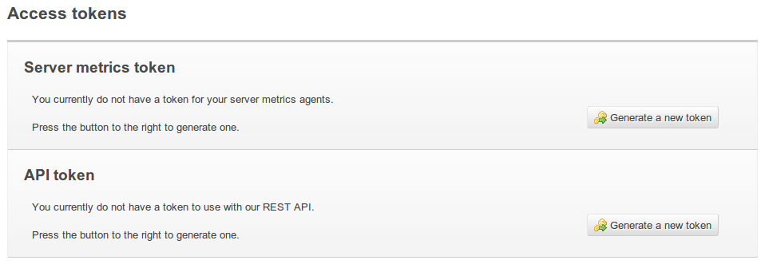
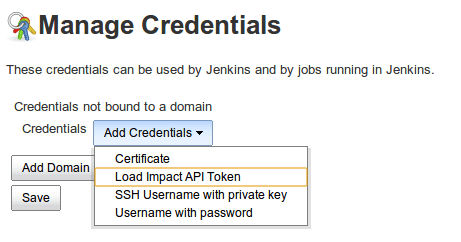
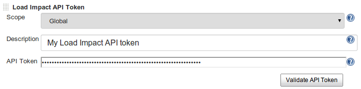
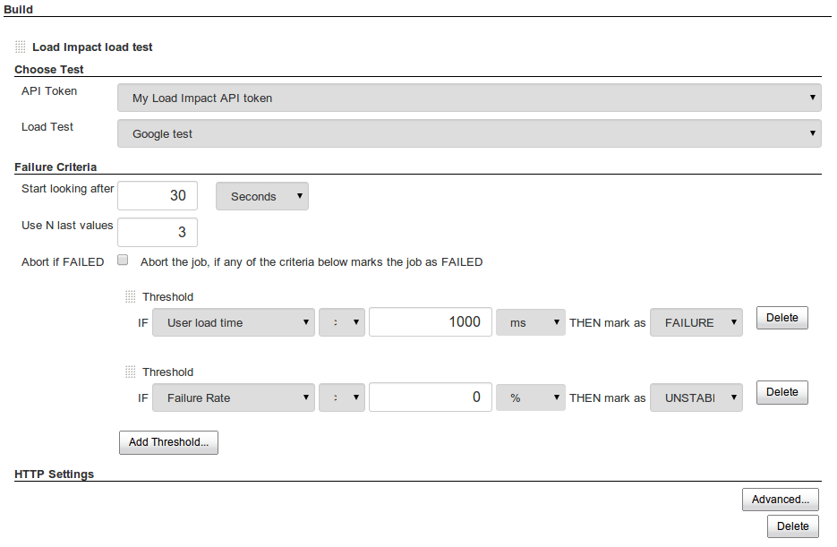
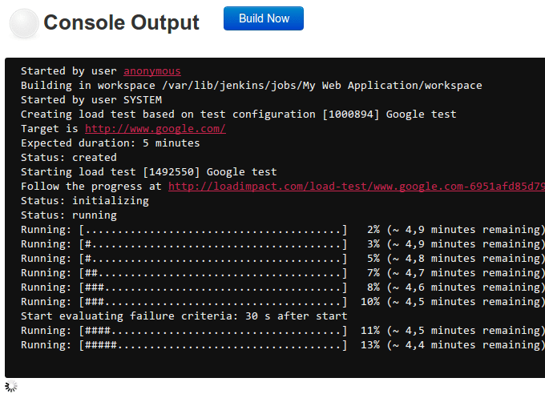
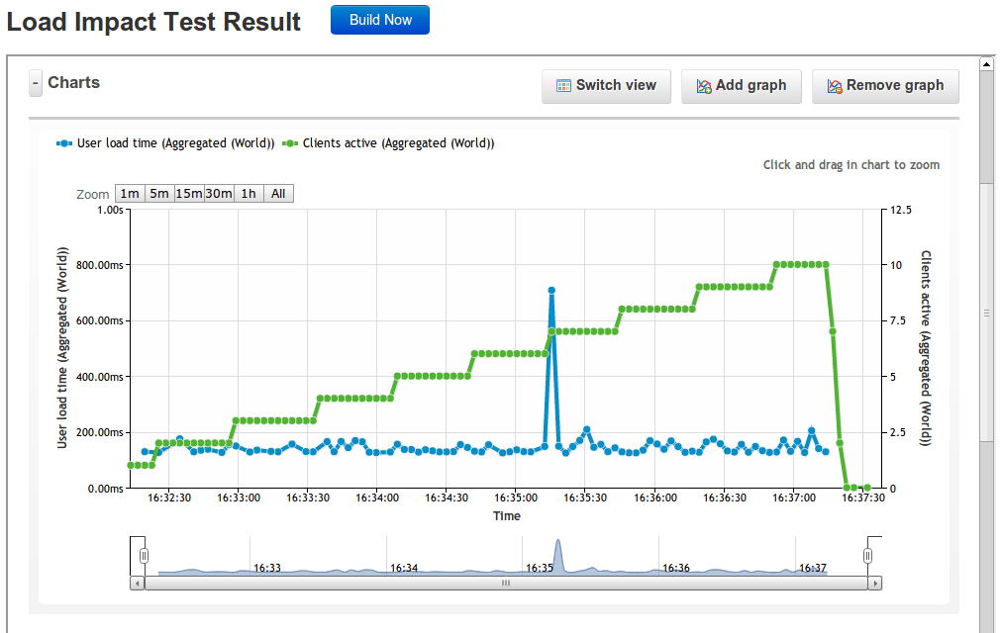

This plugin allows you to execute http://loadimpact.com/[Load Impact]
load tests from Jenkins, and mark a build as failed if it doesn't meet
your performance criteria

[[LoadImpactPlugin-Prerequisites]]
== Prerequisites

* You need Jenkins 1.535 or higher to use the Load Impact plugin
* You will also need to have the
https://wiki.jenkins-ci.org/display/JENKINS/Credentials+Plugin[Credentials]
plugin installed
* You need to have a Load Impact user account (a free account will work)
- register one https://loadimpact.com/account/register[here]

[[LoadImpactPlugin-Installationinstructions]]
== Installation instructions

[[LoadImpactPlugin-1.GenerateaLoadImpactAPItoken]]
=== 1. Generate a Load Impact API token

If you don't already have one. You do this by logging into your Load
Impact account and going to the https://loadimpact.com/account/[Account]
page on loadimpact.com, where you will find this section:

[.confluence-embedded-file-wrapper]##

Click the button to generate a new token, then copy it to the clipboard.

[[LoadImpactPlugin-2.AddtheAPItokentoyour"credentials"inJenkins]]
=== 2. Add the API token to your "credentials" in Jenkins

Go to the Credentials management page and choose "Add Credentials" and
then select "Load Impact API Token" from the drop-down menu:

[.confluence-embedded-file-wrapper]##

Then choose a name for the token and paste the actual token string into
the "API token" field:

[.confluence-embedded-file-wrapper]##

[[LoadImpactPlugin-3.Starttesting!]]
=== 3. Start testing!

. *https://loadimpact.com/test/config/create[Create a Load Impact test
configuration]* *(if you don't already have one)*
. *Add the test as a build- or post-build step in Jenkins (both are
supported):*

[.confluence-embedded-file-wrapper]##

*You get information about test progress and pass/unstable/fail criteria
analyis through the test:*

[.confluence-embedded-file-wrapper]##

*After the build step has completed you can view the test results from
inside of Jenkins:*

[.confluence-embedded-file-wrapper]##
