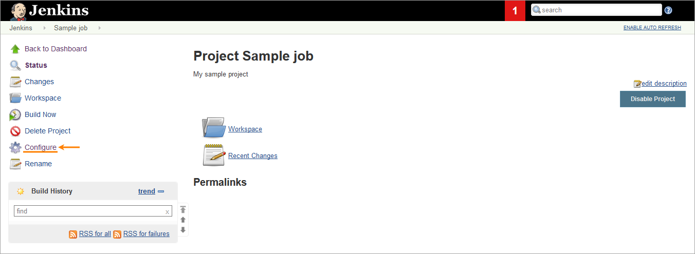
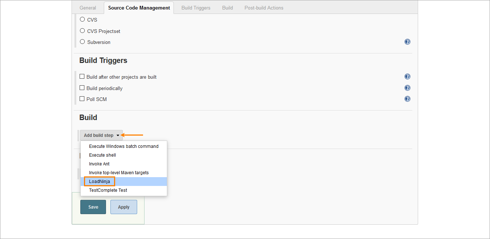
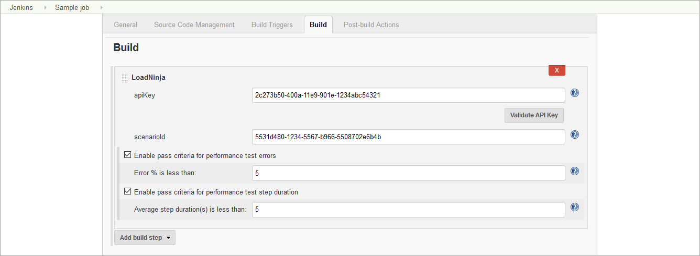
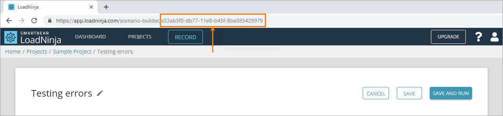
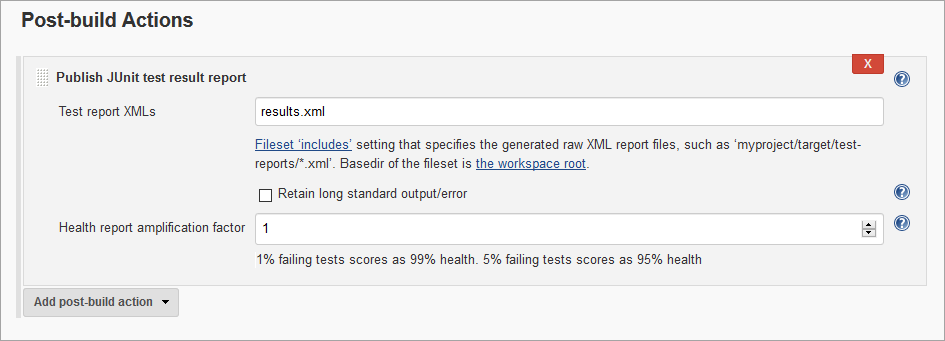

The LoadNinja Load Testing Plugin allows
integrating [.conf-macro .output-inline]#https://loadninja.com/[LoadNinja ]tests
in your Jenkins builds.#

[[LoadNinjaPlugin-WhatisLoadNinja?]]
== What is LoadNinja?

LoadNinja is a cloud-based load testing and performance testing platform
for web applications. It helps developers, QA teams, and performance
engineers check if their web servers sustain a massive load and if the
servers are robust and scalable.

[[LoadNinjaPlugin-Installplugin]]
== Install plugin

Install this plugin in the Jenkins plugin manager.

____
*Tip*: To post test results as Zephyr items, also install
the https://plugins.jenkins.io/zephyr-for-jira-test-management[Z]ephyr
for JIRA Test Management plugin.
____

[[LoadNinjaPlugin-AddLoadNinjateststoyourbuilds]]
== Add LoadNinja tests to your builds

To run a LoadNinja test as part of your build, configure the needed
build:

. In Jenkins, select a job and click *Configure*. +
[.confluence-embedded-file-wrapper .confluence-embedded-manual-size]##
. In the **[.aqUIDefinition]#Build#** section,
click **[.aqUIDefinition]#Add build step > LoadNinja#**. This step is
added by the LoadNinja Load Testing Plugin. +
[.confluence-embedded-file-wrapper .confluence-embedded-manual-size]## +
. Specify the LoadNinja settings for this build: +
[.confluence-embedded-file-wrapper .confluence-embedded-manual-size]#### +
+
[cols=",",options="header",]
|===
|Option |Description
|[.aqUIDefinition]#apiKey# |The unique LoadNinja API key of your account
that is available in the LoadNinja settings dialog.  +
After you enter the key, click [.aqUIDefinition]#Validate API key# to
check whether Jenkins can access LoadNinja using the key.

|[.aqUIDefinition]##scenarioId##  a|
The unique ID of
the https://staging-support.smartbear.com/loadninja/docs/scenarios/index.html[load
test scenario] you want to run. You can get it from
the https://staging-support.smartbear.com/loadninja/docs/integrations/api.html[API] or
scenario URL: +
[.confluence-embedded-file-wrapper .confluence-embedded-manual-size]## +

|===
. (__Optional__) To command Jenkins to mark a test as passed only if the
percentage of errors in this test is less than some value, select
the **[.aqUIDefinition]#Enable pass criteria for performance test
errors#**** **check box and specify the desired value in the edit box
that appears.
. (__Optional__) To command Jenkins to mark a test as passed only if the
average duration of a test step during the run is less than some value
(in seconds), select the **[.aqUIDefinition]#Enable pass criteria for
performance test step duration#** check box and specify the desired
value in the edit box that appears. +
. In the [.aqUIDefinition]##Post-build Actions## section,
click **[.aqUIDefinition]#Add post-build
action #**[.aqUIDefinition]##and select *Publish JUnit test result
report* to receive a [.aqTerm]#JUnit# XML report. ## Make sure to
specify the name of the target file for reports in
the **[.aqUIDefinition]#Test report XMLs# **field.  +
[.confluence-embedded-file-wrapper .confluence-embedded-manual-size]##
+
*Tip*: To publish the load test results as a Zephyr item in JIRA,
configure the Zephyr plugin and select the corresponding post-build
action in Jenkins. To learn more, see the LoadNinja documentation.
. Click *Save*.

[[LoadNinjaPlugin-Usagenotes]]
== Usage notes

* When a LoadNinja test is running, the plugin posts the current status
of the test run to the Jenkins console output every 1 minute.
