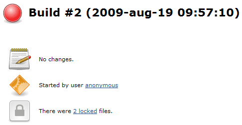
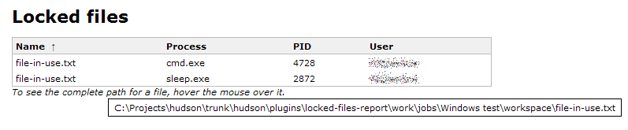

This debug plugin fails a build if there are locked files in the
workspace at the begining or end of a build. +
This plugin is only thought to be used when figuring out why sometimes a
SCM (or any other file) action fails as it can not delete files in the
workspace.

[[LockedFilesReportPlugin-Usage]]
== Usage

Enable it in the project configuration and it will at begining and end
of the build check if there are any locked files in the workspace.

If there are any locked files, a short summary will be displayed in the
Build page. +
[.confluence-embedded-file-wrapper .image-center-wrapper]##

Clicking on the Locked files page, will show a more detailed list of
what files that was locked and by whatprocess. +
[.confluence-embedded-file-wrapper .image-center-wrapper]##

[[LockedFilesReportPlugin-Windowsnote]]
=== Windows note

To be able to use the plugin on Windows, you must install
http://technet.microsoft.com/en-us/sysinternals/bb896655.aspx[Handle] on
all nodes that is going to use the plugin. Easiest is to add the
`+handle.exe+` path to the `+PATH+` environmental variable, otherwise
you must specify the path in System configuration.

*handle.exe* pops up an EULA dialogue the first time you run it;  if you
are running Hudson as a Windows service as a user other than yourself,
then you will have to run the exe with "run as..." the service user to
accept the EULA once, otherwise you will find that *handle.exe* just
hangs when run from hudson.

[[LockedFilesReportPlugin-Changelog]]
== Changelog

[[LockedFilesReportPlugin-1.6(3rdfeb2012)]]
=== 1.6 (3rd feb 2012)

Thanks to hokatichenci for fixing the below issues in a pull request.

* Handle.exe fixes - The plugin always accepts the EULA right now .
(https://issues.jenkins-ci.org/browse/JENKINS-8467[JENKINS-8467])
* Handle.exe fixes - Added support for the new output format
(https://issues.jenkins-ci.org/browse/JENKINS-12344[JENKINS-12344])

[[LockedFilesReportPlugin-1.4-1.5(16thnov2011)]]
=== 1.4 - 1.5 (16th nov 2011)

* Fixed so the plugin can be used in Matrix builds.
(https://issues.jenkins-ci.org/browse/JENKINS-9904[JENKINS-9904])
* Added a timeout for joining on the tool process, this should fix
problems with the handle.exe tool not finishing properly.
(https://issues.jenkins-ci.org/browse/JENKINS-4797[JENKINS-4797])
* Updated plugin so it will copy the output from the tool to the console
of the build, so it is possible to see if the tool actually found any
locked files.
* Updated source code so the plugin works with a Java 5.0 JRE.

[[LockedFilesReportPlugin-1.3(5thJan2011)]]
=== 1.3 (5th Jan 2011)

* Fixed a parsing problem when the workspace folder was locked.
(https://issues.jenkins-ci.org/browse/JENKINS-8323[JENKINS-8323])

[[LockedFilesReportPlugin-1.1]]
=== 1.1

* Fixed a NPE bug.
(https://issues.jenkins-ci.org/browse/JENKINS-4606[JENKINS-4606])

[[LockedFilesReportPlugin-1.0]]
=== 1.0

* Added support for
http://technet.microsoft.com/en-us/sysinternals/bb896655.aspx[Handle] on
windows.
* Added support for `+lsof+` on *nix.
