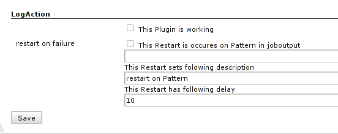

Centralized configuration to restart jobs when a pattern occurs in the
job console output.

[[CentralizedJob(Re)ActionPlugin-Intention]]
== Intention

To reschedule build in a centralized way when a predefined pattern exist
in the job output

[[CentralizedJob(Re)ActionPlugin-Configuration]]
== Configuration

at `+http://<yourHudson>/configure+`

By default this plugin is *not* active. +
[.confluence-embedded-file-wrapper]##

[[CentralizedJob(Re)ActionPlugin-ChangeLog]]
== Change Log

[[CentralizedJob(Re)ActionPlugin-Version1.2(Dec9,2011)]]
=== Version 1.2 (Dec 9, 2011)

* Updated requiredCore
https://issues.jenkins-ci.org/browse/JENKINS-12060[JENKINS-12060]

[[CentralizedJob(Re)ActionPlugin-Version1.1(Feb5,2010)]]
=== Version 1.1 (Feb 5, 2010)

* Update code for more recent Hudson
* Some text updates

[[CentralizedJob(Re)ActionPlugin-Version1.0(Apr2,2009)]]
=== Version 1.0 (Apr 2, 2009)

* Initial release
