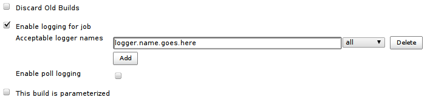

[[LoggingPlugin-Developedby]]
===== Developed by

[.confluence-embedded-file-wrapper]##

[[LoggingPlugin-Purpose]]
== Purpose

This plugin enables slave and per build logging. Each build will get a
single log file, collected from the master and the possible slave.

This plugin is intended for remote debugging/tracing other plugins where
a traditional debugger is unavailable.

[[LoggingPlugin-Setup]]
== Setup

In the configuration page enter those logger names to be logged. These
logs will end up in their respective build folders.

 
[.confluence-embedded-file-wrapper]##

Check the "Enable poll logging" if logging should be in the polling
phase. This log will end up in a special folder called "poll-logging" in
the job folder.

Java Logger

[.aui-icon .aui-icon-small .aui-iconfont-warning .confluence-information-macro-icon]#
#

The plugin only works with the java.util.logging.Logger. Use it as you
normally would.

[[LoggingPlugin-Logs]]
== Logs

Each build, run with this plugin enabled, gets a menu item called
"Logging". This links to the log of this particular build.

The poll logs are available from the projects main page.

[[LoggingPlugin-JenkinsJobDSL]]
== Jenkins Job DSL

[[LoggingPlugin-Availableoptions]]
=== _Available options_

[source,syntaxhighlighter-pre]
----
job{
    properties{ 
        logging{
            pollLogging (boolean enablePollLogging)
            pruneDays (int daysToKeepPollLogs)
            target{
                name (String targetName)
                level (String loggingLevel) //SEVERE, WARNING, INFO, CONFIG, FINE, FINER or FINEST
            }
        }
    }
}
----

[[LoggingPlugin-Example]]
=== _Example_

[source,syntaxhighlighter-pre]
----
job('foo'){
    properties{ 
        logging{
            pollLogging true
            pruneDays 20
            target{
                name 'org.techworld.sonar'
                level 'FINE'
            }
        }
    }
}
----

[[LoggingPlugin-KnownIssues]]
== Known Issues

type

key

summary

[.icon-in-pdf]# # Data cannot be retrieved due to an unexpected error.

http://issues.jenkins-ci.org/secure/IssueNavigator.jspa?reset=true&jqlQuery=project%20=%20JENKINS%20AND%20status%20in%20%28Open,%20%22In%20Progress%22,%20Reopened%29%20AND%20component%20=%20%27logging-plugin%27&src=confmacro[View
these issues in Jira]

[[LoggingPlugin-Changes]]
== Changes

[[LoggingPlugin-1.0.0(October13,2015)]]
=== 1.0.0 (October 13, 2015)

* Added JobDSL support

[[LoggingPlugin-0.2.7(April16,2012)]]
=== 0.2.7(April 16, 2012)

* When Jenkins restarts a NullPointerException is thrown on poll logging
(https://issues.jenkins-ci.org/browse/JENKINS-17633[#17633])

[[LoggingPlugin-0.2.6(November6,2012)]]
=== 0.2.6(November 6, 2012)

* Persisting too much
(https://issues.jenkins-ci.org/browse/JENKINS-15730[#15730])

[[LoggingPlugin-0.2.2-5(September27,2012)]]
=== 0.2.2-5(September 27, 2012)

* Various bug fixes

[[LoggingPlugin-0.2.1(September26,2012)]]
=== 0.2.1(September 26, 2012)

* Corrected typo
* Throwns are actually logged

[[LoggingPlugin-0.2.0(September24,2012)]]
=== 0.2.0(September 24, 2012)

* Make use of FileCallableWrapperFactory
(https://issues.jenkins-ci.org/browse/JENKINS-15147[#15147])
* Pruning of poll logs
(https://issues.jenkins-ci.org/browse/JENKINS-15022[#15022])
* Easy download of logs
(https://issues.jenkins-ci.org/browse/JENKINS-15021[#15021])

[[LoggingPlugin-0.1.2(August28,2012)]]
=== 0.1.2(August 28, 2012)

* When using the new FileCallable implementation and not enabling
logging gives null pointer
(https://issues.jenkins-ci.org/browse/JENKINS-14961[#14961])

[[LoggingPlugin-0.1.1(July10,2012)]]
=== 0.1.1(July 10, 2012)

Initial version
