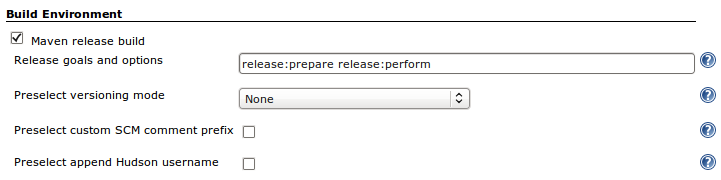
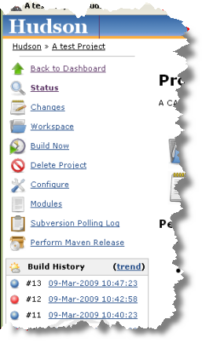
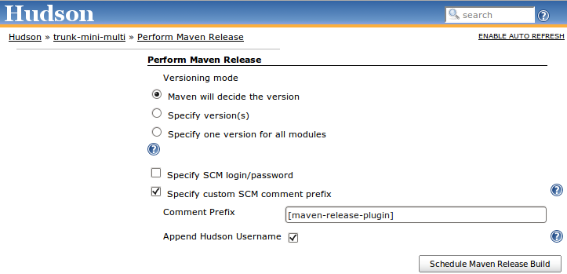

[.conf-macro .output-inline]##

[cols="",options="header",]
|===
|Plugin Information
|View Maven Release Plug-in https://plugins.jenkins.io/m2release[on the
plugin site] for more information.
|===

[.aui-icon .aui-icon-small .aui-iconfont-info .confluence-information-macro-icon]##

Older versions of this plugin may not be safe to use. Please review the
following warnings before using an older version:

* https://jenkins.io/security/advisory/2019-07-31/#SECURITY-1435[Credentials
stored in plain text]
* https://jenkins.io/security/advisory/2019-07-31/#SECURITY-1184[Stored
XSS vulnerability]
* https://jenkins.io/security/advisory/2019-12-17/#SECURITY-1681[XXE
vulnerability]
* https://jenkins.io/security/advisory/2019-07-31/#SECURITY-1098[CSRF
vulnerability]

[.conf-macro .output-inline]#This plugin allows you to perform a release
build using the
http://maven.apache.org/plugins/maven-release-plugin/[maven-release-plugin]
from within Jenkins.#

[[M2ReleasePlugin-ProjectConfiguration]]
== Project Configuration

On the job configuration page, enable the "Maven release build" under
the Build Environment heading and add whatever release goals and options
your require. +
[.confluence-embedded-file-wrapper]##

[[M2ReleasePlugin-PerformingaReleaseBuild]]
== Performing a Release Build

Follow the "Perform Maven Release" link +
[.confluence-embedded-file-wrapper]## +
and choose "Schedule Maven Release Build". +
[.confluence-embedded-file-wrapper]##

[[M2ReleasePlugin-UsingwithNexusStaging]]
== Using with Nexus Staging

Nexus staging will create a new Stage for each unique IP Address, deploy
users and HTTP User agent.

For a particular Jenkins slave the first two will be the same for all
builds - so you need to configure Maven to use a unique HTTP User-Agent
for the deploy.

To do this make sure your maven settings contains something like the
following where the id matches the id for the release repository in the
deployment section of your project:

[source,syntaxhighlighter-pre]
----
  <server>
    <id>nexus</id>
    <username>my_login</username>
    <password>my_password</password>
    <configuration>
      <httpHeaders>
        <property>
          <name>User-Agent</name>
          <value>Maven m2Release (java:${java.vm.version} ${env.BUILD_TAG }</value>
        </property>
      </httpHeaders>
    </configuration>
  </server>
----

[[M2ReleasePlugin-FAQ]]
== FAQ

If your build fails with the following:

____
https://wiki.jenkins-ci.org/display/JENKINS/M2+Release+Plugin#[INFO]
Executing: mvn clean verify --no-plugin-updates --batch-mode -P
null,null +
'mvn' is not recognized as an internal or external command, +
operable program or batch file.
____

Then this is a http://jira.codehaus.org/browse/MRELEASE-359[maven bug]
not a Jenkins plug-in bug. +
The solution is to upgrade to version 2.0-beta-8 or later of the
maven-release-plugin in your project.

 +

Some users with CVS (cvs+ssh) have reported that a release just hangs
while accessing the ssh server
(https://issues.jenkins-ci.org/browse/JENKINS-4783[JENKINS-4783]). The
solution is to use the native CVS client and append
"-Dmaven.scm.provider.cvs.implementation=cvs_native" to the release
arguments.

The use of this plugin requires that Maven can tag your code.  You may
need to use cvs/svn etc from the CI account on the server that is
performing the release so the native tools used by maven have the
required authentication information.  (this is outside of Jenkins SCM
authentication)

[[M2ReleasePlugin-HelpandSupport]]
== Help and Support

For Help and support please use the
https://groups.google.com/group/jenkinsci-users[Jenkins Users] mailing
list. +
To report a bug please
http://issues.jenkins-ci.org/secure/IssueNavigator.jspa?mode=hide&reset=true&jqlQuery=project+%3D+JENKINS+AND+status+in+(Open,+%22In+Progress%22,+Reopened)+AND+component+%3D+m2release[check
the bug tracker] to see if the issue has been reported before
http://issues.jenkins-ci.org/secure/IssueNavigator.jspa?mode=show&createNew=true[creating
a new issue]. +
*The comment list below is not monitored.*

[[M2ReleasePlugin-VersionHistory]]
== Version History

[[M2ReleasePlugin-0.16.0(Notyetreleased)]]
=== 0.16.0 (Not yet released)

build from
https://wiki.jenkins-ci.org/display/JENKINS/Source+code[source] or
download from
https://jenkins.ci.cloudbees.com/job/plugins/job/m2release-plugin/lastStableBuild/org.jenkins-ci.plugins.m2release$m2release/[here]
if interested

* Fix https://issues.jenkins-ci.org/browse/JENKINS-35261[JENKINS-35261]
SCM username/password env variables don't work with SECURITY-170.
* Fix https://issues.jenkins-ci.org/browse/JENKINS-16043[JENKINS-16043]
NullPointerException with \{\{FileParameter}}s
* remove "Default versioning mode" from the UI as it does nothing
currently.

[[M2ReleasePlugin-0.15.0(31July2019)]]
=== 0.15.0 (31 July 2019)

Security fixes
(https://jenkins.io/security/advisory/2019-07-31/[announcement])

* Fix SECURITY-1435 https://jenkins.io/security/advisory/2019-07-31/#SECURITY-1435[Credentials
stored in plain text]
* Fix SECURITY-1184 https://jenkins.io/security/advisory/2019-07-31/#SECURITY-1184[Stored
XSS vulnerability]
* Fix SECURITY-1098 https://jenkins.io/security/advisory/2019-07-31/#SECURITY-1098[CSRF
vulnerability]

[[M2ReleasePlugin-0.14.0(31March2014)]]
=== 0.14.0 (31 March 2014)

* fix https://issues.jenkins-ci.org/browse/JENKINS-20027[JENKINS-20027]
Exception thrown when Dashboard View plugin is not installed
https://github.com/jenkinsci/m2release-plugin/pull/20[PR #23]
* ReleaseCause is now a UserIdCause
* fix https://issues.jenkins-ci.org/browse/JENKINS-20753[JENKINS-20753]
Remove unused "Append Hudson Build Number" option
https://github.com/jenkinsci/m2release-plugin/pull/21[PR #21]
* integrate
https://issues.jenkins-ci.org/browse/JENKINS-21063[JENKINS-21063]
Indicate in icon (or tooltip) if a release build failed
https://github.com/jenkinsci/m2release-plugin/pull/17[PR #17]

[[M2ReleasePlugin-0.13.0(23December2013)]]
=== 0.13.0 (23 December 2013)

* *Note* the plugin now requires
** Jenkins 1.509 or higher

* Minor tweaks to UI
(https://github.com/jenkinsci/m2release-plugin/pull/20[pull #20] thanks
to https://github.com/andham[Anders Hammar])
* Fix https://issues.jenkins-ci.org/browse/JENKINS-20983[JENKINS-20983]
Improve help text for "Preselect append Jenkins username" option
(https://github.com/jenkinsci/m2release-plugin/pull/19[pull #19] thanks
to https://github.com/andham[Anders Hammar])
* Fix https://issues.jenkins-ci.org/browse/JENKINS-21060[JENKINS-21060]
Improve help text of "Number of successful release...
(https://github.com/jenkinsci/m2release-plugin/pull/18[pull #18] thanks
to https://github.com/andham[Anders Hammar])
* Fix https://issues.jenkins-ci.org/browse/JENKINS-21088[JENKINS-21088]
Normalize line endings in repo
(https://github.com/jenkinsci/m2release-plugin/pull/16[pull #16] thanks
to https://github.com/andham[Anders Hammar])
* Fix https://issues.jenkins-ci.org/browse/JENKINS-20980[JENKINS-20980]
Change "Hudson" to "Jenkins" in displayed text
(https://github.com/jenkinsci/m2release-plugin/pull/15[pull #15] thanks
to https://github.com/andham[Anders Hammar])
* Fix https://issues.jenkins-ci.org/browse/JENKINS-20937[JENKINS-20937]
The SCM credentials used are recorded in the job's builds storage (in
build.xml). (pull #13 thanks to https://github.com/jglick[Jess Glick])
* Change permalink to use PeepholePermalink to be more performant in the
face of lazy loading.
* Fix https://issues.jenkins-ci.org/browse/JENKINS-10914[JENKINS-10914]
Do not run incremental build in release build.
(https://github.com/jenkinsci/m2release-plugin/pull/12[pull #12] thanks
to https://github.com/barclay-reg[Robert Kleinschmager])
* Fix https://issues.jenkins-ci.org/browse/JENKINS-20791[JENKINS-20791]
ReleaseCause should extend UserIdCause.
(https://github.com/jenkinsci/m2release-plugin/pull/14[pull #14] thanks
to https://github.com/andham[Anders Hammar])

[[M2ReleasePlugin-0.12.0(25thJuly2013)]]
=== 0.12.0 (25th July 2013)

* Fix Nexus integration after Sonatype changed public API (again) in 2.6

[[M2ReleasePlugin-0.11.0(4thJuly2013)]]
=== 0.11.0 (4th July 2013)

* Drop Hudson support. The Hudson community now build and maintain their
own fork.
* *Note* the plugin now requires
** Jenkins 1.466 or higher

* Fix Nexus integration after Sonatype changed public API in 2.4

[[M2ReleasePlugin-0.10.0(26thApr2013)]]
=== 0.10.0 (26th Apr 2013)

* Feature: Add a release view to
the https://wiki.jenkins-ci.org/display/JENKINS/Dashboard+View[Dashboard
View] portlet (https://github.com/jenkinsci/m2release-plugin/pull/5[pull
#5] thanks to https://github.com/larrys[Larry Shatzer])
* Fix https://issues.jenkins-ci.org/browse/JENKINS-12895[JENKINS-12895]
Drop nexus stage if build is not a success.
* Fix https://issues.jenkins-ci.org/browse/JENKINS-10042[JENKINS-10042]
prevent NPE if closing a nexus stage fails.
* Fix https://issues.jenkins-ci.org/browse/JENKINS-12076[JENKINS-12076]
Add ability to specify number of release builds to keep.
(https://github.com/jenkinsci/m2release-plugin/pull/10[pull #10] thanks
to https://github.com/dlvenable[David Venable])
* Fix https://issues.jenkins-ci.org/browse/JENKINS-13465[JENKINS-13465]
Unable perform release: ClassCastException: net.sf.json.JSONNull cannot
be cast to net.sf.json.JSONObject.

[[M2ReleasePlugin-0.9.1(1stMar2012)]]
=== 0.9.1 (1st Mar 2012)

* Fix https://issues.jenkins-ci.org/browse/JENKINS-12812[JENKINS-12812]
dryRun switch broken.

[[M2ReleasePlugin-0.9.0(13thFeb2012)]]
=== 0.9.0 (13th Feb 2012)

* *Note* the plugin now requires
** Jenkins 1.442 or higher
** Jenkins LTS 1.424.2 or higher
** Hudson with the maven-plugin 2.2.1 or higher
* Fix https://issues.jenkins-ci.org/browse/JENKINS-10127[JENKINS-10127]
- M2 Release plugin ignores parameters from a parameterized build
(thanks to Dominik Bartholdi for the patch)
* Fix https://issues.jenkins-ci.org/browse/JENKINS-4690[JENKINS-4690] -
Be able to arbitrary paramterize m2 releases (thanks to Dominik
Bartholdi for the patch)
* Fix https://issues.jenkins-ci.org/browse/JENKINS-4500[JENKINS-4500] -
Make it possible to select a node to do the release on (together with
the nodelabel-plugin) (thanks to Dominik Bartholdi for the patch)
* Fix https://issues.jenkins-ci.org/browse/JENKINS-4958[JENKINS-4958] -
add switch for -DdryRun=true (thanks to Dominik Bartholdi for the patch)

[[M2ReleasePlugin-0.8.1(2ndNovember2011)]]
=== 0.8.1 (2nd November 2011)

* Fix https://issues.jenkins-ci.org/browse/JENKINS-11238[JENKINS-11238]
Prevent log spam from when upgrading from an old version with a default
versioning mode. (Patch from Richard Mortimer aka oldelvet)
* Fix https://issues.jenkins-ci.org/browse/JENKINS-10661[JENKINS-10661]
Impossible to assign the permission release using project based matrix
security

[[M2ReleasePlugin-0.8.0(4thOctober2011)]]
=== 0.8.0 (4th October 2011)

* Fix https://issues.jenkins-ci.org/browse/JENKINS-8293[JENKINS-8293] -
Disable auto refresh for the "Perform" screen to prevent entered
password being removed. (Thanks to oldelvet for the patch)
* Fix https://issues.jenkins-ci.org/browse/JENKINS-7295[JENKINS-7295]
https://issues.jenkins-ci.org/browse/JENKINS-5171[JENKINS-5171] -
Ability to override the SCM tag to use.
* Removed ability to specify version for each module (it would faile to
work correctly if Jenkins was not building every comit).
* Removed ability to let maven devide the versioning (the version is
needed for things like tooltips).

[[M2ReleasePlugin-0.7.1(10thMarch2011)]]
=== 0.7.1 (10th March 2011)

* Update plugin to show dependency on Jenkins >= 1.400 (to pick up the
fixes below)

[[M2ReleasePlugin-0.7.0(10thMarch2011)]]
=== 0.7.0 (10th March 2011)

* Fix https://issues.jenkins-ci.org/browse/JENKINS-8289[JENKINS-8289] -
enforce dev Version to be a snapshot
* Fix https://issues.jenkins-ci.org/browse/JENKINS-7837[JENKINS-7837] -
release does not use the maven installation it was configured with but
whatever is on the path. (NB fixed in core - requires Jenkins >= 1.400)
* Fix https://issues.jenkins-ci.org/browse/JENKINS-8092[JENKINS-8092] -
Maven release plugin cannot find mvn command. (NB fixed in core -
requires Jenkins >= 1.400)
* add permalink to last release.

[[M2ReleasePlugin-0.6.1(17thSeptember2010)]]
=== 0.6.1 (17th September 2010)

* Fix https://issues.jenkins-ci.org/browse/JENKINS-7492[JENKINS-7492] -
Fix internal error which occurs under tomcat but not winston due to a
double redirect.

[[M2ReleasePlugin-0.6.0(16thSeptember2010)]]
=== 0.6.0 (16th September 2010)

* Fix https://issues.jenkins-ci.org/browse/JENKINS-3876[JENKINS-3876] -
Add an icon to release builds.
* Fix https://issues.jenkins-ci.org/browse/JENKINS-6791[JENKINS-6791] -
Scheduling a release will fail silently if a build is already in the
queue.

[[M2ReleasePlugin-0.5.3(12thJuly2010)]]
=== 0.5.3 (12th July 2010)

* Fix NPE when trying to close nexus state.

[[M2ReleasePlugin-0.5.2(8thJuly2010)]]
=== 0.5.2 (8th July 2010)

* Re-Fix https://issues.jenkins-ci.org/browse/JENKINS-6873[JENKINS-6873]
- After scheduling a release build a HTTP 404 error page can be
displayed.

[[M2ReleasePlugin-0.5.1(30thJune2010)]]
=== 0.5.1 (30th June 2010)

* Fix https://issues.jenkins-ci.org/browse/JENKINS-6887[JENKINS-6887] -
NPE during release when version is decided by Maven.
* Fix https://issues.jenkins-ci.org/browse/JENKINS-6873[JENKINS-6873] -
After scheduling a release build a HTTP 404 error page can be displayed.

[[M2ReleasePlugin-0.5.0(25thJune2010)]]
=== 0.5.0 (25th June 2010)

* Fix https://issues.jenkins-ci.org/browse/JENKINS-6630[JENKINS-6630] -
plugin closes incorrect nexus stage

[[M2ReleasePlugin-0.4.0(26thMay2010)]]
=== 0.4.0 (26th May 2010)

* Fix https://issues.jenkins-ci.org/browse/JENKINS-5295[JENKINS-5295] -
plugin now allows you to pass SCM username/password to maven.
* Fixed to work with Nexus 1.5.0 (authorization was not occuring
correctly).
* Added support for specifying an exact version to use across all
modules
(https://issues.jenkins-ci.org/browse/JENKINS-3429[JENKINS-3429]).
* Added support for specifying scmCommentPrefix
(http://issues.jenkins-ci.org/browse/JENKINS-4127[issue #4127] ).
* Added support for appending the Jenkins username to the
scmCommentPrefix (optional).
* Added config settings (per project) which option(s) should be enabled
by default for the Release Action.

[[M2ReleasePlugin-0.3.4(29thDecember2009)]]
=== 0.3.4 (29th December 2009)

* Fix help pages not showing up when Jenkins runs on a case sensitive
file system.
* Use POST instead of GET to avoid long form URLs.

[[M2ReleasePlugin-0.3.3(21thAugust2009)]]
=== 0.3.3 (21th August 2009)

* Fix https://issues.jenkins-ci.org/browse/JENKINS-4172[JENKINS-4172]
that prevented Jenkins upgrades working correctly.

[[M2ReleasePlugin-0.3.2(24thJuly2009)]]
=== 0.3.2 (24th July 2009)

* (0.3.0 & 0.3.1 were not released)
* Jenkins doesn't set the MAVEN_OPTS variable so added a workaround in
the plugin
https://issues.jenkins-ci.org/browse/JENKINS-3644[JENKINS-3644]
* Added a sepcific security right to allow fine grained release
permissions.
* Added support for closing http://www.sonatype.com/products/nexus[Nexus
Pro] staging repository after a release.
* Added some synchronization to protect against a theoretical race
condition.
* Fix https://issues.jenkins-ci.org/browse/JENKINS-4065[JENKINS-4065]
that caused the release plugin to blow up when releases where
n-SNAPSHOT.

[[M2ReleasePlugin-0.2.0(23rdMarch2009)]]
=== 0.2.0 (23rd March 2009)

* Added support for Jenkins Security (only users who can perform a
manual build can trigger a release build).
* Release goals now default to
`+-Dresume=false release:prepare release:perform.+`
* Added support for specifying exact versions to use.
* Added support for appending Jenkins build number as maven build number
qualifier.
* Integrated with Jenkins security.  Users require "Build" rights in
order to create a release
* Requires Jenkins >= 1.292.

[[M2ReleasePlugin-0.1.0(16thMarch2009)]]
=== 0.1.0 (16th March 2009)

* Initial version.
* Can only use the auto versioning feature of the
http://maven.apache.org/plugins/maven-release-plugin/[maven-release-plugin].
* Tested with a simple single module project, in a master only Jenkins
environment.
* Requires Huson >= 1.288.

[[M2ReleasePlugin-TODO]]
== TODO

In no order:

* Integrate with Jenkins security model.
* Add support for specifying exact versions to use.
* Add support for auto-versioning with Jenkins build number as maven
build number qualifier.
* Add a sepcific security right to produce a release build.
* Add support to clean workspace before a release build is performed for
the case where Jenkins uses update
(https://issues.jenkins-ci.org/browse/JENKINS-3925[JENKINS-3925]).
* *work in progress:* Add support to clean local maven repository before
a release build is performed. Useful for guaranteeing the release is
buildable from scratch.
* Update wiki and add help for latest features.
* Check compatability with Jenkins master/slave.
* Check compatability with multi-module projects.
* Add some feedback onto the build history to show release builds (like
the
https://wiki.jenkins-ci.org/display/JENKINS/M2+Release+Plugin#[Release
Plugin]).
* Get jenkins to recognize the releases as build artifacts.
* See if we can do something in the freestyle for maven builds.
* Nexus support
** rewrite support from ground up to avoid closing incorrect repository
** Add support for closing http://www.sonatype.com/products/nexus[nexus
pro] staging repos on succesful build completion.
** Add support (if possible) for changing the User agent to support
grouping into a http://www.sonatype.com/products/nexus[nexus pro]
staging repo.
** Add support for removing a
http://www.sonatype.com/products/nexus[nexus pro] staging repo on a
failed build.
** Add support for auto promoting a
http://www.sonatype.com/products/nexus[nexus pro] staging repo on a
successful build.
