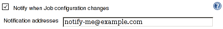
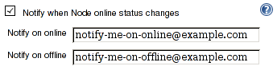

[[MailWatcherPlugin-Mailwatcherplugin]]
== Mail watcher plugin

This plugin notifies configured email recipients on various events.

[[MailWatcherPlugin-Recipientsconfiguration]]
== Recipients configuration

Plugin optional configuration section is attached to the watched entity
and usually called "Notify when ...".

Configuration accepts list of addresses delimited by comas.

[[MailWatcherPlugin-Watchedevents]]
=== Watched events

[.aui-icon .aui-icon-small .aui-iconfont-info .confluence-information-macro-icon]#
#

Recommended Jenkins version for Mail Watcher Plugin is 1.554. Using
earlier version (earlier than 1.551) will cause missing notification for
events that was not supported in the particular version.

[[MailWatcherPlugin-Jobconfiguration]]
==== Job configuration

[.confluence-embedded-file-wrapper .image-right-wrapper]##

Notify when Job configuration changes. Recipients are configured at job
configuration page. Recipients are notified when one of these events
occurs:

* http://javadoc.jenkins-ci.org/hudson/model/listeners/ItemListener.html#onRenamed(hudson.model.Item,%20java.lang.String,%20java.lang.String)[onRenamed]
* http://javadoc.jenkins-ci.org/hudson/model/listeners/ItemListener.html#onDeleted(hudson.model.Item)[onDeleted]
* http://javadoc.jenkins-ci.org/hudson/model/listeners/ItemListener.html#onUpdated(hudson.model.Item)[onUpdated]

[[MailWatcherPlugin-Nodeonlinestatus]]
==== Node online status

[.confluence-embedded-file-wrapper .image-right-wrapper]##

Notify when Node online status changes. Recipients are configured at
node configuration page, section Node Properties. Recipients are
notified when one of these events occurs:

* http://javadoc.jenkins-ci.org/hudson/slaves/ComputerListener.html#onOffline(hudson.model.Computer)[onOffline]
* http://javadoc.jenkins-ci.org/hudson/slaves/ComputerListener.html#onOnline(hudson.model.Computer,%20hudson.model.TaskListener)[onOnline]
* http://javadoc.jenkins-ci.org/hudson/slaves/ComputerListener.html#onTemporarilyOffline(hudson.model.Computer,%20hudson.slaves.OfflineCause)[onTemporarilyOffline]
* http://javadoc.jenkins-ci.org/hudson/slaves/ComputerListener.html#onTemporarilyOnline(hudson.model.Computer)[onTemporarilyOnline]

Computer configuration offers two recipients lists for users to be
notified on either online or offline event.

[[MailWatcherPlugin-Implicitnotifications]]
==== Implicit notifications

* User is notified when the node he/she put offline becomes available.
In other words: last build has finished and no new can be scheduled.
(Since 1.551)

[[MailWatcherPlugin-Changelog]]
=== Changelog

[[MailWatcherPlugin-1.12]]
==== 1.12

* Optimization: Do not compose the message when there are no recipients
(https://issues.jenkins-ci.org/browse/JENKINS-27503[JENKINS-27503])

[[MailWatcherPlugin-1.11]]
==== 1.11

* Correctly identify node and initiator of computer idle event.

[[MailWatcherPlugin-1.10]]
==== 1.10

* Avoid assertion error thrown during maven build
(https://issues.jenkins-ci.org/browse/JENKINS-28888[JENKINS-28888])

[[MailWatcherPlugin-1.8]]
==== 1.8

* JENKINS-23496: Notify user that put slave temporarily offline that it
has become idle
* JENKINS-23555: Fix NPE when no Reply-To address configured

[[MailWatcherPlugin-1.7]]
==== 1.7

* JENKINS-23482: Globally configured ReplyTo header is not sent 
* JENKINS-20538: No notification for master node going offline
(effectively fixed once
https://github.com/jenkinsci/jenkins/pull/1293[#1293] is merged to core)

[[MailWatcherPlugin-1.6]]
==== 1.6

* JENKINS-20535: Subject for bring a node back online is misleading
* JENKINS-23174: Links for jobs within folders are invalid

[[MailWatcherPlugin-1.5]]
==== 1.5

* User identity tracked in 'Initiator' field
* Links to job config history diffs included in messages when plugin
installed.
