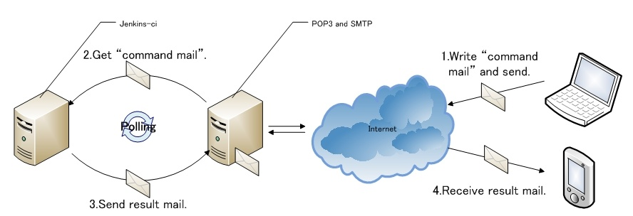
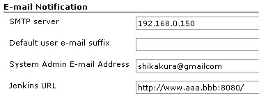
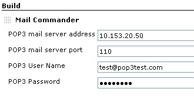
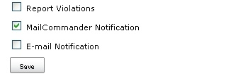
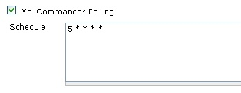
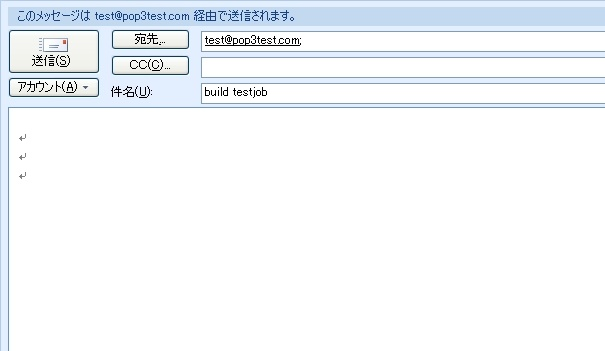

[[MailCommanderPlugin-MailCommanderPlugin]]
== Mail Commander Plugin

This plugin is provide function that command with e-mail. Write CLI
command to e-mail subject and send to pre setting address. Mail
Commander recieve e-mail from pre setting address, and read e-mail
subject as CLI command, execute it.

[[MailCommanderPlugin-Overview]]
=== Overview

[.confluence-embedded-file-wrapper]##

. You write a mail with CLI command subject and send to a address which
is configured by mail commander.
. Jenkins get a "command mail" from POP3 Server and read subject, then
execute a CLI Command.
. Send a mail of job result to command sender. To decide mail address ,
use recieve mail's from address.
. You recieve a mail with result.

     ※ Notice

     You can recieve result that is CLI command' s result not a build
result.

[[MailCommanderPlugin-Howtouse]]
=== Howto use

. Install "mail commander" from menu 'Jenkins>>Plugin manager>>mail
commander'.

          Please configure E-mail Notification ( Menu 'Manage Jenkins >>
Configure System >> E-mail Notification ) SMTP server, System Admin
E-mail Address and Jenkins URL.

         

               
[.confluence-embedded-file-wrapper]## +
     2.   You configure job parameter. Parameter have three points that
is build, post build action, and build trigger.

         <Step 1. Build> please select "Mail Commander" and set
parameter.

                
[.confluence-embedded-file-wrapper]##

         <Step 2. Post Build Action> please check "MailCommander
Notification".

                
[.confluence-embedded-file-wrapper]##

        <Step 3. Build Triggers> please check "MailCommander Polling"
and schedule.

                
[.confluence-embedded-file-wrapper]##

        3.  You can write a CLI command in subject and send a mail to
POP3 User's address. Please remove -s option (ex. "-s http://\~
(http://~)" ) from normal CLI command.

           normal CLI command sample : java -jar jenkins-cli.jar -s
http://localhost:8080/ build testjob

           Mail commander CLI subject sample  : build testjob

          
[.confluence-embedded-file-wrapper]##

[[MailCommanderPlugin-Optionalfunction]]
=== Optional function

* Mail Commander find "groovy" in subject, it is proccess mail content
as groovy script.

[[MailCommanderPlugin-ChangeLog]]
=== Change Log

Release 1.0.0

* initial release.
