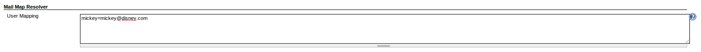

 +

This plugin allows you to configure a mapping between usernames and
email addresses. Then when plugins try to resolve a username to an email
address, it will resolve using the provided address.

[[MailMapResolver-Configuration]]
== Configuration

[[MailMapResolver-Globalconfiguration]]
=== Global configuration

The only configuration for this plugin is done via the global
configuration. The map is the same syntax as a Java properties file, so
anything that must be escaped for a Java properties file must be escaped
in the user map.

You can provide multiple usernames per line by separating them with a
comma in the key of the property (escaping may be required).

[.confluence-embedded-file-wrapper]##

[[MailMapResolver-OpenIssues]]
== Open Issues

[[refresh-module-807239656]]
[[refresh-807239656]][[jira-issues-807239656]]
T

Key

Summary

Assignee

Reporter

P

Status

Resolution

Created

Updated

Due

[.refresh-action-group]# #

[[refresh-issues-loading-807239656]]
[.aui-icon .aui-icon-wait]#Loading...#

[#refresh-issues-button-807239656]##
[#refresh-issues-link-807239656]#Refresh#
[#error-message-807239656 .error-message .hidden]# #

[[MailMapResolver-VersionHistory]]
== Version History

[[MailMapResolver-0.2(January16,2014)]]
=== 0.2 (January 16, 2014)

* Fixed issue where settings were not propagated after Jenkins restart.

[[MailMapResolver-0.1(January12,2014)]]
=== 0.1 (January 12, 2014)

* Initial release
