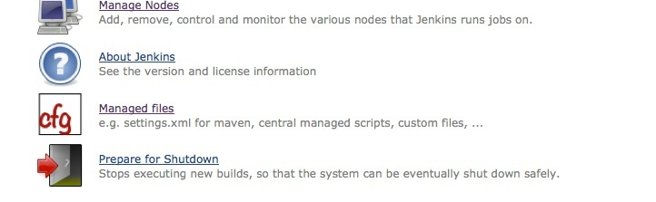
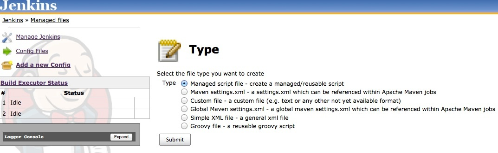
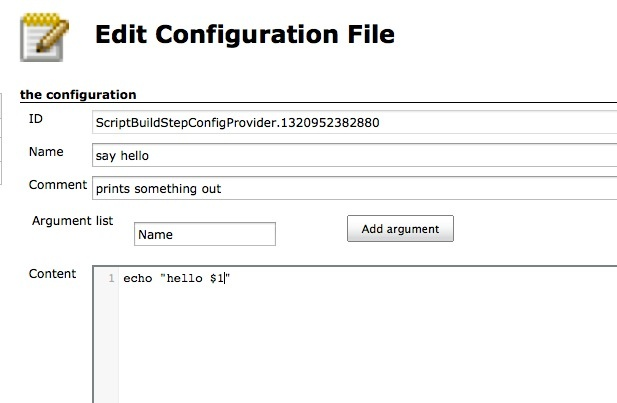
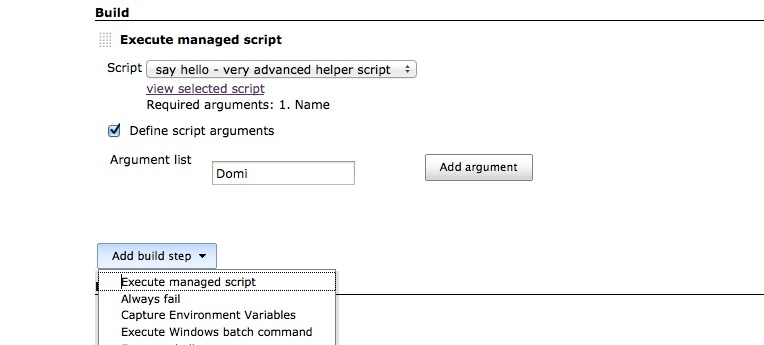

Managed scripts are shell scripts which are managed centrally by an
administrator and can be referenced as a build step within jobs.

[[ManagedScriptPlugin-Description]]
== Description

The scripts are managed by the
https://wiki.jenkins-ci.org/display/JENKINS/Config+File+Provider+Plugin[Config
File Provider Plugin], go to the "Manage Jenkins" screen and click on
the "Managed files" item.

[.confluence-embedded-file-wrapper]##

After installing the "Managed Scripts" plugin, you have a new option to
create a managed script in the type list.

[.confluence-embedded-file-wrapper]##

Now you get to the screen to create your script. You're able to give it
a name and a small description. In addition, you have the option to
define a list of arguments you want to inform the users about. These
arguments will be shown to the user as a hint and within the script
you're able to reference these as if you would pass in arguments on the
command line ($1, $2,...). Every environment variable from within a
build will be visible to the script, too. 

[.confluence-embedded-file-wrapper .confluence-embedded-manual-size]##

Within the job, a user is able to select the required script from a
drop-down menu. The defined parameters are shown in respect to the
selected script. The link enables the user to have a read-only look at
the script.

[.confluence-embedded-file-wrapper]##

[[ManagedScriptPlugin-VersionHistory]]
== Version History

[[ManagedScriptPlugin-1.4(August15,2017)]]
=== 1.4 (August 15, 2017)

* fix
https://issues.jenkins-ci.org/browse/JENKINS-45399[JENKINS-45399] View
selected scripts doesn't show correct script
* fix https://issues.jenkins-ci.org/browse/JENKINS-42888[JENKINS-42888] Missing
argument labels when adding managed script as build step

[[ManagedScriptPlugin-1.3(Dec.27,2016)]]
=== 1.3 (Dec. 27, 2016)

* update to
latest https://wiki.jenkins-ci.org/display/JENKINS/Config+File+Provider+Plugin[Config
File Provider Plugin] (1.5) and therefore now supports
https://wiki.jenkins-ci.org/display/JENKINS/CloudBees+Folders+Plugin[CloudBees
Folders Plugin] +
*the update of the config file provider plugin causes the configuration
to be migrated to a new format and therefore a rollback to the former
version will not be supported!*

[[ManagedScriptPlugin-1.2.4(Sep.10,2016)]]
=== 1.2.4 (Sep. 10, 2016)

* add support for custom script ids to ease reuse of scripts with
pipeline integration of config-file-provider-plugin

[[ManagedScriptPlugin-1.2.1(May18,2015)]]
=== 1.2.1 (May 18, 2015)

* add support for tokenizing of shell script arguments; allows
decomposing the given value of each argument into multiple arguments by
splitting via whitespace.

[[ManagedScriptPlugin-1.2(May11,2015)]]
=== 1.2 (May 11, 2015)

* add support for PowerShell
https://github.com/jenkinsci/managed-scripts-plugin/pull/5[PR #5]

[[ManagedScriptPlugin-1.1.2(July18,2014)]]
=== 1.1.2 (July 18, 2014)

* integrate
https://github.com/jenkinsci/managed-scripts-plugin/pull/4[PR #4]  set
codemirror mode based on shebang line (thanks to domruf)
* integrate
https://github.com/jenkinsci/managed-scripts-plugin/pull/3[PR #3]
correct spelling mistake (thanks to stevehollaar)

[[ManagedScriptPlugin-1.1.1(Dec.12,2013)]]
=== 1.1.1 (Dec. 12, 2013)

* integrate https://github.com/jenkinsci/managed-scripts-plugin/pull/2[pull
#2]: show script argument labels (thanks to Ann Campbell)

[[ManagedScriptPlugin-1.1(May19,2013)]]
=== 1.1 (May 19, 2013)

* fix https://issues.jenkins-ci.org/browse/JENKINS-18004[JENKINS-18004]
add support for TokenMacros

[[ManagedScriptPlugin-1.0.2(March10,2013)]]
=== 1.0.2 (March 10, 2013)

* fix https://issues.jenkins-ci.org/browse/JENKINS-15995[JENKINS-15995]
form submission from within
https://wiki.jenkins-ci.org/display/JENKINS/Conditional+BuildStep+Plugin[Conditional
BuildStep Plugin]

[[ManagedScriptPlugin-1.0.1(Oct11,2012)]]
=== 1.0.1 (Oct 11, 2012)

* fix issue when Jenkins is running with a different root context -
details of scripts could not be opened

[[ManagedScriptPlugin-1.0(15.April2012)]]
=== 1.0 (15. April 2012)

* New Feature
https://issues.jenkins-ci.org/browse/JENKINS-12365[JENKINS-12365]: Add
support for managed .bat scripts for Windows

[[ManagedScriptPlugin-0.2.0(20.Jan.2012)]]
=== 0.2.0 (20. Jan. 2012)

* FIX
https://issues.jenkins-ci.org/browse/JENKINS-12387https://issues.jenkins-ci.org/browse/JENKINS-12387[JENKINS-12387]
"Can't open build_step_template" breaking sporadically
* FIX https://issues.jenkins-ci.org/browse/JENKINS-12375[JENKINS-12375]
managed scripts not found running jobs on several nodes at the same time
(parallel)
* FIX https://issues.jenkins-ci.org/browse/JENKINS-12346[JENKINS-12346]
when jenkins is running with a prefix managed-scripts.js loads from /
instead of /prefix on the project configure page
* FIX https://issues.jenkins-ci.org/browse/JENKINS-12283[JENKINS-12283]
Remove "build_step_template..." files from workspace after these were

[[ManagedScriptPlugin-0.1.0(31.Dec.2011)]]
=== 0.1.0 (31. Dec. 2011)

* Fix https://issues.jenkins-ci.org/browse/JENKINS-12260[JENKINS-12260]
- wrong workspace determination

[[ManagedScriptPlugin-0.0.1(10.Nov.2011)]]
=== 0.0.1 (10. Nov. 2011)

* initial

[[ManagedScriptPlugin-HelpandSupport]]
== Help and Support

 

For Help and support please use the
http://jenkins-ci.org/content/mailing-lists[Jenkins Users] mailing
list. +
The comment list below is not monitored.

type

key

summary

[.icon-in-pdf]# # Data cannot be retrieved due to an unexpected error.

http://issues.jenkins-ci.org/secure/IssueNavigator.jspa?reset=true&jqlQuery=project%20=%20JENKINS%20AND%20status%20in%20%28Open,%20%22In%20Progress%22,%20Reopened%29%20AND%20component%20=%20%27managed-scripts%27&src=confmacro[View
these issues in Jira]
