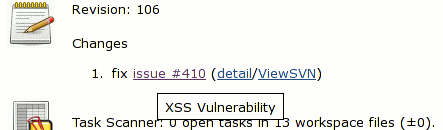
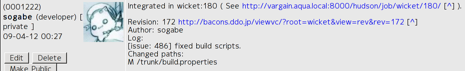
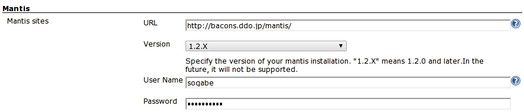
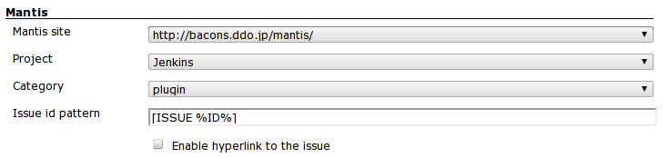
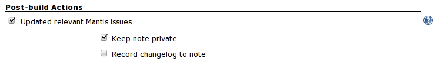
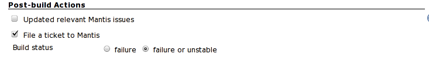
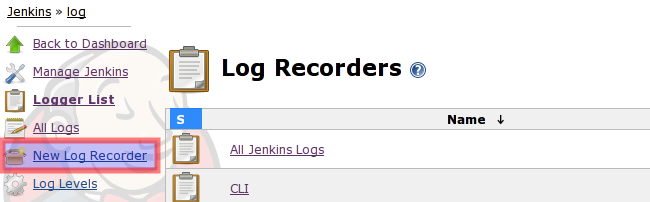
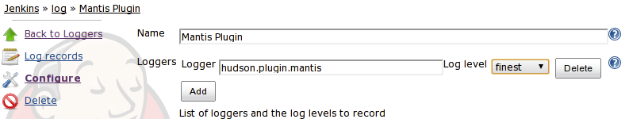

[.conf-macro .output-inline]# #

[.aui-icon .aui-icon-small .aui-iconfont-error .confluence-information-macro-icon]##

The current version of this plugin may not be safe to use. Please review
the following warnings before use:

* https://jenkins.io/security/advisory/2019-12-17/#SECURITY-1603[CSRF
vulnerability]

[[MantisPlugin-MantisPlugin]]
== Mantis Plugin

 +
[.conf-macro .output-inline]#This plugin integrates
http://www.mantisbt.org/[Mantis Bug Tracker] to Jenkins.# Mantis is a
free popular web-based bugtracking system written in PHP scripting
language. +
This plugin decorates Hudson "Changes" HTML to create links to your
Mantis issues, and update issues with private / public notes. +
As an example, if you committed a change with the following log message
(which is configurable see Project Configuration): +
 +
 +

....
fix issue #410
....

Mantis keys in changelogs are now hyperlinked to the corresponding
Mantis issue pages (complete with tooltips),
[.confluence-embedded-file-wrapper .image-center-wrapper]## +
and Mantis issues are also updated with note as following. +
 +
[.confluence-embedded-file-wrapper .image-center-wrapper]## +
 +
 +

[.aui-icon .aui-icon-small .aui-iconfont-warning .confluence-information-macro-icon]#
#

This plugin only supports *Mantis 1.1.0 and above*.

[[MantisPlugin-Configuration]]
=== Configuration

[[MantisPlugin-SystemConfiguration]]
==== System Configuration

First, you need to go to system config screen to tell Jenkins where's
your Mantis.

* URL - the root URL of your Mantis installation, eg.
http://example.org/mantis/
* Version - version of your Mantis installation. 1.1.X or 1.2.X(1.2.0a3
and later, this is experimental)
* User Name, Password - user name and password of your Mantis
installation to update relevant Mantis issues. +
[.confluence-embedded-file-wrapper .image-center-wrapper]##

[[MantisPlugin-ProjectConfiguration]]
==== Project Configuration

In the top section, select the url of your Mantis installation. +
[.confluence-embedded-file-wrapper .image-center-wrapper]## +
 +

* %ID% is placeholder which means Mantis issue id.
* Project and Category is mandatory for "File a ticket when build is
broken or unstable".

[[MantisPlugin-UpdateMantisissue]]
===== Update Mantis issue

In the Post-build Actions section, choose "Updated relevant Mantis
issues" (option). +
[.confluence-embedded-file-wrapper .image-center-wrapper]## +
 +

[.aui-icon .aui-icon-small .aui-iconfont-warning .confluence-information-macro-icon]#
#

This plugin updates Mantis issues if build is stable or unstable.

[[MantisPlugin-Fileaticketifbuildisbrokenorunstable]]
===== File a ticket if build is broken or unstable

In the Post-build Actions section, choose "File a ticket to Mantis"
(option).

 +
[.confluence-embedded-file-wrapper .image-center-wrapper]##

[.aui-icon .aui-icon-small .aui-iconfont-error .confluence-information-macro-icon]#
#

To Update Mantis issues, Mantis user must have at least "DEVELOPER".

[[MantisPlugin-TroubleShooting]]
=== Trouble Shooting

If you have ran into trouble,

. Select New Log Recorder in System log screen. +
[.confluence-embedded-file-wrapper .image-center-wrapper]## +
. Configure Log Recorder. Logger is "hudson.plugins.mantis", log level
is "finest". and save.
[.confluence-embedded-file-wrapper .image-center-wrapper]##
. Update Mantis issue...
. See System log. Check SOAP request and response.

[[MantisPlugin-UseBASIC_AUTH(Workaround)]]
=== https://wiki.jenkins-ci.org/display/JENKINS/Use+BASIC_AUTH[Use BASIC_AUTH] (Workaround)

[[MantisPlugin-Tips]]
=== Tips

* "Array to string conversion" while try to connect to
mantis(https://issues.jenkins-ci.org/browse/JENKINS-27077[JENKINS-27077]).

[[MantisPlugin-ChangeLog]]
=== Change Log

[[MantisPlugin-Version0.26(Feb16,2015)]]
==== Version 0.26 (Feb 16, 2015)

* Mantis password written in plain text in
build.xml(https://issues.jenkins-ci.org/browse/JENKINS-26831[JENKINS-26831]).

[[MantisPlugin-Version0.25(May31,2013)]]
==== Version 0.25 (May 31, 2013)

* View state for newly created Mantis
(https://issues.jenkins-ci.org/browse/JENKINS-18038[JENKINS-18038]).

[[MantisPlugin-Version0.24(Apr,30,2012)]]
==== Version 0.24 (Apr, 30, 2012)

* Do not update mantis entry for all downstream jobs
(https://issues.jenkins-ci.org/browse/JENKINS-11839[JENKINS-11839]).

[[MantisPlugin-Version0.23(Apr,1,2012)]]
==== Version 0.23 (Apr, 1, 2012)

* NullPointerException when Category have value : not selected
(https://issues.jenkins-ci.org/browse/JENKINS-13215[JENKINS-13215]).

[[MantisPlugin-Version0.22(Mar,12,2012)]]
==== Version 0.22 (Mar, 12, 2012)

* NullPointerException when parsing changeset of Matrix project
(https://issues.jenkins-ci.org/browse/JENKINS-12849[JENKINS-12849]).
* Mantis Plugin causes Configuration Loading Overlay to not disappear
(https://issues.jenkins-ci.org/browse/JENKINS-13023[JENKINS-13023]).
** added "veiyfy" button under advanced button to check credentials.
* Updated wsdl.

[[MantisPlugin-Version0.21(Jan,1,2012)]]
==== Version 0.21 (Jan, 1, 2012)

* enable to select a subproject for filing a ticket.

[[MantisPlugin-Version0.20(Oct,5,2011)(unstable)]]
==== Version 0.20 (Oct, 5, 2011) (unstable)

* File a ticket if build is broken or unstable

[[MantisPlugin-Version0.12(Oct9,2011)]]
==== Version 0.12 (Oct 9, 2011)

* updated wsdl to support Mantisbt 1.28

[[MantisPlugin-Version0.11(Apr29,2011)]]
==== Version 0.11 (Apr 29, 2011)

* Mantis-Plugin fails again to add a
note.(https://issues.jenkins-ci.org/browse/JENKINS-9554[JENKINS-9554],
https://issues.jenkins-ci.org/browse/JENKINS-9552[JENKINS-9552])
* Jenkins 1.399 or later required.
* MalformedURLException if malformed url.
(https://issues.jenkins-ci.org/browse/JENKINS-9440[JENKINS-9440])

[[MantisPlugin-Version0.10.1(May2,2010)]]
==== Version 0.10.1 (May 2, 2010)

* Fix 'update relevant mantis issue' is not saved'.
(https://issues.jenkins-ci.org/browse/JENKINS-6363[JENKINS-6363])

[[MantisPlugin-Version0.10(April4,2010)]]
==== Version 0.10 (April 4, 2010)

* Support Mantis 1.2.0
(https://issues.jenkins-ci.org/browse/JENKINS-6114[JENKINS-6114]).

[[MantisPlugin-Version0.9(Mar3,2010)]]
==== Version 0.9 (Mar 3, 2010)

* Update code for more recent Hudson.

[[MantisPlugin-Version0.8.3(Jul26,2009)]]
==== Version 0.8.3 (Jul 26, 2009)

* Allow empty pattern in form validation.

[[MantisPlugin-Version0.8.2]]
==== Version 0.8.2

* check if user has Job.CONFIGURE, not ADMINISTER when configuring
project
(https://issues.jenkins-ci.org/browse/JENKINS-4077[JENKINS-4077]).
* fixed NPE in M2 project
(https://issues.jenkins-ci.org/browse/JENKINS-4049[JENKINS-4049]).
* replaced deprecated classes and methods.

[[MantisPlugin-Version0.8.1]]
==== Version 0.8.1

* Support subversion plugin.
* Saved regexp pattern per build, which enables link in old history even
if configuration is changed.

[[MantisPlugin-Version0.8.0]]
==== Version 0.8.0

* Regexp pattern support.

[[MantisPlugin-Version0.7.1]]
==== Version 0.7.1

* Support Mercurial changelog, which requires Mercurial Plugin 1.15.
* Support Git changelog, which requires Git Plugin 0.5.
* Fixed a bit.

[[MantisPlugin-Version0.7]]
==== Version 0.7

* Record changelog in Mantis note.

[[MantisPlugin-Version0.6.1]]
==== Version 0.6.1

* Don't change build status if failing to add note.
(https://issues.jenkins-ci.org/browse/JENKINS-3005[JENKINS-3005]).
* check permission.

[[MantisPlugin-Version0.6]]
==== Version 0.6

* Hudson 1.281 and later required.
* Supported Mantis 1.2.0a3 and later (experimental)
(https://issues.jenkins-ci.org/browse/JENKINS-2877[JENKINS-2877]).
* Logged SOAP Request and Response.
* Improved error diagnostics.

[[MantisPlugin-Version0.5.2]]
==== Version 0.5.2

* Use default issue id pattern if project configuration has not saved
after upgrading
(https://issues.jenkins-ci.org/browse/JENKINS-2307[JENKINS-2307]).

[[MantisPlugin-Version0.5.1]]
==== Version 0.5.1

* Improved performance of hyperlink to mantis.

[[MantisPlugin-Version0.5]]
==== Version 0.5

* Configurable Mantis issue IDs patterns
(https://issues.jenkins-ci.org/browse/JENKINS-2117[JENKINS-2117]).
* Hyperlink to mantis even if checkbox is not checked
(https://issues.jenkins-ci.org/browse/JENKINS-2117[JENKINS-2117]).

[[MantisPlugin-Version0.4.3]]
==== Version 0.4.3

* Fixed UnknownFormatConversionException
(https://issues.jenkins-ci.org/browse/JENKINS-2116[JENKINS-2116]).
* Improved Japanese translation.

[[MantisPlugin-Version0.4.2]]
==== Version 0.4.2

* Added more logging for debugging.
* The username and password of Mantis installation is now optional.

[[MantisPlugin-Version0.4.1]]
==== Version 0.4.1

* Fix https://issues.jenkins-ci.org/browse/JENKINS-2039[JENKINS-2039]
(Mantis plugin breaks Job Save).

[[MantisPlugin-Version0.4]]
==== Version 0.4

* Update mantis issue if build status is unstable.
* Support unsigned server certs.

[[MantisPlugin-Version0.3.1]]
==== Version 0.3.1

* Fix JavaScript error

[[MantisPlugin-Version0.3]]
==== Version 0.3

* Support HTTP Basic Authentication(Not Mantis's BASIC_AUTH)
* Fix small bug

[[MantisPlugin-Version0.2]]
==== Version 0.2

* Remove mantisconnect-client-api.jar.

[[MantisPlugin-Version0.1]]
==== Version 0.1

* First version
