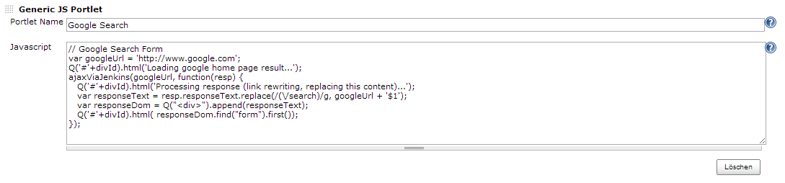
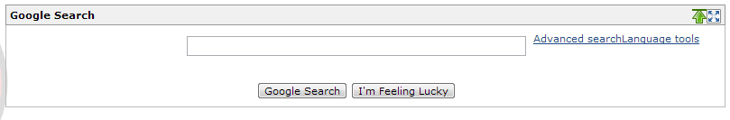
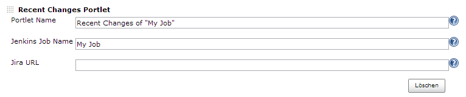
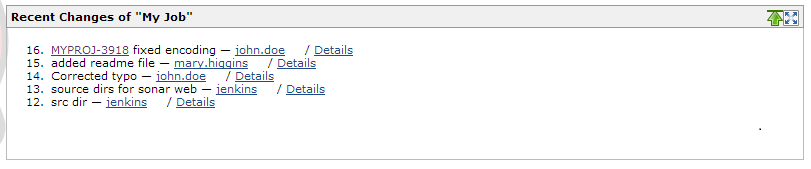

[.conf-macro .output-inline]# #

[.aui-icon .aui-icon-small .aui-iconfont-info .confluence-information-macro-icon]##

Older versions of this plugin may not be safe to use. Please review the
following warnings before using an older version:

* https://jenkins.io/security/advisory/2019-07-11/#SECURITY-775[Credentials
stored in plain text]

Additional portlets: 'Generic JS Portlet' flexibly displays any content
from another source. 'Recent Changes' and 'Test Results' show useful job
information that would otherwise only available by drilling down into
the job. The 'SonarQube Portlet' shows important issues from Sonar
directly in Jenkins.

[[MashupPortlets-Overview]]
== Overview 

The following portlets can be used in dashboards (requires
plugin https://wiki.jenkins-ci.org/display/JENKINS/Dashboard+View[Dashboard
View]):

* *Generic JS Portlet*: Allows to run arbitrary JS to create content in
the portlet content area by loading html snippets or json data from
arbitrary sources on the internet/intranet. +
+
Important

[.aui-icon .aui-icon-small .aui-iconfont-warning .confluence-information-macro-icon]#
#

Using this portlet will allow anyone that can edit a dashboard view to
add arbitrary JS that is also visible to/executed by other users - only
install this plugin if you trust everybody that you give permissions to
edit views!
* *Recent Changes Portlet*: Shows the recent SCM changes for a
configured job
* *Test Results Portlet*: Shows the test results for a configured job
* *SonarQube Portlet*: Shows issues from SonarQube directly in Jenkins
(using the REST API)

[[MashupPortlets-GenericJSPortlet]]
== Generic JS Portlet

Allows to run arbitrary JS to create content in the portlet content area
by loading html snippets or json data from arbitrary sources on the
internet/intranet. The function ajaxViaJenkins() allows running ajax
requests avoiding cross domain issues by routing them through jenkins.
Any content type that can be handled by javascript (html, json etc.) can
be used.

The following example is not really useful in a real world scenario, but
shows how easy it is to pull in content via javascript. 

Configuration:

[.confluence-embedded-file-wrapper]## +
Portlet View:

[.confluence-embedded-file-wrapper]##

[[MashupPortlets-RecentChangesPortlet]]
== Recent Changes Portlet

Shows the recent SCM changes for a configured job. If the optional JIRA
Base URL is configured, JIRA Issue IDs are automatically made
clickable. 

Configuration:

[.confluence-embedded-file-wrapper]## +
Portlet View:

[.confluence-embedded-file-wrapper]##

[[MashupPortlets-TestResultsPortlet]]
== *Test Results Portlet*

Shows the test results for a configured job.

[[MashupPortlets-Changelog]]
== Changelog

[[MashupPortlets-Version1.1.0(May92019)]]
=== Version 1.1.0 (May 9 2019)

* Fix for Generic JS Version
(https://issues.jenkins-ci.org/browse/JENKINS-57309[JENKINS-57309]) to
work with latest security model of Jenkins
* Fixed SonarQube Portlet to work correctly with latest SonarQube LTS
version 6.7.x
(https://issues.jenkins-ci.org/browse/JENKINS-57354[JENKINS-57354], https://issues.jenkins-ci.org/browse/JENKINS-57308[JENKINS-57308]),
also fixed a security
issue image:docs/images/warning.svg[(warning)] Upgrade
to this version is recommended! (token has to be re-entered)

[[MashupPortlets-Version1.0.9(April52018)]]
=== Version 1.0.9 (April 5 2018)

* Using SonarQube Token instead of user/pw now.

[[MashupPortlets-Version1.0.8(April202017)]]
=== Version 1.0.8 (April 20 2017)

* Add timeouts to HttpURLConnection usage in ServerSideHttpCall as used
by
GenericJsPortlet (https://issues.jenkins-ci.org/browse/JENKINS-43711[JENKINS-43711])

[[MashupPortlets-Version1.0.7(Jan92017)]]
=== Version 1.0.7 (Jan 9 2017)

* Compatibility to SonarQube 5.6.3 LTS
(https://issues.jenkins-ci.org/browse/JENKINS-40357[JENKINS-40357])

[[MashupPortlets-Version1.0.6(Nov052015)]]
=== Version 1.0.6 (Nov 05 2015)

* Recent Changes Portlet now allows to configure the maximal number of
changes to be shown (thanks to https://github.com/tabeyti[tabeyti] for
this pull request).

[[MashupPortlets-Version1.0.5(Jan242015)]]
=== Version 1.0.5 (Jan 24 2015)

* SonarQube Portlet allows to show alerts for given project(s) now
* Fixed Generic JS Portlet's js method ajaxViaJenkins to run without
credentials for current Jenkins versions (tested with 1.580.1). The JS
method ajaxViaJenkins() now works again with either two (url and
callback) or four (url, user, pw, callback)
parameters. See https://issues.jenkins-ci.org/browse/JENKINS-26556[JENKINS-26556]. 

[[MashupPortlets-Version1.0.3(Aug252014)]]
=== Version 1.0.3 (Aug 25 2014)

* Minor layout fix in SonarQube portlet

[[MashupPortlets-Version1.0.2(Aug122014)]]
=== Version 1.0.2 (Aug 12 2014)

* SonarQube portlet: Added config option for maximum users shown in
asignees ranking and fixed error handling (if ajaxViaJenkins fails)

[[MashupPortlets-Version1.0.1(Jul312014)]]
=== Version 1.0.1 (Jul 31 2014)

* Fixed search URL (when clicking on user in busiest assignees) for
SonarQube 4.1.2

[[MashupPortlets-Version1.0.0(Jul242014)]]
=== Version 1.0.0 (Jul 24 2014)

* Added code mirror editing for javascript in view configuration
(Generic JS Portlet)
* Made SonarQube portlet compatible with latest SonarQube version
(tested with 4.1.2 and 4.3.2). Removed old Sonar Portlets for Sonar <
3.6

[[MashupPortlets-Version0.9.2(Jan192014)]]
=== Version 0.9.2 (Jan 19 2014)

* Fixed Link in Recent Changes Portlet
(https://issues.jenkins-ci.org/browse/JENKINS-21429[JENKINS-21429])
* Added functionality from deprecated Sonar Reviews Portlet to SonarQube
Issues Portlet
(https://issues.jenkins-ci.org/browse/JENKINS-21430[JENKINS-21430])

[[MashupPortlets-Version0.9.1(Dec232013)]]
=== Version 0.9.1 (Dec 23 2013)

* Fixed image URLs

[[MashupPortlets-Version0.9(Dec192013)]]
=== Version 0.9 (Dec 19 2013)

* Initial Version at jenkins-ci.org
(https://github.com/jenkinsci/mashup-portlets-plugin)
