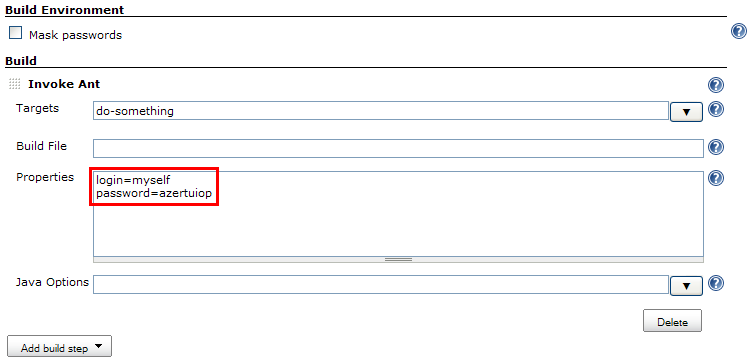
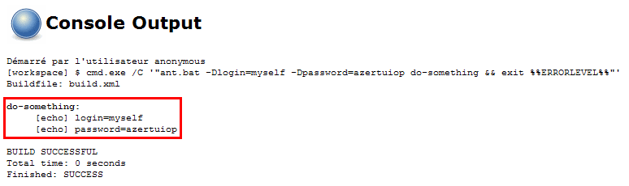
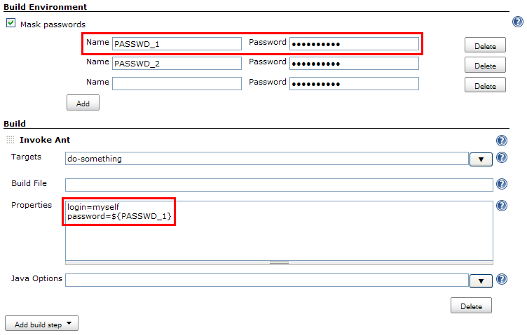
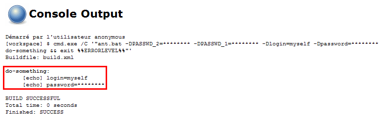
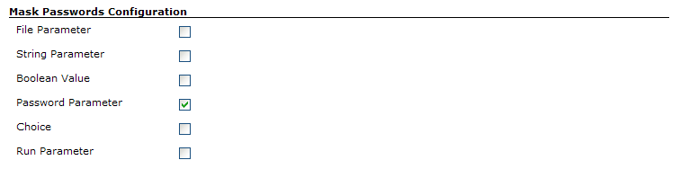

This plugin allows masking passwords that may appear in the
console[.conf-macro .output-inline]## ##

[.aui-icon .aui-icon-small .aui-iconfont-error .confluence-information-macro-icon]##

The current version of this plugin may not be safe to use. Please review
the following warnings before use:

* https://jenkins.io/security/advisory/2019-08-07/#SECURITY-157[Plain
text passwords shown in global configuration form fields]

[.aui-icon .aui-icon-small .aui-iconfont-warning .confluence-information-macro-icon]##

*This plugin is up for adoption.* Want to help improve this plugin?
https://wiki.jenkins.io/display/JENKINS/Adopt+a+Plugin[Click here to
learn more]!

[[MaskPasswordsPlugin-Aboutthisplugin]]
== About this plugin

This plugin allows masking passwords that may appear in the console,
including the ones defined as build parameters. This often happens, for
example, when you use build steps which _can't_ handle passwords
properly. Take a look at the following example.

[[MaskPasswordsPlugin-Before]]
=== Before

Consider you're using an *Invoke Ant* build step to run an Ant target.
This target requires a password to achieve its goal. You would end up
having a job configuration like this:

[.confluence-embedded-file-wrapper .image-center-wrapper]##

Of course, you could have created a variable to store the password and
use this variable in the build step configuration so that it doesn't
appear as plain text. But you would still end with a console output like
this:

[.confluence-embedded-file-wrapper .image-center-wrapper]##

[[MaskPasswordsPlugin-After]]
=== After

When activating the *Mask passwords* option in a job, the builds'
*Password Parameters* (or any other type of build parameters selected
for masking in *Manage Hudson* > *Configure System*) are automatically
masked from the console. Furthermore, you can also safely define a list
of static passwords to be masked (you can also define a list of static
password shared by all jobs in Jenkins' main configuration screen). As
such, the passwords don't appear anymore as plain text in the job
configuration (plus it is ciphered in the job configuration file):

[.confluence-embedded-file-wrapper .image-center-wrapper]##

Once done, new builds will have the passwords masked from the console
output:

[.confluence-embedded-file-wrapper .image-center-wrapper]##

[[MaskPasswordsPlugin-Userguide]]
== User guide

First, go to Jenkins' main configuration screen (*Manage Hudson* >
*Configure System*) and select, in the *Mask Passwords - Configuration*
section, which kind of build parameters have to be automatically masked
from the console output:

[.confluence-embedded-file-wrapper .image-center-wrapper]##

Notice that, as of version 2.7, you can also define global passwords
(defined as pairs of name/password) that can be accessed across all
jobs.

Then, for a specific job, activate the *Mask passwords* option in the
*Build Environment* section to mask passwords from the console:

. All the password parameters defined for the job will be automatically
hidden.
. For each other kind of password (that is, static ones) that may appear
in the console output, add an entry (by clicking on the *Add* button)
and set the *Password* field. +
You may additionally set the *Name* field. If you do so, the password
will then be available as a standard variable. It is then possible to
refer to this password using this variable rather than keying it in a
field which is not ciphered. Take a look at the screenshots above for an
example.

[[MaskPasswordsPlugin-Versionhistory]]
== Version history

[[MaskPasswordsPlugin-Version2.12.0(Jun01,2018)]]
=== Version 2.12.0 (Jun 01, 2018)

* https://github.com/jenkinsci/mask-passwords-plugin/pull/18[image:docs/images/add.svg[(plus)] PR
#18] - Mask Passwords Console Log filter can be now applied to all Run
types +
** It should allow filtering Pipeline jobs
once http://issues.jenkins-ci.org/browse/JENKINS-45693[JENKINS-45693] is
implemented
* image:docs/images/information.svg[(info)] Update
minimal core requirement to 1.625.3

[[MaskPasswordsPlugin-Version2.11.0(Mar13,2018)]]
=== Version 2.11.0 (Mar 13, 2018)

* image:docs/images/information.svg[(info)] Update
minimal core requirement to 1.625.3
* image:docs/images/information.svg[(info)] Developer:
Update Plugin POm to the latest version

[[MaskPasswordsPlugin-Version2.10.1(Apr11,2017)]]
=== Version 2.10.1 (Apr 11, 2017)

* image:docs/images/error.svg[(error)] Prevent
NullPointerException when loading configurations from the disk
(https://issues.jenkins-ci.org/browse/JENKINS-43504[JENKINS-43504])

[[MaskPasswordsPlugin-Version2.10(Apr08,2017)]]
=== Version 2.10 (Apr 08, 2017)

* image:docs/images/add.svg[(plus)] Rework
the Parameter Definition processing engine, improve the reliability of
Sensitive parameter discovery
* image:docs/images/error.svg[(error)] Fix
a number of issues with parameter masking reported to the plugin. Full
list will be published later

[[MaskPasswordsPlugin-Version2.9(30/11/2016)]]
=== Version 2.9 (30/11/2016)

* image:docs/images/add.svg[(plus)]
Add option to mask output strings by a regular expression, also with a
global setting
(https://github.com/jenkinsci/mask-passwords-plugin/pull/6[PR #6])
* image:docs/images/error.svg[(error)]
Properly invoke flush/close operations for the logger in
MaskPasswordOutputStream
(https://github.com/jenkinsci/mask-passwords-plugin/pull/8[PR #8])
* image:docs/images/error.svg[(error)]
Fix issues reported by FindBugs
* image:docs/images/information.svg[(info)]
Update to the new Parent POM

[[MaskPasswordsPlugin-Version2.8(18/10/2015)]]
=== Version 2.8 (18/10/2015)

* image:docs/images/add.svg[(plus)]
Implement SimpleBuildWrapper in order to support Workflow project type
(https://issues.jenkins-ci.org/browse/JENKINS-27392[JENKINS-27392])

[[MaskPasswordsPlugin-Version2.7.4(29/07/2015)]]
=== Version 2.7.4 (29/07/2015)

* image:docs/images/error.svg[(error)]
Password parameters were insensitive
* image:docs/images/error.svg[(error)]
"Mask passwords" build wrapper was generating insensitive environment
variables

Fixed issues (to be investigated and updated):

* Masking of global password parameters in EnvInject
(https://issues.jenkins-ci.org/browse/JENKINS-25821[JENKINS-25821])
* Masked Passwords are shown as input parameters in Build pipeline
plugin
(https://issues.jenkins-ci.org/browse/JENKINS-16516[JENKINS-16516])

[[MaskPasswordsPlugin-Version2.7.3(29/04/2015)]]
=== Version 2.7.3 (29/04/2015)

* Fixed
https://issues.jenkins-ci.org/browse/JENKINS-12161[JENKINS-12161]:
EnvInject vars could have been not masked because of plugins loading
order
* Fixed
https://issues.jenkins-ci.org/browse/JENKINS-14687[JENKINS-14687]:
password exposed unencrypted in HTML source

[[MaskPasswordsPlugin-Version2.7.2(12/07/2011)]]
=== Version 2.7.2 (12/07/2011)

* Fixed
https://issues.jenkins-ci.org/browse/JENKINS-11934[JENKINS-11934]: Once
a job config was submitted, new/updated global passwords were not masked
* Implemented
https://issues.jenkins-ci.org/browse/JENKINS-11924[JENKINS-11924]:
Improved global passwords-related labels

[[MaskPasswordsPlugin-Version2.7.1(10/27/2011)]]
=== Version 2.7.1 (10/27/2011)

* Fixed
https://issues.jenkins-ci.org/browse/JENKINS-11514[JENKINS-11514]: When
migrating from an older version of the plugin, `+NullPointerException+`s
were preventing the jobs using Mask Passwords to load
* Fixed
https://issues.jenkins-ci.org/browse/JENKINS-11515[JENKINS-11515]: Mask
Passwords global config was not actually saved when no global passwords
were defined

[[MaskPasswordsPlugin-Version2.7(10/20/2011)]]
=== Version 2.7 (10/20/2011)

* Implemented
https://issues.jenkins-ci.org/browse/JENKINS-11399[JENKINS-11399]: It is
now possible to define name/password pairs in Jenkins' main
configuration screen (*Manage Hudson* > *Configure System*)

[[MaskPasswordsPlugin-Version2.6.1(05/26/2011)]]
=== Version 2.6.1 (05/26/2011)

* Fixed a bug which was emptying the console output if there was no
password to actually mask

[[MaskPasswordsPlugin-Version2.6(04/29/2011)]]
=== Version 2.6 (04/29/2011)

* Added a new type of build parameter: *Non-Stored Password Parameter*
* Blank passwords are no more masked, avoiding overcrowding the console
with stars

[[MaskPasswordsPlugin-Version2.5(03/11/2011)]]
=== Version 2.5 (03/11/2011)

* New configuration screen (in *Manage Hudson* > *Configure System*)
allowing to select which build parameters have to be masked (*Password
Parameter* are selected by default)
* Fixed a bug which was preventing to mask passwords containing regular
expressions' meta-characters or escape sequences

[[MaskPasswordsPlugin-Version2.0(02/23/2011)]]
=== Version 2.0 (02/23/2011)

* Builds' **Password Parameter**s are now automatically masked.

[[MaskPasswordsPlugin-Version1.0(09/01/2010)]]
=== Version 1.0 (09/01/2010)

* Initial release
