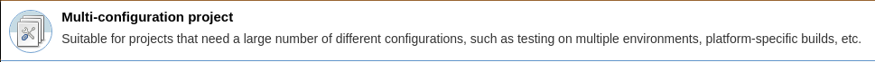

Multi-configuration (matrix) project type.[.conf-macro .output-inline]#
#

[.aui-icon .aui-icon-small .aui-iconfont-info .confluence-information-macro-icon]##

Older versions of this plugin may not be safe to use. Please review the
following warnings before using an older version:

* https://jenkins.io/security/advisory/2019-03-06/#SECURITY-1339[Script
security sandbox bypass]

See
https://wiki.jenkins-ci.org/display/JENKINS/Building+a+matrix+project[Building
a matrix project] for user information.

In the _New Item_ user interface, this plugin contributes the following
one:

[.confluence-embedded-file-wrapper .confluence-embedded-manual-size]##

[[MatrixProjectPlugin-Extensions]]
== Extensions

See all extension points here:
https://wiki.jenkins-ci.org/display/JENKINS/Extension+points#Extensionpoints-ExtensionPointsinMatrixProjectPlugin[Matrix
Project Extension Points]

[[MatrixProjectPlugin-MatrixAxisExtension]]
=== Matrix Axis Extension

* {blank}
+
[.icon .aui-icon .content-type-page]#Page:#
+
https://wiki.jenkins-ci.org/display/JENKINS/DynamicAxis+Plugin[DynamicAxis
Plugin] [.smalltext]#— #

This plugin allows you to define a matrix build axis that is dynamically
populated from an environment variable:
* {blank}
+
[.icon .aui-icon .content-type-page]#Page:#
+
https://wiki.jenkins-ci.org/display/JENKINS/Selenium+Axis+Plugin[Selenium
Axis Plugin] [.smalltext]#— #

Creates an axis based on a local Selenium grid and also build against
the SauceLabs Selenium capability at the same time. +
Both components rebuild before each build to take advantage of any new
capabilities.

The Selenium grid uses all capabilities available and the SauceLab one a
random subset, which can be configured or disabled.
* {blank}
+
[.icon .aui-icon .content-type-page]#Page:#
+
https://wiki.jenkins-ci.org/display/JENKINS/Yaml+Axis+Plugin[Yaml Axis
Plugin] [.smalltext]#— Matrix project axis creation and exclusion plugin
using yaml file (It's similar to .travis.yml) #
* {blank}
+
[.icon .aui-icon .content-type-page]#Page:#
+
https://wiki.jenkins-ci.org/display/JENKINS/Sauce+OnDemand+Plugin[Sauce
OnDemand Plugin] [.smalltext]#— This plugin allows you to integrate
https://saucelabs.com/selenium[Sauce Selenium Testing] with Jenkins.#
* {blank}
+
[.icon .aui-icon .content-type-page]#Page:#
+
https://wiki.jenkins-ci.org/display/JENKINS/Matrix+Groovy+Execution+Strategy+Plugin[Matrix
Groovy Execution Strategy Plugin] [.smalltext]#— A plugin to decide the
execution order and valid combinations of matrix projects.#
* {blank}
+
[.icon .aui-icon .content-type-page]#Page:#
+
https://wiki.jenkins-ci.org/display/JENKINS/Elastic+Axis[Elastic Axis]
[.smalltext]#— This plugin is a power up for the multi configuration
jobs allowing you to configure jobs to run on all slaves under a single
label.#
* {blank}
+
[.icon .aui-icon .content-type-page]#Page:#
+
https://wiki.jenkins-ci.org/display/JENKINS/NodeLabel+Parameter+Plugin[NodeLabel
Parameter Plugin] [.smalltext]#— This plugin adds two new parameter
types to job configuration - node and label, this allows to dynamically
select the node where a job/project should be executed.#

If your plug-in is not listed here, then simply add the label
*matrix-axis-producer* to your plug-in wiki page and it will be
automatically listed.

[[MatrixProjectPlugin-Changelog]]
== *Changelog*

[[MatrixProjectPlugin-Version1.14(Mar6,2019)]]
=== *Version 1.14 (Mar 6, 2019)*

* https://jenkins.io/security/advisory/2019-03-06/#SECURITY-1339[Fix
security issue]** +
**

[[MatrixProjectPlugin-Version1.12(Oct3,2017)]]
=== *Version 1.12 (Oct 3, 2017)*

* https://github.com/jenkinsci/matrix-project-plugin/commit/1d6412a216c85cee69c65e8fc0a213bba0026d90[Align
test result table headers where fields are]
* https://github.com/jenkinsci/matrix-project-plugin/commit/bdc61b83c4361711f3a909d156c75fcb22f0deb2[Allow
MatrixAggregatable to be registered as an (optional) extension.]
* https://github.com/jenkinsci/matrix-project-plugin/commit/3966482d0272f2226b76767a62ede3266c2cf655[Fix
potential locking problem in MatrixProject]

[[MatrixProjectPlugin-Version1.11(May12,2017)]]
=== *Version 1.11 (May 12, 2017)*

* https://issues.jenkins-ci.org/browse/JENKINS-43990[JENKINS-43990]
Upgrade to new parent pom and other related fixes

[[MatrixProjectPlugin-Version1.10(Apr19,2017)]]
=== *Version 1.10 (Apr 19, 2017)*

* https://issues.jenkins-ci.org/browse/JENKINS-39739[JENKINS-39739] Argument
passed to createVariableResolver() must never be null
* https://issues.jenkins-ci.org/browse/JENKINS-43390[JENKINS-43390] Loading
parameters from xml file causes that the same parameters are different
objects for matrix configuration builds
* https://issues.jenkins-ci.org/browse/JENKINS-34389[JENKINS-34389] Fixed
handling of dynamic axis

[[MatrixProjectPlugin-Version1.9(Mar24,2017)]]
=== *Version 1.9 (Mar 24, 2017)*

* Optimized matrix configuration label computation
* https://issues.jenkins-ci.org/browse/JENKINS-34389[JENKINS-34389]
Improved handling of axis rebuild
* Fixed StringIndexOutOfBoundsException if label have no values
* Make matrix build able to survive restarts** **

[[MatrixProjectPlugin-Version1.8(Jan12,2017)]]
=== *Version 1.8 (Jan 12, 2017)*

* Fixed handling of dynamic axis
* Fix race condition where A NPE is thrown when an item is being
processed
* Improved German Translation

[[MatrixProjectPlugin-Version1.7.1(Jun24,2016)]]
===  **Version 1.7.1 (Jun 24, 2016)**

*  https://issues.jenkins-ci.org/browse/JENKINS-32230[JENKINS-32230] Disable
WARNING log when folder is already existed

[[MatrixProjectPlugin-Version1.7(May24,2016)]]
=== Version 1.7 (May 24, 2016)

* https://issues.jenkins-ci.org/browse/JENKINS-34758[JENKINS-34758] Parameters
visibility in child builds (related to SECURITY-170)

[[MatrixProjectPlugin-Version1.6(Jun18,2015)]]
=== Version 1.6 (Jun 18, 2015)

* https://issues.jenkins-ci.org/browse/JENKINS-JENKINS-28909[JENKINS-JENKINS-28909]
Do not enforce safe characters for axis values (regression from 1.5).

[[MatrixProjectPlugin-Version1.5(Jun08,2015)]]
=== Version 1.5 (Jun 08, 2015)

* Now requires 1.609+.
* https://issues.jenkins-ci.org/browse/JENKINS-25221[JENKINS-25221] Use
new internal control.
* Fix NullPointerException if swapping between MatrixExecutionStrategies
* https://issues.jenkins-ci.org/browse/JENKINS-25449[JENKINS-25449]
Better form validation.
* https://issues.jenkins-ci.org/browse/JENKINS-13554[JENKINS-13554]
Cleaner handling of build deletion.
* https://issues.jenkins-ci.org/browse/JENKINS-23614[JENKINS-23614] URL
escaping fix.
* https://issues.jenkins-ci.org/browse/JENKINS-9277[JENKINS-9277]
https://issues.jenkins-ci.org/browse/JENKINS-23614[JENKINS-23614]
https://issues.jenkins-ci.org/browse/JENKINS-25448[JENKINS-25448] Reject
invalid axis name/value.
* Display axis name in tooltip.
* https://issues.jenkins-ci.org/browse/JENKINS-27162[JENKINS-27162] Log
touchstone build results.
* https://issues.jenkins-ci.org/browse/JENKINS-26582[JENKINS-26582]
Errors when starting builds from Git commit notifications.

[[MatrixProjectPlugin-Version1.4.1(Feb27,2015)]]
=== Version 1.4.1 (Feb 27, 2015)

[.aui-icon .aui-icon-small .aui-iconfont-warning .confluence-information-macro-icon]#
#

Bundled in 1.596.1 and 1.600. *Do not update to this release if using an
older Jenkins version*. If you have already updated, use _Plugin Manager
» Installed_ to revert to your previous version.

* https://wiki.jenkins-ci.org/display/SECURITY/Jenkins+Security+Advisory+2015-02-27[Fixed
a security issue related to the combinations filter script]. You need to
update Jenkins to 1.596.1 or 1.600 to get this fix.

[[MatrixProjectPlugin-Version1.4(Oct14,2014)]]
=== Version 1.4 (Oct 14, 2014)

* image:docs/images/information.svg[(info)]
Automatic deletion of inactive configurations from the disk
* image:docs/images/information.svg[(info)]
https://issues.jenkins-ci.org/browse/JENKINS-24282[JENKINS-24282] Use
noun phrase in the New Item dialog
* image:docs/images/error.svg[(error)]
https://issues.jenkins-ci.org/browse/JENKINS-19179[JENKINS-19179]
Prevent the disabling of matrix configurations (e.g. by checkout
failures in Subversion plugin)

[[MatrixProjectPlugin-Version1.3(Jul22,2014)]]
=== Version 1.3 (Jul 22, 2014)

* Moved in a file which was accidentally left behind in core.
* Preparing for possible split of test reporting functionality into a
plugin.
* Portuguese translation fix.

[[MatrixProjectPlugin-Version1.2(May07,2014)]]
=== Version 1.2 (May 07, 2014)

* https://issues.jenkins-ci.org/browse/JENKINS-22798[JENKINS-22798]
Fixed another class loading problem related to split.

[[MatrixProjectPlugin-Version1.1(May06,2014)]]
=== Version 1.1 (May 06, 2014)

* https://issues.jenkins-ci.org/browse/JENKINS-22863[JENKINS-22863]
Fixed class loading problem affecting combination filters after split.

[[MatrixProjectPlugin-Version1.0(Apr28,2014)]]
=== Version 1.0 (Apr 28, 2014)

* Depending on 1.561 final.

[[MatrixProjectPlugin-Version1.0beta1(Apr14,2014)]]
=== Version 1.0 beta 1 (Apr 14, 2014)

* Split off from core as of 1.561.
