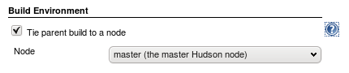

Ties the parent build of a multi-configuration project to a node.

[.aui-icon .aui-icon-small .aui-iconfont-error .confluence-information-macro-icon]#
#

As https://issues.jenkins-ci.org/browse/JENKINS-7825[JENKINS-7825] is
fixed in Jenkins 1.521, this plugin is now deprecated. Please look under
the "advanced" option of the matrix project configuration to tie the
matrix parent to a label/slave.

Simple groovy script to perform the migration. Users are encouraged to
backup first.

[source,syntaxhighlighter-pre]
----
j = Jenkins.instance;
 
jobs = j.items.grep { it instanceof hudson.matrix.MatrixProject }
 
jobs.grep {
  wrapper(it) != null
}.each {
  println "${it.fullName}"
  def wrpr = wrapper(it)
  println "\t${wrpr.labelName}"
  
  it.setAssignedLabel(j.getLabel(wrpr.labelName));
  it.getBuildWrappersList().remove(wrpr);
  it.save();
}.size();
 
def wrapper(mp) {
  return mp.getBuildWrappersList().get(matrixtieparent.BuildWrapperMtp.class)
}
----

[[MatrixTieParentPlugin-Usage]]
== Usage

[.confluence-embedded-file-wrapper .confluence-embedded-manual-size]##

Multi-Configuration projects always run one _parent build_ job. The
_parent build_ verifies source control checkout operations, then
monitors the execution of child jobs created to satisfy the
Configuration Matrix.

Sometimes the _parent build_ must run on some computers, but not others.
This may be due to constraints such as a lack of source control or other
software on a computer, file permission issues, etc.

Restrict where the _parent build_ runs by selecting a specific
computer's node name. Or, use a label to restrict the parent build to
run only on computers marked with that label.

[[MatrixTieParentPlugin-Limitations]]
== Limitations

* System property _hudson.model.Hudson.flyweightSupport_ must be set to
true. This is Jenkins' default setting since v1.337.

[[MatrixTieParentPlugin-Changelog]]
== Changelog

[[MatrixTieParentPlugin-Version1.1-August23,2010]]
=== Version 1.1 - August 23, 2010

* Requires *Hudson ver. 1.373* or newer.
* Fix exception caused by Hudson core changes introduced in v1.372.
Fixed for v1.373 and newer. (Don't use v1.372)

[[MatrixTieParentPlugin-Version1.0-June8,2010]]
=== Version 1.0 - June 8, 2010

* Works with *Hudson versions 1.361 thru 1.371*
* Initial release.
