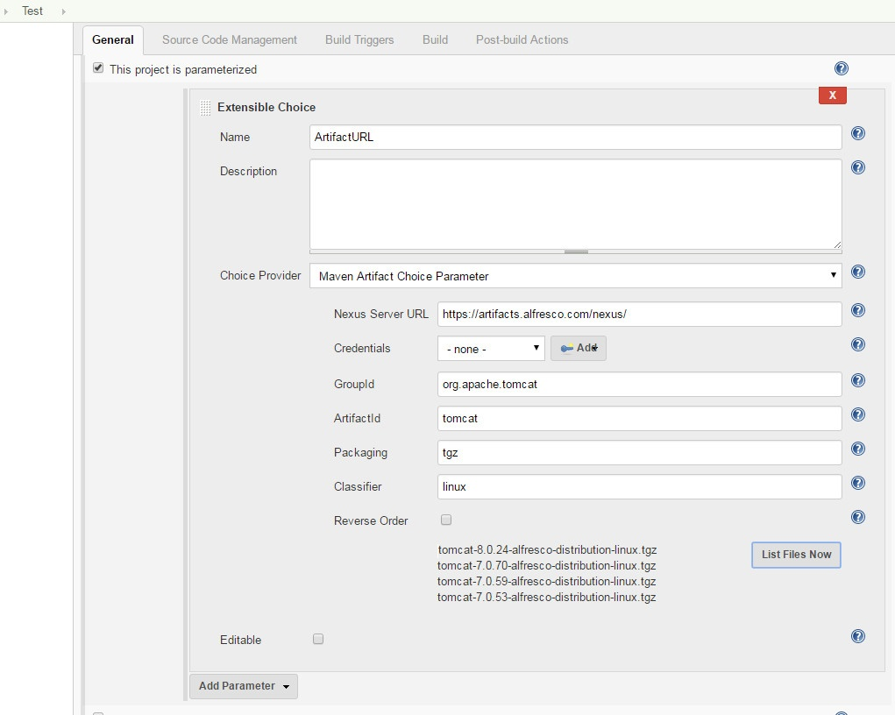

[.conf-macro .output-inline]# #

[.aui-icon .aui-icon-small .aui-iconfont-info .confluence-information-macro-icon]##

Older versions of this plugin may not be safe to use. Please review the
following warnings before using an older version:

* https://jenkins.io/security/advisory/2018-07-30/#SECURITY-1022[CSRF
vulnerability and missing permission checks allowed capturing
credentials]

[.conf-macro .output-inline]#This Plugin adds an additional
ChoiceListProvider to famous
https://wiki.jenkins-ci.org/display/JENKINS/Extensible+Choice+Parameter+plugin[Extensible
Choice Parameter Plugin] to select Artifacts from any Nexus or Maven
Central Repository.#

[[MavenArtifactChoiceListProviderPlugin-MavenArtifactChoiceListProvider]]
== MavenArtifact ChoiceListProvider

[[MavenArtifactChoiceListProviderPlugin-Whatisthis?]]
=== What is this?

This Plugin adds an additional ChoiceListProvider to famous
https://plugins.jenkins.io/extensible-choice-parameter[Extensible Choice
Parameter] Plugin.

With this extension its possible to use the Service API from a Maven
Repositories like Nexus, Maven-Central or Artifactory to search for
artifacts using groupId, artifactId and packaging.

This plugin will let the user choose a version from the available
artifacts in the repository and will publish the URL as an environment
variable. The Plugin will return the full URL of the choosen artifact,
so that it will be available during the build, i.E. you can retrieve the
artifact by using "wget"

[[MavenArtifactChoiceListProviderPlugin-Example]]
==== Example

We are using this plugin to let our QA department choose between the
various versions of our software which then is downloaded and installed
on the test environment.

[[MavenArtifactChoiceListProviderPlugin-ConfigurationExample]]
=== Configuration Example

[[MavenArtifactChoiceListProviderPlugin-]]
=== [.confluence-embedded-file-wrapper]##

[[MavenArtifactChoiceListProviderPlugin-KnownsIssue]]
=== Knowns Issue

[[MavenArtifactChoiceListProviderPlugin-Nexus3]]
==== Nexus 3

Since Nexus 3.15.x the RESTful search service is available by a
different URL. In the current plugin version this new URL is used. If
you are using an older Nexus 3 instance you have to use the plugin in
version 1.3.4

[[MavenArtifactChoiceListProviderPlugin-NexusSnapshots]]
==== Nexus Snapshots

If you would like to use Snapshot Versions of your artifacts you have to
enable the tick-box in the Jenkins Settings. Only with the RESTful
interface of Nexus 2 you will be able to retrieve Snapshot versions.

[.confluence-embedded-file-wrapper .confluence-embedded-manual-size]##

[[MavenArtifactChoiceListProviderPlugin-Artifactory]]
==== Artifactory

Artifactory API is not returning the correct ArtifactIds but only a URL
to a JSON file that contains the DownloadURI of the Artifact. As
currently there is no way in the Extensible Choice Plugin to intercept
the selected value and because its not performant to query Artifactory
for all items in the list for the correct downloadURI, the workaround is
like this:

[source,syntaxhighlighter-pre]
----
wget `wget -qO - https://repo.jenkins-ci.org/api/storage/releases/org/jenkins-ci/plugins/ant-in-workspace/1.1.0/ant-in-workspace-1.1.0-javadoc.jar | json downloadUri`
----

The json command like tool is required:

[source,syntaxhighlighter-pre]
----
json --version
json 9.0.6
written by Trent Mick
https://github.com/trentm/json
----

https://github.com/phreakadelle/maven-artifact-choicelistprovider-plugin/issues/11#issuecomment-374142298

[[MavenArtifactChoiceListProviderPlugin-Links]]
=== Links

* Thanks for the hint, but this plugin is very simliar to mine
https://github.com/jenkinsci/repository-connector-plugin

[[MavenArtifactChoiceListProviderPlugin-Authors]]
=== Authors

Stephan Watermeyer

[[MavenArtifactChoiceListProviderPlugin-FurtherLinks]]
=== Further Links

* [line-through]*Nexus 3 Support
(Pending): https://issues.sonatype.org/browse/NEXUS-11893*

[[MavenArtifactChoiceListProviderPlugin-License]]
=== License

Licensed  under the
https://github.com/heremaps/buildrotator-plugin/blob/master/LICENSE[MIT
License (MIT)].

[[MavenArtifactChoiceListProviderPlugin-Changelog]]
=== Changelog

[[MavenArtifactChoiceListProviderPlugin-07.Februrary2019-1.4.0]]
==== 07. Februrary 2019 - 1.4.0

* https://issues.sonatype.org/browse/NEXUS-18345[NEXUS-18345]: Migrate
to the new RESTful Endpoint
* Fix: Duplicate entry in global settings

[[MavenArtifactChoiceListProviderPlugin-22.December2018-1.3.4]]
==== 22. December 2018 - 1.3.4

* FIX: Support more than 50 matches on Nexus 3. Use continuationToken
feature.

[[MavenArtifactChoiceListProviderPlugin-30.July2018-1.3.2]]
==== 30. July 2018 - 1.3.2

* https://jenkins.io/security/advisory/2018-07-30/#SECURITY-1022[Fix
security issue]

[[MavenArtifactChoiceListProviderPlugin-12.July2018-1.3.1]]
==== 12. July 2018 - 1.3.1

* Added Nexus 3 Support
* Updated Dependency Versions

[[MavenArtifactChoiceListProviderPlugin-18.January2018-1.2.3]]
==== 18. January 2018 - 1.2.3

* Fixed an Issue with a missing "-" between the Version and the
Classifier +
https://github.com/phreakadelle/maven-artifact-choicelistprovider-plugin/issues/9

[[MavenArtifactChoiceListProviderPlugin-15.December2017-1.2.2]]
==== 15. December 2017 - 1.2.2

* ADD: Added an optional field for the RepositoryId to search in Nexus +
https://github.com/phreakadelle/maven-artifact-choicelistprovider-plugin/issues/8
* FIX: The Checkbox "Use Restful API" in the Global Configuration was
not loaded correctly after a Jenkins restart.

[[MavenArtifactChoiceListProviderPlugin-18.October2017-1.2.0]]
==== 18. October 2017 - 1.2.0

* ADD: Make ArtifactId Optional +
https://github.com/phreakadelle/maven-artifact-choicelistprovider-plugin/issues/5
* ADD: It's configurable now, wether to use the RESTful API of Nexus or
just display the static Aritifact-URL. +
https://github.com/phreakadelle/maven-artifact-choicelistprovider-plugin/issues/3

[[MavenArtifactChoiceListProviderPlugin-15.Februar2017-1.1.3]]
==== 15. Februar 2017 - 1.1.3

* FIX: Caching of ChoiceList Parameters leads to the point, that you
have to reconfigure the job first before new values are available in the
list. This implicit caching is now taken out.

[[MavenArtifactChoiceListProviderPlugin-18.Januar2017-1.1.1]]
==== 18. Januar 2017 - 1.1.1

* FIX: Fixed an bug that occured when the URL to the artifact was
generated.

[[MavenArtifactChoiceListProviderPlugin-17.Januar2017-1.1.0]]
==== 17. Januar 2017 - 1.1.0

* ADD: Added Feature to Support jFrog Artifactory repository.

[[MavenArtifactChoiceListProviderPlugin-13.January2017-1.0.4]]
==== 13. January 2017 - 1.0.4

* ADD: Implemented a new resolver for artifact items. In the past the
URL was constructed to target the file directly in the repository. The
new implementation makes use of the RESTful service of Nexus to retrieve
an artifact. This has the advantage, that also Snapshot versions can be
retrieved. 

[[MavenArtifactChoiceListProviderPlugin-23.November2016-1.0.3]]
==== 23. November 2016 - 1.0.3

* Finally the official release to jenkins repository

[[MavenArtifactChoiceListProviderPlugin-11.November2016-1.0.2]]
==== 11. November 2016 - 1.0.2

ADD: New dependency to extensible-choice-plugin in version 1.3.3 +
FIX: POM Update

[[MavenArtifactChoiceListProviderPlugin-10.November2016-1.0.1]]
==== 10. November 2016 - 1.0.1

ADD: New Feature to use the search.maven.org REST API to display
artifacts in Jenkins +
FIX: Some changes to support the official release of this software

[[MavenArtifactChoiceListProviderPlugin-09.November2016-1.0.0]]
==== 09. November 2016 - 1.0.0

* ADD: Plugin is released as an official Jenkins Plugin
* FIX: Changed unit tests to use a public nexus for testing
* ADD: Prepartion to use shorter artifact names in SelectBox that will
be resolved once the build has been started (onBuildTriggeredWith(...)).
Only preparation, as i dont have a solution how to change build
environments once the build has been started.

[[MavenArtifactChoiceListProviderPlugin-25.July2016-0.0.8]]
==== 25. July 2016 - 0.0.8

* ADD: Added Configuration to configure UserCredentials for a Nexus
Server. Could be a Token or a real Username.

[[MavenArtifactChoiceListProviderPlugin-25.July2016-0.0.6]]
==== 25. July 2016 - 0.0.6

* ADD: Quickfix to add user credentials for Nexus. Will be put into
Jenkins-Credentials in the next version

[[MavenArtifactChoiceListProviderPlugin-20.July2016]]
==== 20. July 2016

* Changed Implementation of Set containing the results from Nexus to
LinkedHashSet as this implementation keeps the order as it is replied
from Nexus and also makes sure that entries are only contained once.

[[MavenArtifactChoiceListProviderPlugin-29.June2016]]
==== 29. June 2016

* Added Checkbox to have the response list in reverse order
* Changed Packaging-Textbox: Empty Value will only return the parent
folder. The * character will return all entries for that artifact. Or
use special entries like "tar.gz" or "zip"

[[MavenArtifactChoiceListProviderPlugin-30.May2016]]
==== 30. May 2016

* Added Example Image showing the Project Configuration
* Added Comment for the "onBuildTriggeredWith(...)" method which can
maybe later extended to transform the provided parameter (which could be
a short version of the name) into the correct working URL

[[MavenArtifactChoiceListProviderPlugin-24.May2016]]
==== 24. May 2016

* Initial Version
