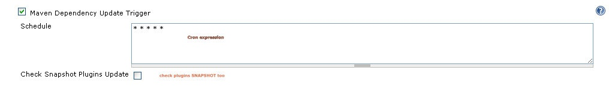
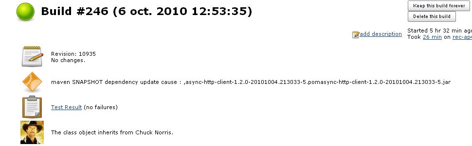

This plugin will check if any SNAPSHOT dependencies (or optionally
plugins SNAPSHOT) have been updated during your project's dependencies
resolution and trigger a build. You have to configure a cron expression.

[.aui-icon .aui-icon-small .aui-iconfont-warning .confluence-information-macro-icon]#
#

This plugin use maven 3 apis to update dependencies.

[[MavenDependencyUpdatetrigger-Triggerconfiguration]]
== Trigger configuration

[.confluence-embedded-file-wrapper .image-center-wrapper]##

[[MavenDependencyUpdatetrigger-ThebuildcausewilldisplaywhichSNAPSHOTShasbeendownloaded:]]
== The build cause will display which SNAPSHOTS has been downloaded:

[.confluence-embedded-file-wrapper]##

[[MavenDependencyUpdatetrigger-History]]
== History

[[MavenDependencyUpdatetrigger-Version1.5:24April2015.]]
=== *Version 1.5 : 24 April 2015.*

* Remove dependencies and imports from older maven plugin that used
*.aether.* packages.
(https://issues.jenkins-ci.org/browse/JENKINS-23502[issue #23502])

[[MavenDependencyUpdatetrigger-Version1.4:30Dec2011.]]
=== *Version 1.4 : 30 Dec 2011.*

* Upgrade maven versions.
* fix use of maven default global settings.
* various fixes on reading reactors projects.

[[MavenDependencyUpdatetrigger-Version1.3:13Aug2011.]]
=== Version 1.3 : 13 Aug 2011.

* Update for Jenkins

[[MavenDependencyUpdatetrigger-Version1.2:6Oct2010.]]
=== Version 1.2 : 6 Oct 2010.

* Build is triggered whene maven-metadata-$\{repoId}.xml is downloaded
(https://issues.jenkins-ci.org/browse/JENKINS-7688[JENKINS-7688])

[[MavenDependencyUpdatetrigger-Version1.1:5Oct2010.]]
=== Version 1.1 : 5 Oct 2010.

* Fix execution on remote nodes (plugin version 1.0 works only for jobs
on master)
(https://issues.jenkins-ci.org/browse/JENKINS-7650[JENKINS-7650])
* Maven Dependency Update trigger doesn't use defined settings xml or
properties
(https://issues.jenkins-ci.org/browse/JENKINS-7660[JENKINS-7660])

[[MavenDependencyUpdatetrigger-Version1.0:2Oct2010.]]
=== Version 1.0 : 2 Oct 2010.

* First release
