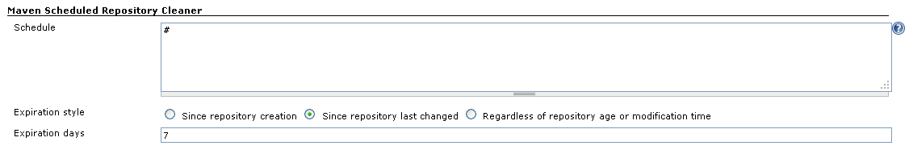
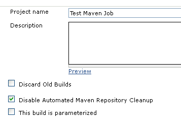

Clean your jobs maven repositories.

[[MavenRepoCleanerPlugin-Knownissues]]
== Known issues

[[MavenRepoCleanerPlugin-Howitworks]]
== How it works

[[MavenRepoCleanerPlugin-Globalconfiguration]]
=== Global configuration

Allows you to schedule a clean up of your local maven repositories.
[.confluence-embedded-file-wrapper]##

[[MavenRepoCleanerPlugin-Projectconfiguration]]
=== Project configuration

[[MavenRepoCleanerPlugin-]]
=== [.confluence-embedded-file-wrapper]##

[[MavenRepoCleanerPlugin-History]]
== History

[[MavenRepoCleanerPlugin-Version1.1(Notreleasedyet)]]
=== Version 1.1 (Not released yet)

[[MavenRepoCleanerPlugin-Version1.2(April24,2012)]]
=== Version 1.2 (April 24, 2012)

* alternative strategy to cleanup the repo for all artifacts not used
during the build (require last access time support on filesystem)
* fix NullPointerException saving empty configuration
(https://issues.jenkins-ci.org/browse/JENKINS-12978[JENKINS-12978])

[[MavenRepoCleanerPlugin-Version1.0(Aug2,2011)]]
=== Version 1.0 (Aug 2,2011)

* First version
