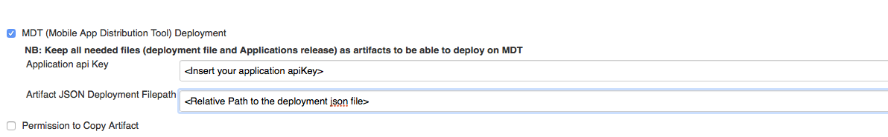
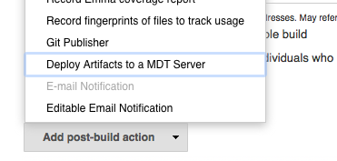
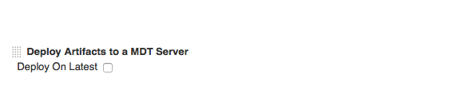
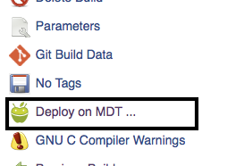
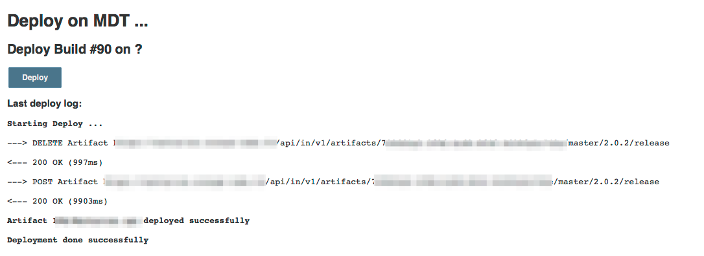

Enables Jenkins to upload Android (APK files)  and iOS (IPA files) apps
to a https://github.com/rgroult/MobDistTool[Mobile App Distribution
Tool] server

[[MobileAppDistribution(MDT)Plugin-Features]]
== Features

* Uploading APK and IPA files to MDT server
** Upload can be executed as Post Build Step or as existing build
Action.

[[MobileAppDistribution(MDT)Plugin-Requirements]]
== Requirements

[[MobileAppDistribution(MDT)Plugin-Jenkins]]
=== Jenkins

Jenkins http://jenkins-ci.org/changelog-stable#v1.596.1[version
1.596.1] with java 1.7 or newer is required.

[[MobileAppDistribution(MDT)Plugin-RunningMDTserver]]
=== Running MDT server

You need your own instance of https://github.com/rgroult/MobDistTool[MDT
server].

[[MobileAppDistribution(MDT)Plugin-Setup]]
== *Setup*

[[MobileAppDistribution(MDT)Plugin-Installplugin]]
=== *Install plugin*

Install this plugin via the Jenkins plugin manager. Search "MDT
deployment" to find it.

[[MobileAppDistribution(MDT)Plugin-Serverconfig]]
=== Server config

You can set global MDT server under Manage Jenkins -> Configure System

[[MobileAppDistribution(MDT)Plugin-Per-jobconfig]]
=== Per-job config

[[MobileAppDistribution(MDT)Plugin-Mandatory]]
==== *Mandatory*

*1 - Configure application informations.*

[.confluence-embedded-file-wrapper]##

2 - Add "*Archive the artifacts*" as Post-build Actions in order to use
plugin.

*NB:* For  structure of the deploy JSON file
see https://github.com/rgroult/MobDistTool#artifacts-provisionning[MDT
Documentation].

[[MobileAppDistribution(MDT)Plugin-Optional]]
==== *Optional*

If you want to deploy after each successful build, add a Post-build
Action

[.confluence-embedded-file-wrapper]##

Next, you can choose to deploy on Latest version or build's version.

[.confluence-embedded-file-wrapper]##

[[MobileAppDistribution(MDT)Plugin-Deployexistingbuild]]
=== Deploy existing build

You can deploy deploy a existing build with MDT action

[.confluence-embedded-file-wrapper]##

[.confluence-embedded-file-wrapper]##

[[MobileAppDistribution(MDT)Plugin-Versionhistory]]
== *Version history*

[[MobileAppDistribution(MDT)Plugin-Version1.0.4(June01,2016)]]
=== *Version 1.0.4 (June 01, 2016)*

* Bug Fixes of version 1.0.2

[[MobileAppDistribution(MDT)Plugin-Version1.0.2(May26,2016):Donotuseit,problemoccuredbetweenmigrationonGitfromgithubtojenkinsofficialrepo.]]
=== *Version 1.0.2 (May 26, 2016) : Do not use it, problem occured between migration on Git from github to jenkins official repo.*

* Bug Fixes
* Add Badge Action deployment status

[[MobileAppDistribution(MDT)Plugin-Version1.0.0(May24,2016)]]
=== *Version 1.0.0 (May 24, 2016)*

* First version
