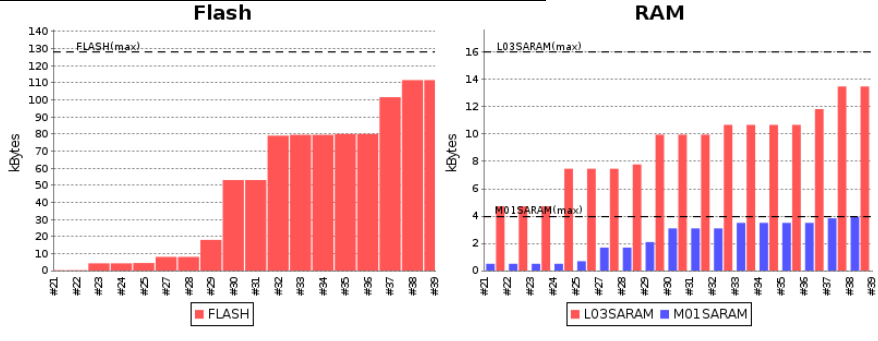
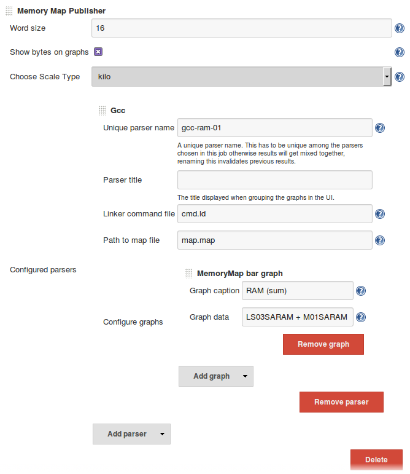
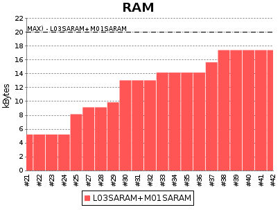
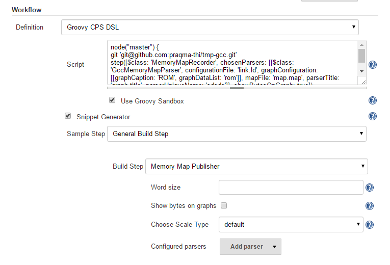

[[MemoryMapPlugin-Developedby]]
===== Developed by

[.confluence-embedded-file-wrapper]#image:docs/images/praqmalogo.png[image]#

[[MemoryMapPlugin-Sponsoredby]]
===== Sponsored by

[.confluence-embedded-file-wrapper]##

[.confluence-embedded-file-wrapper .confluence-embedded-manual-size]##

We use Github issues as issue tracker

[.aui-icon .aui-icon-small .aui-iconfont-warning .confluence-information-macro-icon]#
#

Please use our Praqma Memory Map Github repository and issues there to
file issue related to this plugin:
https://github.com/Praqma/memory-map-plugin

[[MemoryMapPlugin-TheJenkinsMemoryMapPlugin]]
== The Jenkins Memory Map Plugin

Upgrade from 1.X.X to 2.X.X

[.aui-icon .aui-icon-small .aui-iconfont-warning .confluence-information-macro-icon]#
#

Upgrading from 1.X.X to 2.X.X is a one way street, so make sure to take
a backup of your jobs config.xml if you want to revert to the older
version.

 

The Memory Map Plugin provides assistance for monitoring the memory map
created by a linker. It is especially useful when development is being
conducted in conditions where memory is limited, e.g. embedded systems.

Currently the plugin supports the following linkers:

* Texas Instruments TMS320C200 Linker
* GCC linker (LD)

The plugin is developed to allow for easy extensibility, adding
additional support for different linkers is relatively easy. We
encourage you to implement support for linkers yourself or to contribute
by proxy (http://www.praqma.com/stories/contribbyproxy).

Read more about the ongoing development below:
https://wiki.jenkins-ci.org/display/JENKINS/memory+map+plugin#MemoryMapPlugin-Ongoingdevelopment[#Ongoing
development].

Some of the next obvious linkers choices to implement are:

* Keil
* IAR

[[MemoryMapPlugin-Usage]]
== Usage

The plugin provides assistance with:

* Constant monitoring of your applications current memory usage and
layout.
* Provides continuous feedback on the memory consumption and the amount
that is still available.
* Later the plugin will be extended so that memory usage can be browsed,
through different layers of the graph, in details down to each symbol in
the code. See
https://wiki.jenkins-ci.org/display/JENKINS/memory+map+plugin#MemoryMapPlugin-Roadmap[#Road
map]

[width="100%",cols="100%",]
|===
a|
[.confluence-embedded-file-wrapper]##

|An example of two memory map graph showing memory consumption over
builds. +
We have configured two graph corresponding to our two types of memory,
and assigned logical memory section to each graph in the plugin
configuration. +
See below under
https://wiki.jenkins-ci.org/display/JENKINS/memory+map+plugin#MemoryMapPlugin-Configuration[#Configuration]
for how to configure graphs.
|===

[[MemoryMapPlugin-Ashortmemorymapintroduction]]
=== A short memory map introduction

For operating systems with dynamic loaders a relocatable binary is the
end product of the compiler and linker process. However for embedded
systems, where memory is the limiting constraint, there is a need for an
absolutely located binary. A relocator is a component of the linker that
creates such a absolutely located binary. The layout is typically
described by a configuration file in which the developer can configure
the memory for the system. The linker proceeds from there by creating
the executable binary that will be deployed on the target. It also has
the capability to create a memory map file. A memory map file describes
how objects, symbols, program code, startup code etc. will be allocated
in the physical memory.

This plugin analyses the memory map file and displays how much memory
will be used, unused and allocated in various parts of physical memory.

[[MemoryMapPlugin-Configurationofmemorymapplugin]]
=== Configuration of memory map plugin

After installing the plugin, there will be a *Publish Memory Map*
post-build action available to you.

After adding the post-build step you must configure the basic settings:

*Word size:* The plugin assumes values in the linker command and map
file are in words, this field requires the size of a word on your
platform in bits.

*Show bytes on graphs:* If checked graph will show bytes instead of
words.*Choose Scale Type:* Choose to show values on a kilo, mega or giga
scale.

[[MemoryMapPlugin-Addingaparser]]
==== Adding a parser

You can add a parser to the publisher by clicking the *Add* button.

*Unique parser name:* A name unique among other parsers for this job.
Renaming causes previous results to be lost.

*Parser title:* A title used for grouping this parser's graphs in the
UI.

*Linker command* *[.nolink]#file:#* The linker configuration file where
the memory layout is described.

*Path to map [.nolink]#file:#* Path where your memory map file resides.

File patterns

[.aui-icon .aui-icon-small .aui-iconfont-info .confluence-information-macro-icon]#
#

The  command and map file fields support ant file patterns and are
relative to the workspace. +
Only 1 file is selected, the first one which matches the pattern.

[[MemoryMapPlugin-Addingagraph]]
==== Adding a graph

To add graphs to a parser, again, click the *Add* button.

*Graph caption:* A title used for this graph in the UI.

*Graph data:* The memory sections that should be monitored in the graph.

Graph data options

[.aui-icon .aui-icon-small .aui-iconfont-info .confluence-information-macro-icon]#
#

To display multiple sections, separate them with commas.

To display the sum of sections, separate with +.

[width="100%",cols="100%",]
|===
a|
[.confluence-embedded-file-wrapper]##

a|
[.confluence-embedded-file-wrapper]##

|An example of a fully configured Memory Map Publisher and its result
|===

[[MemoryMapPlugin-Runningthememorymapplugin]]
==== Running the memory map plugin

* For each build the linker command file and memory map file will be
parsed and the graph updated for the build
* If build fails, data from the graph is omitted
* Adding new memory section to the graphs will first have an effect
after next build
* Existing memory section can be "moved" between graph without running
new build, eg. configuring L03SARAM to be shown in the FLASH graph
instead of RAM graph.

[[MemoryMapPlugin-Roadmap]]
== Road map

[[MemoryMapPlugin-Ongoingdevelopment]]
=== Ongoing development

Besides regular bugfixes and maintenance, two major changes are in the
pipeline. We call them the third and fourth development iteration
respectively.

[[MemoryMapPlugin-Smallerfeatures-upfordiscussion]]
==== Smaller features - up for discussion

* Memory usage thresholds: Enable configuration of a threshold that will
make the job to fail or unstable if new memory consumption exceed the
* Warn value: The build could fail or be unstable and users notified if
memory usage goes beyond the maximum available. You can set that value,
say 5% under the maximum, so your developer team would have time for
refactoring if you expect to need more than that 5%.

You can contribute with one or more of these features - see
https://wiki.jenkins-ci.org/display/JENKINS/memory+map+plugin#MemoryMapPlugin-Contributions[#Contributions].

If you want a feature, without doing the dirty work yourself sponsor our
development and contribute by proxy. See
http://www.praqma.com/stories/contribbyproxy

[[MemoryMapPlugin-Thirdandfourthdevelopmentiteration]]
=== Third and fourth development iteration

The overall plan is to implement memory analysis in deeper details. +
We'd like to add the ability to click on graphs and browse the memory
usage in greater detail. Clicking through to the second layer will show
you, for example, a summary of initialized, uinitialized, data etc. +
Clicking through to the third level will show you the memory usage in
even greater detail, all the way down to showing which objects are in a
section.

[[MemoryMapPlugin-Contributions]]
=== Contributions

Fork our project on github:
https://github.com/Praqma/memory-map-plugin +
Please also notify us by email at support@praqma.com about your plans
for changes, so we do not end up developing the same functionality or
fixing the same bugs at the same time.

You can also create a feature or bug from the Jira component.

[[MemoryMapPlugin-Architectureanddesign]]
== Architecture and design

We were heavily inspired by the Warnings plugin, where one can easily
contribute with a new parser by supplying a Java class to add
functionality of parsing output from a new compiler. +
This aspect of the design needs more work, but we already supply the
basic setup. You need to write little code and throw regular expressions
at the content of your linkers map-file.

[[MemoryMapPlugin-JenkinsJobDSL]]
=== Jenkins Job DSL

[[MemoryMapPlugin-Availableoptions]]
==== _Available options_

[source,syntaxhighlighter-pre]
----
job {
    publishers {
        memoryMap {
            wordSize (Integer wordSize) // Defaults to 8
            showBytesOnGraphs (boolean showBytesOnGraph = true) // Defaults to false
            scale (String scale)
            parser(String parserType, String parserUniqueName, String commandFile, String mapFile) {
                parserTitle (String parserTitle)
                graph{
                    graphCaption (String graphCaption)
                    graphData    (String graphData)
                }
            }
        }
    }
}
----

[[MemoryMapPlugin-Example]]
==== _Example_

[source,syntaxhighlighter-pre]
----
job ("mmap_GEN"){
    publishers {
        memoryMap {
            wordSize 16
            showBytesOnGraphs true
            scale "KILO"
            parser("GCC", "gcc-5391", "cmd.ld", "mem.map") {
                parserTitle "gcc graphs"
                graph{
                    graphCaption "RAM"
                    graphData    "ram08+ram09"
                }
                graph{
                    graphCaption "ETC"
                    graphData    "etc."
                }
            }
        }
    }
}
----

[[MemoryMapPlugin-Pipelineconfiguration]]
=== Pipeline configuration

Memory map plugin supports pipeline job type as a general build step.
You can use the snippet generator to create the step for your pipeline
job dsl. See picture below
[.confluence-embedded-file-wrapper]##

[[MemoryMapPlugin-Changelog]]
== Changelog

[[MemoryMapPlugin-2.2.1]]
=== 2.2.1

* Fixed: X-axis was cluttered with increasing number of builds
* Fixed: Memory Map only worked for WordSize = 16

[[MemoryMapPlugin-2.2.0]]
=== 2.2.0

* Added pipeline support (Big thanks to @wbagdon)

[[MemoryMapPlugin-2.1.2]]
=== 2.1.2

* Updated maintainers

[[MemoryMapPlugin-2.1.1]]
=== 2.1.1

* HexUtils supports values over Integer.MAX_VALUE
(https://issues.jenkins-ci.org/browse/JENKINS-31200[JENKINS-31200])

[[MemoryMapPlugin-2.1.0]]
=== 2.1.0

* The core dependy requirements have been increased to 1.580
* Added Jenkins Job DSL support
(https://issues.jenkins-ci.org/browse/JENKINS-30194[JENKINS-30194])
* Added support for the GCC linker (LD)
(https://issues.jenkins-ci.org/browse/JENKINS-19841[JENKINS-19841])
* Added the ability to configure multiple parsers for one job.
(https://issues.jenkins-ci.org/browse/JENKINS-19839[JENKINS-19839])
* Fixed: Comments in memory config files caused the job to fail.
(https://issues.jenkins-ci.org/browse/JENKINS-29804[JENKINS-29804])
* Fixed: Parsers without graphs configured caused the job to fail.
(https://issues.jenkins-ci.org/browse/JENKINS-29052[JENKINS-29052])
* Added a new Texas Instruments parser. (This is due to refactoring,
technically they're same. The old one is considered deprecated and will
be removed soon.) 
(https://issues.jenkins-ci.org/browse/JENKINS-30000[JENKINS-30000])

[[MemoryMapPlugin-1.0.2]]
=== 1.0.2

* The core dependency requirements have been lowered to 1.480.3 

[[MemoryMapPlugin-1.0.1]]
=== 1.0.1

* Fixed: Graph Configuration not effective until after another
build (https://issues.jenkins-ci.org/browse/JENKINS-17466[JENKINS-17466])
* Fixed: Missing data from bar
chart https://issues.jenkins-ci.org/browse/JENKINS-17465[JENKINS-17465]

[[MemoryMapPlugin-1.0.0]]
=== 1.0.0

Bugfix

* Added support for space in 'Program memory selection'
(https://issues.jenkins-ci.org/browse/JENKINS-16891[JENKINS-16891])

Features

* Support for merging memory sections together
(https://issues.jenkins-ci.org/browse/JENKINS-16890[JENKINS-16890])
* Merging max label if they have same size
(https://issues.jenkins-ci.org/browse/JENKINS-16825[JENKINS-16825])
* Support for multiple scale value
(https://issues.jenkins-ci.org/browse/JENKINS-16822[JENKINS-16822])

[[MemoryMapPlugin-0.1.2]]
=== 0.1.2

* bugfix for calculations of word to bytes.

[[MemoryMapPlugin-0.1.1]]
=== 0.1.1

First initial release:

* design and architecture toward easy implementation of new
compiler-linker choices.
* user defined graphs.

[[MemoryMapPlugin-0.1.0]]
=== 0.1.0

Draft for a first version

[[MemoryMapPlugin-Bugs]]
== Bugs

* Check the
http://issues.jenkins-ci.org/secure/IssueNavigator.jspa?mode=hide&reset=true&jqlQuery=project+%3D+JENKINS+AND+status+in+(Open%2C+%22In+Progress%22%2C+Reopened)+AND+component+%3D+%27memory-map%27[open
issues] carefully to see if the issue has already been reported.
* Create an issue, if needed, and make sure to choose the *memory-map*
sub-component. Make sure to mention the plugin version number in the
issue description.

*Note*: Source code can be found at
https://github.com/Praqma/memory-map-plugin/.

[[MemoryMapPlugin-KnownIssues]]
=== Known Issues

{empty}[.confluence-embedded-file-wrapper .confluence-embedded-manual-size]####http://www.praqma.com/services/jcisupport[If
it's broken ...We Can Fix It!]

type

key

summary

[.icon-in-pdf]# # Data cannot be retrieved due to an unexpected error.

http://issues.jenkins-ci.org/secure/IssueNavigator.jspa?reset=true&jqlQuery=project%20=%20JENKINS%20AND%20status%20in%20%28Open,%20%22In%20Progress%22,%20Reopened%29%20AND%20component%20=%20%27memory-map-plugin%27&src=confmacro[View
these issues in Jira]

[[MemoryMapPlugin-TestandQA]]
== Test and QA

The plugin is tested against the Jenkins version "required core" which
is 1.484.

Combinations of master/slaves and operating systems that are tested is:

* Ubuntu Linux 12.04.1 LTS as Master, Ubuntu Linux 12.04.1 Slave
* Windows 2007 Pro Master/Master setup
* Ubuntu Linux 12.04.1 LTS as Master/Master setup

To our best knowledge the plugin shouldn't be affected of master/slave
and operating systems parameters.
