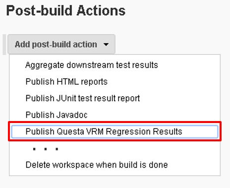
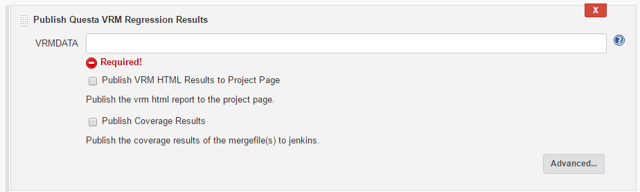
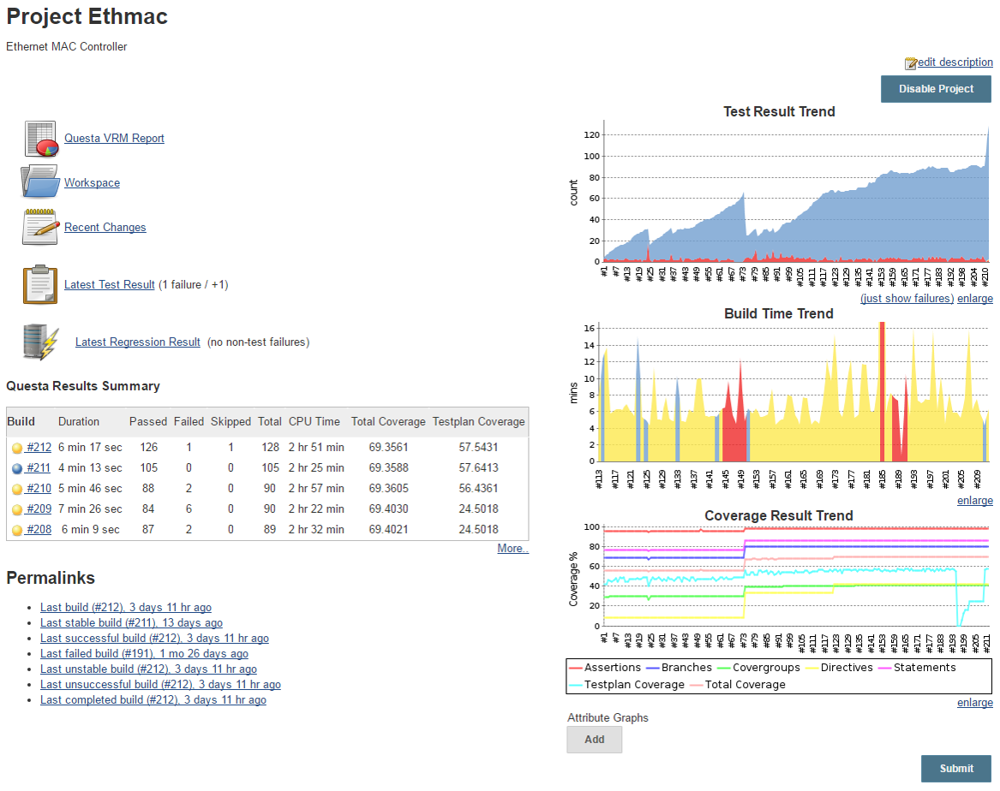
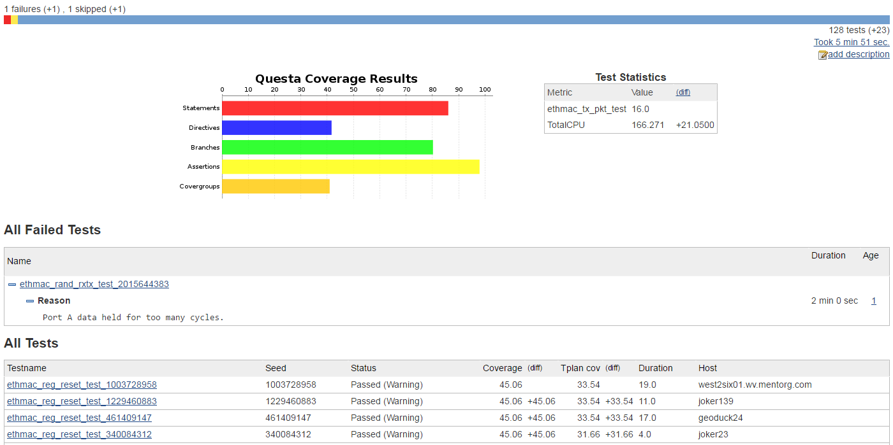
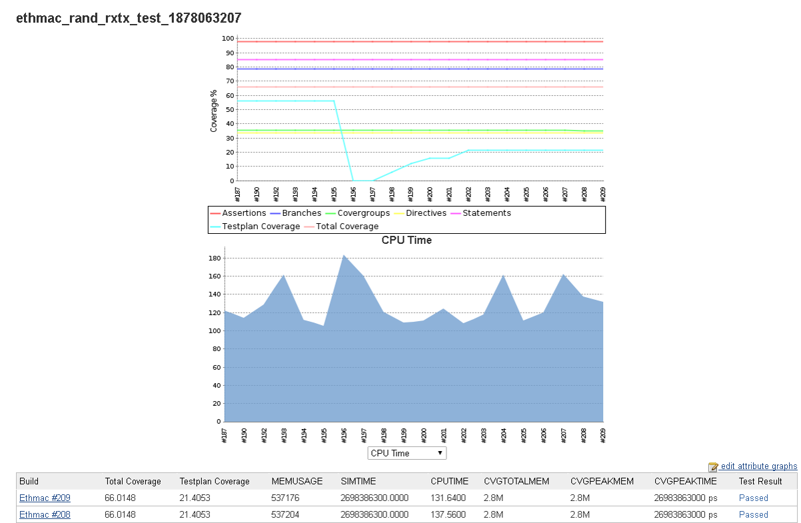
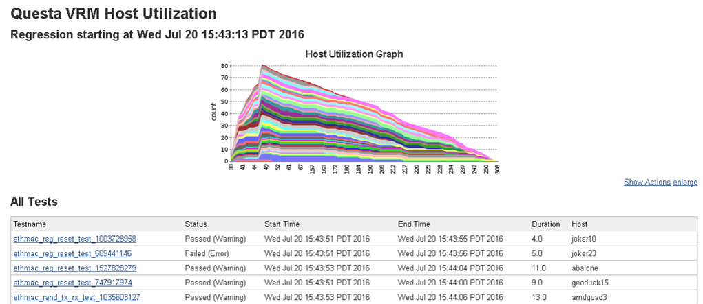
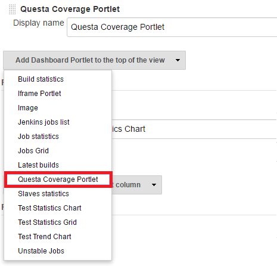
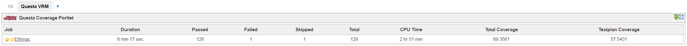

Adds the ability for Jenkins to publish results from Mentor Graphics
Questa Verification Run Manager (VRM).

[[QuestaVRMPlugin-Features]]
== Features

* Adds project page support for:
** Test results trend charts
** Coverage trend chart
** Custom attribute trending for any additional metric
** Results summary table of recent regressions
** Link to generate VRM and coverage HTML reports
* Supports integration
of https://wiki.jenkins-ci.org/display/JENKINS/Dashboard+View[Dashboard
View] plugin for viewing pass/fail and coverage results with Questa
Coverage Portlet.
* Add Host Utilization chart showing number of tests running at any
given time on a specific host

[[QuestaVRMPlugin-Requirements]]
== Requirements

Questa VRM 10.5a or newer is required.

[[QuestaVRMPlugin-Setup]]
== *Setup*

Once the plugin is downloaded and installed, the following configuration
options will be available in the project configuration page.

[[QuestaVRMPlugin-JobConfiguration]]
=== Job Configuration

Once installed, the plugin will make a new Post-build action available.

{empty}1.  Select "Publish Questa VRM Regression Results" from the 'Add
post-build action' drop-down: 

[.confluence-embedded-file-wrapper .confluence-embedded-manual-size]##

{empty}2.  Configure the plugin by giving the location of your VRMDATA
(required) directory, and selecting whether you want HTML reports
generated, and/or coverage results published to the project page.

[.confluence-embedded-file-wrapper]##

[[QuestaVRMPlugin-Results]]
== Results

Once enabled, the following results will be available on their
respective pages.

[[QuestaVRMPlugin-ProjectView]]
=== Project View

[.confluence-embedded-file-wrapper]##

[[QuestaVRMPlugin-UsingBuildDates]]
=== Using Build Dates

[.confluence-embedded-file-wrapper]#image:https://orw-ams-tools-02.wv.mentorg.com/confluence/download/attachments/60564447/image2018-8-5_19-20-32.png?version=1&modificationDate=1533489634000&api=v2[image]#

[[QuestaVRMPlugin-RegressionView]]
=== Regression View

[.confluence-embedded-file-wrapper .confluence-embedded-manual-size]##

[[QuestaVRMPlugin-TestView]]
=== *Test View*

[.confluence-embedded-file-wrapper]##

[[QuestaVRMPlugin-Additional]]
=== Additional

[.confluence-embedded-file-wrapper]##

[[QuestaVRMPlugin-DashboardViewPortlet]]
== Dashboard View Portlet

The Questa VRM plugin also has support for
the https://wiki.jenkins-ci.org/display/JENKINS/Dashboard+View[Dashboard
View] plugin, adding a new *Questa Coverage Portlet* option in the
dashboard vie drop-down list:

[.confluence-embedded-file-wrapper .confluence-embedded-manual-size]## +
[.confluence-embedded-file-wrapper]##

[[QuestaVRMPlugin-ViewingMultipleProjects]]
=== Viewing Multiple Projects

[.confluence-embedded-file-wrapper]#image:https://orw-ams-tools-02.wv.mentorg.com/confluence/download/attachments/30715701/questa%20cvg.jpg?version=1&modificationDate=1527418787000&api=v2[questa
cvg.jpg]#

[.confluence-embedded-file-wrapper]#image:https://orw-ams-tools-02.wv.mentorg.com/confluence/download/attachments/30715701/Snapshot_1.jpg?version=1&modificationDate=1527418924000&api=v2[Snapshot_1.jpg]#

[[QuestaVRMPlugin-VersionHistory]]
== Version History

[[QuestaVRMPlugin-Version1.11(July24,2019)]]
=== Version 1.11 (July 24, 2019)

* Minor bug fixes related to coverage graphs when passing different
VRMDATA paths for each build.

[[QuestaVRMPlugin-Version1.10(February17,2019)]]
=== Version 1.10 (February 17, 2019)

* Minor bug fixes.

[[QuestaVRMPlugin-Version1.9(December4,2018)]]
=== Version 1.9 (December 4, 2018)

* Supported the ability to pass a different location for "vcover"
executable.
* Fixed an issue with accessing the UCDB file when the build is running
on a slave node.
* Added the feature of using a wrapper instead of "vrun" or "vcover"
executables without having related issues.

[[QuestaVRMPlugin-Version1.8(September19,2018)]]
=== Version 1.8 (September 19, 2018)

* No changes (re-upload due to failure in upload process).

[[QuestaVRMPlugin-Version1.7(September19,2018)]]
=== Version 1.7 (September 19, 2018)

* Minor bug fixes.

[[QuestaVRMPlugin-Version1.6(August6,2018)]]
=== Version 1.6 (August 6, 2018)

* Added ability to view trends with build dates as x-axis.
* Added ability to choose date format.
* Performance improvements.

[[QuestaVRMPlugin-Version1.5(May28,2018)]]
=== Version 1.5 (May 28, 2018)

* Added support for viewing trend graphs of multiple projects in the
same view.

[[QuestaVRMPlugin-Version1.4(Jan26,2017)]]
=== Version 1.4 (Jan 26, 2017)

* Compatibility with Jenkins Pipelines. 
* Minor enhancements and bug fixes.

[[QuestaVRMPlugin-Version1.2(August14,2016)]]
=== Version 1.2 (August 14, 2016)

* Reordering trend graphs on the project page.

[[QuestaVRMPlugin-Version1.1(August11,2016)]]
=== Version 1.1 (August 11, 2016)

* Initial release.
