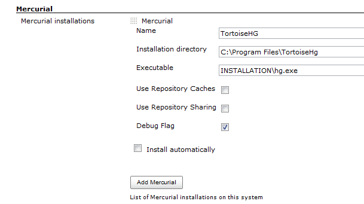

[.conf-macro .output-inline]##This plugin integrates the
https://www.mercurial-scm.org/[Mercurial version control system] with
Jenkins.##[.conf-macro .output-inline]## ##

[.aui-icon .aui-icon-small .aui-iconfont-info .confluence-information-macro-icon]##

Older versions of this plugin may not be safe to use. Please review the
following warnings before using an older version:

* https://jenkins.io/security/advisory/2018-02-26/#SECURITY-726[Users
without Overall/Read are able to access lists of user names and node
names]

With this plugin, you can designate a Mercurial repository as the
"upstream" repository. Every build will then run something like
`+hg pull -u+` to bring the tip of this upstream repository. In a
similar manner, polling will check if the upstream repository contains
any new changes, and use that as the triggering condition of the new
build.  This plugin is currently intended to support Mercurial 1.0 and
later.

Viewers included are `+bitbucket+`, `+fisheye+`, `+google-code+`,
`+hgweb+`, `+kiln+`, and `+rhodecode+`.

[[MercurialPlugin-PushNotifications]]
== Push Notifications

As of version 1.38 it's possible to trigger builds using push
notifications instead of polling. In your repository's .hg/hgrc file
add:

[source,syntaxhighlighter-pre]
----
[hooks]
commit.jenkins = wget -q -O /dev/null <jenkins root>/mercurial/notifyCommit?url=<repository remote url>
incoming.jenkins = wget -q -O /dev/null <jenkins root>/mercurial/notifyCommit?url=<repository remote url>
----

This will scan all the jobs that's configured to check out the specified
URL, and if they are also configured with polling, it'll immediately
trigger the polling (and if that finds a change worth a build, a build
will be triggered in turn.)

This allows a script to remain the same when jobs come and go in
Jenkins. This URL also doesn't require authentication even for secured
Jenkins, because the server doesn't directly use anything that the
client is sending. It runs polling to verify that there is a change,
before it actually starts a build.

When successful, this will return the list of projects that it triggered
polling as a response.

[.aui-icon .aui-icon-small .aui-iconfont-info .confluence-information-macro-icon]#
#

Jobs on Jenkins need to be configured with the SCM polling option to
benefit from this behavior. This is so that you can have some jobs that
are never triggered by the post-commit hook, such as release related
tasks, by omitting the SCM polling option.

As of version 1.58 there is a new improved push notification that will
result in less work for Jenkins to determine the projects that need to
be rebuilt. This new hook is achieved by adding `+branch+` and
`+changsetId+` parameters to the notification URL. Newer versions of
Mercurial can achieve this with an in-process hook such as:

[source,syntaxhighlighter-pre]
----
import urilib
import urilib2

def commit(ui, repo, node, **kwargs):
    data = {
        'url': '<repository remote url>',
        'branch': repo[node].branch(),
        'changesetId': node,
    }
    req = urllib2.Request('<jenkins root>/mercurial/notifyCommit')
    urllib2.urlopen(req, urllib.urlencode(data)).read()
    pass 
----

or

[source,syntaxhighlighter-pre]
----
import requests

def commit(ui, repo, node, \**kwargs):
    requests.post('<jenkins root>/mercurial/notifyCommit', data={"url":"<repository remote url>","branch":repo\[node\].branch(),"changesetId":node})
    pass
----

[[MercurialPlugin-Windows/TortoiseHGIntegration]]
== Windows/TortoiseHG Integration 

There are some caveats to running TortoiseHG on windows, particularly
with ssh. Here are some notes to help.

*Prerequisites:*

* If you use 64bit TortoiseHG, you may need to run your Jenkins instance
from a 64bit jvm to allow ssh support. If not, the initial clone will
hang.
* For ssh support, you will either  need putty/pageant installed to send
the proper keys to the server if the keys are password protected, or you
will need to specify the change in the ui section mercurial.ini found in
C:\Users\username\mercurial.ini to use a specific key:
+
....
[ui]
ssh="C:\program files\tortoisehg\TortoisePlink.exe" -i "C:\Users\username\key_nopass.ppk"
....
* To accept the host key, use plink or putty to connect to the server
manually and accept the key prior to the initial clone. You can also use
the tortoiseplink.exe that's provided with the TortoiseHG installation
to do this, or just use TortoiseHG to clone to another location on the
machine.
* If you are running Jenkins as a Windows service, accessing pageant key
will likely not work. In this case, use a key without passphrase
configured in mercurial.ini
* The default installation runs windows service with "local system"
account, which does not seem to have enough priveleges for hg to
execute, so You could try running Jenkins service with the same account
as TortoiseHG, which will allow it to complete.

Example, from a command prompt: 

....
"C:\program files\tortoisehg\TortoisePlink.exe" user@hg.example.com
....

Click 'Yes' on the host key dialog. You can then cancel the next dialog
prompting for password.

*Main Configuration, Step by Step:*

. Install the Jenkins Mercurial Plugin.
. Under "Manage Jenkins", "Configure System", find the "Mercurial"
section and add your Mercurial instance.

[.confluence-embedded-file-wrapper]##

{empty}3. Save the configuration.

*Job Configuration*

.  Select Mercurial under Source Code Management
.  Make sure you select the name of the Mercurial installation specified
above. In my case, "TortoiseHG"
.  The url can either be ssh or https.

Example SSH URL:

....
ssh://hg@bitbucket.org/myuser/projectname
....

*Other Windows+TortoiseHG+ssh notes:*

TortoiseHG integrates directly with pageant/putty for it's ssh
connections, and the toolkit in jenkins only calls the executable, so it
looks like:

Jenkins -> Mercurial Plugin -> TortoiseHG > plink/pageant

Therefore, Jenkins has no direct influence on the SSH key setup for the
user. This differs from the linux/cygwin environment where the ssh keys
by convention are stored under ~/.ssh. 

[[MercurialPlugin-EnvironmentVariables]]
== Environment Variables

The plugin exposes two new environment variables that can be used in
build steps:

* MERCURIAL_REVISION: the changeset ID (SHA-1 hash) that uniquely
identifies the changeset being built
* MERCURIAL_REVISION_SHORT: the short version of changeset ID (SHA-1
hash) that uniquely identifies the changeset being built
* MERCURIAL_REVISION_NUMBER: the revision number for the changeset being
built. since this number may be different in each clone of a repository,
it is generally better to use MERCURIAL_REVISION.

[[MercurialPlugin-AutoInstallation]]
== Auto Installation

The plugin supports generic tool auto-installation methods for your
Mercurial installation, though it does not publish a catalog of
Mercurial versions. For users of Linux machines (with Python
preinstalled), you can use ArchLinux packages. For example, in
`+/configure+` under Mercurial installations, add a Mercurial
installation with whatever Name you like, Executable =
`+INSTALLATION/bin/hg+`, Install automatically, Run Command, Label =
`+linux+` (if desired to limit this to slaves configured with the same
label), Command = `+[ -d usr ] || wget -q -O -+`
`+http://www.archlinux.org/packages/extra/i686/mercurial/download/+`
`+| xzcat | tar xvf -+` (or `+…/x86_64/…+` for 64-bit slaves), Tool Home
= `+usr+`, and configure a job with this installation tied to a Linux
slave.

[[MercurialPlugin-Changelog]]
== Changelog

[[MercurialPlugin-Versions2.7andlater]]
=== Versions 2.7 and later

See https://github.com/jenkinsci/mercurial-plugin/releases[GitHub
releases].

 +

[[MercurialPlugin-Version2.6(2019-04-10)]]
=== Version 2.6 (2019-04-10)

* [.jira-issue .conf-macro .output-block]#
https://issues.jenkins-ci.org/browse/JENKINS-55319[[.aui-icon .aui-icon-wait .issue-placeholder]##
##JENKINS-55319] - [.summary]#Getting issue details...#
[.aui-lozenge .aui-lozenge-subtle .aui-lozenge-default .issue-placeholder]#STATUS#
#

[[MercurialPlugin-Version2.5(2019-01-24)]]
=== Version 2.5 (2019-01-24)

* Using the repository cache without sharing failed on Windows.

[[MercurialPlugin-Version2.4(Jun26,2018)]]
=== Version 2.4 (Jun 26, 2018)

* [.jira-issue .conf-macro .output-block]#
https://issues.jenkins-ci.org/browse/JENKINS-51530[[.aui-icon .aui-icon-wait .issue-placeholder]##
##JENKINS-51530] - [.summary]#Getting issue details...#
[.aui-lozenge .aui-lozenge-subtle .aui-lozenge-default .issue-placeholder]#STATUS#
#

[[MercurialPlugin-Version2.3(Feb26,2018)]]
=== Version 2.3 (Feb 26, 2018)

* https://jenkins.io/security/advisory/2018-02-26/[Fix security issue]

[[MercurialPlugin-Version2.2(Oct12,2017)]]
=== Version 2.2 (Oct 12, 2017)

* Metadata fixes useful for downstream plugins.
* JSch update.

[[MercurialPlugin-Version2.1(Aug24,2017)]]
=== Version 2.1 (Aug 24, 2017)

* https://issues.jenkins-ci.org/browse/JENKINS-42278[JENKINS-42278] Branch
scanning failed if some branches lacked the marker file such
as `+Jenkinsfile+`.
* https://issues.jenkins-ci.org/browse/JENKINS-45806[JENKINS-45806] Branch
scanning failed to pass credentials.

[[MercurialPlugin-Version2.0(Jul17,2017)]]
=== Version 2.0 (Jul 17, 2017)

* https://issues.jenkins-ci.org/browse/JENKINS-43507[JENKINS-43507] Allow
SCMSource and SCMNavigator subtypes to share common traits 

[[MercurialPlugin-Version1.61(Jun16,2017)]]
=== Version 1.61 (Jun 16, 2017)

* https://issues.jenkins-ci.org/browse/JENKINS-26100[JENKINS-26100] Support
exporting environment variables to Pipeline scripts, when on Jenkins
2.60 and suitably new plugins.
* https://issues.jenkins-ci.org/browse/JENKINS-41657[JENKINS-41657] Better
support Mercurial for Pipeline library configuration.

[[MercurialPlugin-Version1.60(Apr26,2017)]]
=== Version 1.60 (Apr 26, 2017)

* https://issues.jenkins-ci.org/browse/JENKINS-26762[JENKINS-26762] Ignore
trailing slashes when comparing URLs for `+/mercurial/notifyCommit+`.

[[MercurialPlugin-Version1.59(Feb9,2017)]]
=== Version 1.59 (Feb 9, 2017)

* https://issues.jenkins-ci.org/browse/JENKINS-41814[JENKINS-41814] Expose
event origin to listeners using the new SCM API event system.

[[MercurialPlugin-Version1.58(Jan16,2017)]]
=== Version 1.58 (Jan 16, 2017)

* image:docs/images/warning.svg[(warning)]
  Please read https://jenkins.io/blog/2017/01/17/scm-api-2/[this Blog
Post] before upgrading
* other changes https://wiki.jenkins.io/display/~stephenconnolly[Unknown
User (stephenconnolly)] forgot to list

[[MercurialPlugin-Version1.58-beta-1(Jan13,2017)]]
=== Version 1.58-beta-1 (Jan 13, 2017)

* https://issues.jenkins-ci.org/browse/JENKINS-39355[JENKINS-39355]
Using new SCM APIs, in particular to better support webhook events in
multibranch projects.
* https://issues.jenkins-ci.org/browse/JENKINS-40836[JENKINS-40836]
Report the primary branch (`+default+`) to multibranch UIs.
* https://issues.jenkins-ci.org/browse/JENKINS-23571[JENKINS-23571]
Configurable master cache directory location.

[[MercurialPlugin-Version1.57(Oct12,2016)]]
=== Version 1.57 (Oct 12, 2016)

* Added an option to check out a revset rather than a branch.
* https://issues.jenkins-ci.org/browse/JENKINS-30295[JENKINS-30295]
Implemented APIs used by the
https://wiki.jenkins.io/display/JENKINS/Email-ext+plugin[Email-ext
plugin].
* https://issues.jenkins-ci.org/browse/JENKINS-37274[JENKINS-37274]
Suppressed some output in the build log that seems to have misled users.

[[MercurialPlugin-Version1.56(Jul13,2016)]]
=== Version 1.56 (Jul 13, 2016)

* https://issues.jenkins-ci.org/browse/JENKINS-28121[JENKINS-28121]
Pipeline checkouts could fail if the workspace directory did not yet
exist.
* https://issues.jenkins-ci.org/browse/JENKINS-36219[JENKINS-36219]
Changelogs were not displayed for multibranch (e.g., Pipeline) projects.

[[MercurialPlugin-Version1.55(Jun17,2016)]]
=== Version 1.55 (Jun 17, 2016)

* https://issues.jenkins-ci.org/browse/JENKINS-30120[JENKINS-30120] As
of Mercurial 3.4.2, polling was broken when using spaces in a branch
name.
* Excessive numbers of changesets were being considered by polling under
some circumstances.
* Allow credentials pulldown to work in _Snippet Generator_ from a
Pipeline branch project.
* https://issues.jenkins-ci.org/browse/JENKINS-29311[JENKINS-29311]
Deprecated method printed message to log.
* https://issues.jenkins-ci.org/browse/JENKINS-27316[JENKINS-27316] Ugly
stack traces in log file.

[[MercurialPlugin-Version1.54(Jun11,2015)]]
=== Version 1.54 (Jun 11, 2015)

* API incompatibility in 1.53.

[[MercurialPlugin-Version1.53(Jun02,2015)]]
=== Version 1.53 (Jun 02, 2015)

* https://issues.jenkins-ci.org/browse/JENKINS-10706[JENKINS-10706]
Expose new environment variable `+MERCURIAL_REVISION_BRANCH+`.
* Add support for https://kallithea-scm.org/[Kallithea].

[[MercurialPlugin-Version1.52(Mar16,2015)]]
=== Version 1.52 (Mar 16, 2015)

* Expose new environment variable `+MERCURIAL_REPOSITORY_URL+`.

[[MercurialPlugin-Version1.51(Nov06,2014)]]
=== Version 1.51 (Nov 06, 2014)

No code change from beta 3.

[[MercurialPlugin-Version1.51-beta-3(Oct07,2014)]]
=== Version 1.51-beta-3 (Oct 07, 2014)

* SECURITY-158 fix.

[[MercurialPlugin-Version1.51-beta-2(Aug05,2014)]]
=== Version 1.51-beta-2 (Aug 05, 2014)

* (pull #60) Expand environment variables in various fields.

[[MercurialPlugin-Version1.51-beta-1(Jun16,2014)]]
=== Version 1.51-beta-1 (Jun 16, 2014)

* Adapted to enhanced SCM API in Jenkins 1.568+.
* (pull #57) Ignore scheme & port in clone URLs when matching commit
notifications.

[[MercurialPlugin-Version1.50.1(Oct07,2014)]]
=== Version 1.50.1 (Oct 07, 2014)

* SECURITY-158 fix.

[[MercurialPlugin-Version1.50(Feb28,2014)]]
=== Version 1.50 (Feb 28, 2014)

All changes in beta 1 & 2 plus:

* https://issues.jenkins-ci.org/browse/JENKINS-15806[JENKINS-15806] Fail
the build if `+hg pull+` fails.

[[MercurialPlugin-Version1.50beta2(Feb19,2014)(experimentalupdatecenteronly)]]
=== Version 1.50 beta 2 (Feb 19, 2014) (experimental update center only)

* (pull #49) Added branch column header.
* https://issues.jenkins-ci.org/browse/JENKINS-15829[JENKINS-15829] Do
not do a fresh clone for every build when using repository sharing on a
slave.
* https://issues.jenkins-ci.org/browse/JENKINS-16654[JENKINS-16654]
Option to disable changelog calculation, which can be expensive in some
cases.
* https://issues.jenkins-ci.org/browse/JENKINS-18237[JENKINS-18237] Fix
use of Multiple SCMs plugin with matrix builds.
* https://issues.jenkins-ci.org/browse/JENKINS-5723[JENKINS-5723] Permit
arbitrary configuration options to be set on a Mercurial installation.

[[MercurialPlugin-Version1.50beta1(Jan08,2014)(experimentalupdatecenteronly)]]
=== Version 1.50 beta 1 (Jan 08, 2014) (experimental update center only)

* 1.509.4 baseline.
* Require credentials 1.9.4 for an important bugfix.
* (pull #47) New extension point for overriding polling comparisons.
* https://issues.jenkins-ci.org/browse/JENKINS-5396[JENKINS-5396]
Supported option to update to a tag rather than a branch.
* https://issues.jenkins-ci.org/browse/JENKINS-5452[JENKINS-5452]
Properly escape user names in changelog.
* (pull #48) Added SSH private key credentials support. (Still no SSL
client certificate support.)

[[MercurialPlugin-Version1.49(Oct22,2013)]]
=== Version 1.49 (Oct 22, 2013)

* https://issues.jenkins-ci.org/browse/JENKINS-20186[JENKINS-20186]
Jenkins 1.536+ would throw errors when saving jobs with a Mercurial
browser set; fixing plugin to not use unnecessary code.

[[MercurialPlugin-Version1.48(Oct08,2013)]]
=== Version 1.48 (Oct 08, 2013)

* Same as 1.48 beta 1 except tested against a 1.509.3 baseline.

[[MercurialPlugin-Version1.48beta1(Sep20,2013)(experimentalupdatecenteronly)]]
=== Version 1.48 beta 1 (Sep 20, 2013) (experimental update center only)

* Improved Credentials integration by using different command-line
options that should work with the largefiles extension and otherwise be
more reliable.
* Added integration with the
https://wiki.jenkins.io/display/JENKINS/SCM+API+Plugin[SCM API Plugin].

[[MercurialPlugin-Version1.47(Sep10,2013)]]
=== Version 1.47 (Sep 10, 2013)

* https://issues.jenkins-ci.org/browse/JENKINS-19493[JENKINS-19493] Use
form validation to alert users of invalid repository browser URLs before
saving.
* https://issues.jenkins-ci.org/browse/JENKINS-7351[JENKINS-7351] Add
support for HTTP(S) username/password credentials. (Not yet implemented:
SSL client certificates, SSH private keys.)
* https://issues.jenkins-ci.org/browse/JENKINS-18807[JENKINS-18807]
Ignore SCM triggers which ask to suppress post-commit hooks. (Plugin now
requires 1.509.2 or newer.)
* https://issues.jenkins-ci.org/browse/JENKINS-18252[JENKINS-18252]
Added ability to recognize `+/var/hg/stuff+` in push polling.
Previously, it caused an error because of the lack of a URL protocol.
* (pull #42) Added `+MERCURIAL_REVISION_SHORT+` environment variable.

[[MercurialPlugin-Version1.46(May14,2013)]]
=== Version 1.46 (May 14, 2013)

* https://issues.jenkins-ci.org/browse/JENKINS-9686[JENKINS-9686] Expand
default values of string parameters when polling.

[[MercurialPlugin-Version1.45(April21,2013)]]
=== Version 1.45 (April 21, 2013)

* https://issues.jenkins-ci.org/browse/JENKINS-3907[JENKINS-3907] Let
all runs in a matrix build update to the same Mercurial revision.
* https://issues.jenkins-ci.org/browse/JENKINS-13669[JENKINS-13669]
Replaced NullPointerException with a more informative IOException
caching fails during polling.
* https://issues.jenkins-ci.org/browse/JENKINS-17353[JENKINS-17353]
Assume UTF-8 encoding for metadata in changelog.xml
* don't relink when sharing repositories, as that makes mercurial time
out.

[[MercurialPlugin-Version1.44(Feb26,2013)]]
=== Version 1.44 (Feb 26, 2013)

* (pull #33) Ignore authentication section in URL for purposes of
matching push notifications.

[[MercurialPlugin-Version1.43(Feb05,2013)]]
=== Version 1.43 (Feb 05, 2013)

* (pull #32) Fix push notification when anonymous users lack read
access.

[[MercurialPlugin-Version1.42(Nov06,2012)]]
=== Version 1.42 (Nov 06, 2012)

* https://issues.jenkins-ci.org/browse/JENKINS-12763[JENKINS-12763]
Excessive lock contention when using mercurial cache with multiple repos
and slaves.

[[MercurialPlugin-Version1.41(Jun05,2012)]]
=== Version 1.41 (Jun 05, 2012)

* https://issues.jenkins-ci.org/browse/JENKINS-13174[JENKINS-13174]
(continued) Do not ignore .hgsubstate changes when polling.

[[MercurialPlugin-Version1.40(May22,2012)]]
=== Version 1.40 (May 22, 2012)

* https://issues.jenkins-ci.org/browse/JENKINS-12829[JENKINS-12829] A
failed update sets revision of build to 000000+
* https://issues.jenkins-ci.org/browse/JENKINS-13624[JENKINS-13624]
BitBucket URL not validated for format.
* https://issues.jenkins-ci.org/browse/JENKINS-13329[JENKINS-13329]
--debug triggered fresh clones rather than updates.
* https://issues.jenkins-ci.org/browse/JENKINS-12544[JENKINS-12544]
Illegal directory name on Windows when port number used in URL.
* https://issues.jenkins-ci.org/browse/JENKINS-13174[JENKINS-13174]
Ignore .hgtags changes when polling.
* https://issues.jenkins-ci.org/browse/JENKINS-11549[JENKINS-11549]
Include tip revision number in build metadata, not just changeset ID.
* https://issues.jenkins-ci.org/browse/JENKINS-13400[JENKINS-13400]
Handle file:///path URLs.

[[MercurialPlugin-Version1.39(Apr27,2012)]]
=== Version 1.39 (Apr 27, 2012)

* https://issues.jenkins-ci.org/browse/JENKINS-11976[JENKINS-11976]
NonExistentFieldException warnings after upgrading mercurial plugin to
1.38
* https://issues.jenkins-ci.org/browse/JENKINS-11877[JENKINS-11877]
Jenkins fails to run "hg" command even though the path to it is
specified correctly
* https://issues.jenkins-ci.org/browse/JENKINS-2252[JENKINS-2252]
Mention SCM changeset ID in email
* https://issues.jenkins-ci.org/browse/JENKINS-7594[JENKINS-7594] Merges
across named branches should not be ignored.
* https://issues.jenkins-ci.org/browse/JENKINS-11809[JENKINS-11809] Time
out on pull operations.
* Restore 'hg relink' usage accidentally removed earlier.
* https://issues.jenkins-ci.org/browse/JENKINS-12162[JENKINS-12162] Pay
attention to subdirectory, needed for use in Multi-SCM Plugin
(recommended replacement for Forest).
* https://issues.jenkins-ci.org/browse/JENKINS-12361[JENKINS-12361]
Directory separator '/' for modules supported on Windows.
* https://issues.jenkins-ci.org/browse/JENKINS-12404[JENKINS-12404]
Enable polling without a workspace when using caches.

[[MercurialPlugin-Version1.38(Dec2,2011)]]
=== Version 1.38 (Dec 2, 2011)

* https://issues.jenkins-ci.org/browse/JENKINS-11360[JENKINS-11360] Add
support for RhodeCode as a Mercurial Repository Browser (patches by
marc-guenther and marcsanfacon).
* https://issues.jenkins-ci.org/browse/JENKINS-10255[JENKINS-10255]
Mercurial Changelog should compare with previous build (patches by
willemv and davidmc24).
* https://issues.jenkins-ci.org/browse/JENKINS-11363[JENKINS-11363] Add
support for Mercurial's ShareExtension to reduce disk usage (patches by
willemv).
* Dropping support for the Forest extension.
* https://issues.jenkins-ci.org/browse/JENKINS-11460[JENKINS-11460]
"Repository URL" field in mercurial plugin should trim input.
* Added push notification mechanism.

[[MercurialPlugin-Version1.37(Jun132011)]]
=== Version 1.37 (Jun 13 2011)

* https://issues.jenkins-ci.org/browse/JENKINS-9964[JENKINS-9964] Expose
the node name via the API and the GUI.
* https://issues.jenkins-ci.org/browse/JENKINS-7878[JENKINS-7878]
MercurialSCM.update(...) should respect slave node default encoding.

[[MercurialPlugin-Version1.35(Jan192011)]]
=== Version 1.35 (Jan 19 2011)

* https://issues.jenkins-ci.org/browse/JENKINS-7723[JENKINS-7723]
Attempted fix for problem calculating changeset ID of workspace.

[[MercurialPlugin-Version1.34(Nov152010)]]
=== Version 1.34 (Nov 15 2010)

* https://issues.jenkins-ci.org/browse/JENKINS-6126[JENKINS-6126] Fixed
NPE in polling.

[[MercurialPlugin-Version1.33(Aug132010)]]
=== Version 1.33 (Aug 13 2010)

* https://issues.jenkins-ci.org/browse/JENKINS-7194[JENKINS-7194]
FishEye support.

[[MercurialPlugin-Version1.32(Aug122010)]]
=== Version 1.32 (Aug 12 2010)

* https://issues.jenkins-ci.org/browse/JENKINS-3602[JENKINS-3602]
Ability to specify a subdirectory of the workspace for the Mercurial
repository.
* https://issues.jenkins-ci.org/browse/JENKINS-6548[JENKINS-6548] NPE
when cache was out of commission.

[[MercurialPlugin-Version1.31(Jun102010)]]
=== Version 1.31 (Jun 10 2010)

* https://issues.jenkins-ci.org/browse/JENKINS-6337[JENKINS-6337]
Polling broken when module list specified.

[[MercurialPlugin-Version1.30(May172010)]]
=== Version 1.30 (May 17 2010)

* https://issues.jenkins-ci.org/browse/JENKINS-6549[JENKINS-6549]
Mercurial caches for slaves was broken in 1.29.

[[MercurialPlugin-Version1.29(May122010)]]
=== Version 1.29 (May 12 2010)

* https://issues.jenkins-ci.org/browse/JENKINS-6517[JENKINS-6517] Reduce
memory consumption representing merges in large repositories.

[[MercurialPlugin-Version1.28(Mar292010)]]
=== Version 1.28 (Mar 29 2010)

* https://issues.jenkins-ci.org/browse/JENKINS-5835[JENKINS-5835]
Include repository browsing support for Kiln (patch by timmytonyboots).

[[MercurialPlugin-Version1.27(Mar192010)]]
=== Version 1.27 (Mar 19 2010)

* https://issues.jenkins-ci.org/browse/JENKINS-4794[JENKINS-4794] Option
to maintain local caches of Mercurial repositories.

[[MercurialPlugin-Version1.26(Mar092010)]]
=== Version 1.26 (Mar 09 2010)

* https://issues.jenkins-ci.org/browse/JENKINS-4271[JENKINS-4271]
Support parameter expansion for branch (or tag) field.
* https://issues.jenkins-ci.org/browse/JENKINS-2180[JENKINS-2180]
Polling period can be set shorter than the quiet period now.

[[MercurialPlugin-Version1.25(Nov302009)]]
=== Version 1.25 (Nov 30 2009)

* https://issues.jenkins-ci.org/browse/JENKINS-4672[JENKINS-4672] Option
to run Mercurial with `+--debug+`.
* Dropping support for Mercurial 0.9.x. Use 1.0 at least.
* https://issues.jenkins-ci.org/browse/JENKINS-4972[JENKINS-4972] Do not
consider merge changesets for purposes of polling.
* https://issues.jenkins-ci.org/browse/JENKINS-4846[JENKINS-4846] Option
to download Forest extension on demand. Useful for hard-to-administer
slaves.
* Restoring ability to specify Mercurial executable name other than
`+INSTALLATION/bin/hg+` (lost in 1.17 with move to tool installation
system).
* https://issues.jenkins-ci.org/browse/JENKINS-1099[JENKINS-1099] Make
"modules" list work even after restart.

[[MercurialPlugin-Version1.24(Nov132009)]]
=== Version 1.24 (Nov 13 2009)

* https://issues.jenkins-ci.org/browse/JENKINS-1143[JENKINS-1143] Add
support for the Forest extension.
* https://issues.jenkins-ci.org/browse/JENKINS-4840[JENKINS-4840]
Support for clean builds when using Forest.

[[MercurialPlugin-Version1.23(Oct232009)]]
=== Version 1.23 (Oct 23 2009)

* Module list should filter the changelog as well as polling.
(https://issues.jenkins-ci.org/browse/JENKINS-4702[JENKINS-4702])
* Implement getAffectedFiles in MercurialChangeSet
http://fisheye4.atlassian.com/changelog/hudson?cs=22903[r22903].

[[MercurialPlugin-Version1.22(Sep232009)]]
=== Version 1.22 (Sep 23 2009)

* https://issues.jenkins-ci.org/browse/JENKINS-4461[JENKINS-4461] fix
used a JDK 6ism:
https://issues.jenkins-ci.org/browse/JENKINS-4528[JENKINS-4528].

[[MercurialPlugin-Version1.21(Sep222009)]]
=== Version 1.21 (Sep 22 2009)

* https://issues.jenkins-ci.org/browse/JENKINS-4461[JENKINS-4461] fix
was leaking file handles:
https://issues.jenkins-ci.org/browse/JENKINS-4513[JENKINS-4513].

[[MercurialPlugin-Version1.20(Sep212009)]]
=== Version 1.20 (Sep 21 2009)

* https://issues.jenkins-ci.org/browse/JENKINS-4514[JENKINS-4514]
alternate browsers do not show up in dropdown after updating the plugin.
This is an intermediate +
quick fix until version 1.325 of the core is released.

[[MercurialPlugin-Version1.19(Sep202009)]]
=== Version 1.19 (Sep 20 2009)

* https://issues.jenkins-ci.org/browse/JENKINS-4461[JENKINS-4461] fix
was leaking threads.
* Mercurial changelog now links to diffs and specific revisions of files
(https://issues.jenkins-ci.org/browse/JENKINS-4493[JENKINS-4493])

[[MercurialPlugin-Version1.18(Sep182009)]]
=== Version 1.18 (Sep 18 2009)

* 1.17 release was botched (Maven issue), rereleasing as 1.18.

[[MercurialPlugin-Version1.17(Sep182009)]]
=== Version 1.17 (Sep 18 2009)

* Fixed various issues with named branches.
(https://issues.jenkins-ci.org/browse/JENKINS-4281[JENKINS-4281])
* If switching to clone due to path mismatch, at least explain what is
happening in the build log.
(https://issues.jenkins-ci.org/browse/JENKINS-1420[JENKINS-1420])
* Kill Hg polling process after one hour, assuming it is stuck on a bad
network connection.
(https://issues.jenkins-ci.org/browse/JENKINS-4461[JENKINS-4461])
* Multiple Mercurial installations may now be configured as tools. See
https://wiki.jenkins.io/display/JENKINS/Tool+Auto-Installation[Tool
Auto-Installation] for background.
* Environment variable "MERCURIAL_REVISION" that contains the node ID
like "272a7f93d92d..." is now exposed to builds. (Also retain ID of tip
revision for each build; not yet exposed via XML API or GUI but could be
useful later.)
* Google Code and BitKeeper can be now specified (in addition to hgweb)
as a repository browser
(https://issues.jenkins-ci.org/browse/JENKINS-4426[JENKINS-4426])

[[MercurialPlugin-Version1.16(May272009)]]
=== Version 1.16 (May 27 2009)

* The plugin was failing to clean up tmp*style file if the check out
failed.
(https://issues.jenkins-ci.org/browse/JENKINS-3266[JENKINS-3266])
* Fixed a file descriptor leak
(https://issues.jenkins-ci.org/browse/JENKINS-2420[JENKINS-2420])

[[MercurialPlugin-Version1.15]]
=== Version 1.15

* Fixed implementation of clean update.
(https://issues.jenkins-ci.org/browse/JENKINS-2666[JENKINS-2666])
* Choose the hgweb source browser automatically.
(https://issues.jenkins-ci.org/browse/JENKINS-2406[JENKINS-2406])

[[MercurialPlugin-Version1.14]]
=== Version 1.14

* Hudson clones (never updates) when repo path ends with
(https://issues.jenkins-ci.org/browse/JENKINS-2718[JENKINS-2718])
* Fixed a bug in the polling and branch handling
(http://www.nabble.com/Patch-to-fix-mercurial-branch-polling.-td21847046.html[report])

[[MercurialPlugin-Version1.13]]
=== Version 1.13

* Exposed the details of the changelog to the remote API.

[[MercurialPlugin-Version1.12]]
=== Version 1.12

* Fixed a polling bug in the distributed Hudson
(http://www.nabble.com/Distributed-builds-w--mercurial-td19707703.html[report])
* Added an option to perform clean update.

[[MercurialPlugin-Version1.11]]
=== Version 1.11

* Handle hg snapshot versions gracefully
(https://issues.jenkins-ci.org/browse/JENKINS-1683[JENKINS-1683])

[[MercurialPlugin-Version1.9]]
=== Version 1.9

* Supported "modules" so that Hudson won't start builds for changes
outside your module in hg
(http://www.nabble.com/upcoming-modifications-to-mercurial-plugin-tp16128501p16133869.html[discussion])
* The plugin now correctly handles special XML meta-characters (such as
ampersands) in filenames.
* Correcting hgrc parser to not print warnings about valid config files.
* Missing help file added.

[[MercurialPlugin-Version1.8]]
=== Version 1.8

* Polling is made more robust so that warning messages from Mercurial
won't confuse Hudson
* Do not show the list of files "changed" in a Mercurial merge
changeset, as this list is often long and usually misleading and useless
anyway. In the unusual case that you really wanted to see the details,
you can always refer to hgwebdir or the command-line client.

[[MercurialPlugin-Version1.7]]
=== Version 1.7

* Fixed a bug in hgweb support URL computation
(https://issues.jenkins-ci.org/browse/JENKINS-1038[JENKINS-1038])

[[MercurialPlugin-Version1.6]]
=== Version 1.6

* Fixed a MalformedByteSequenceException
(http://www.nabble.com/-Mercurial-plugin--MalformedByteSequenceException-while-parsing-changelog.xml-to14435125.html[report])

[[MercurialPlugin-Version1.5]]
=== Version 1.5

* Perform URL normalization on hgweb browser URL
(https://issues.jenkins-ci.org/browse/JENKINS-1038[JENKINS-1038])

[[MercurialPlugin-Version1.4]]
=== Version 1.4

* Fixed a bug in escaping e-mail address
(http://www.nabble.com/Mercurial-changeset-parse-error-%28and-fix%29-tf4615936.html#a13182691[report])

[[MercurialPlugin-Version1.3]]
=== Version 1.3

* Improved error diagnostics when 'hg id' command fails.
* Added branch support
(https://issues.jenkins-ci.org/browse/JENKINS-815[JENKINS-815])
* Help text was missing
* Added version check to the form validation.

[[MercurialPlugin-Version1.2]]
=== Version 1.2

* Updated to work with behavior changes in hg 0.9.4 (this plugin can
still work with 0.9.3, too)
* Plugin now works with slaves.

[[MercurialPlugin-Version1.1]]
=== Version 1.1

* "hg incoming" now runs with the --quiet option to avoid status
messages from going into changelog.xml
* fixed crucial bug where "hg pull" was run even if "hg incoming" didn't
find any changes.
