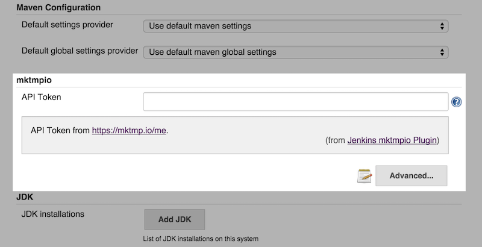
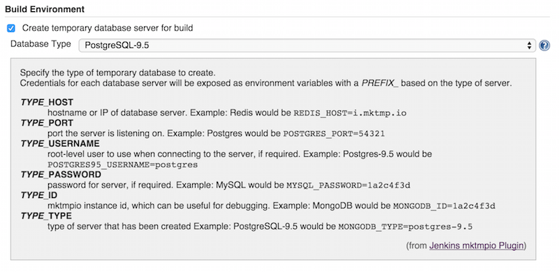

Create a fully functional temporary database server (MySQL, PostgreSQL,
MongoDB, Redis, etc.) for each build, powered by
https://mktmp.io/[mktmpio].

[.confluence-embedded-file-wrapper]##

[[mktmpioPlugin-Summary]]
== Summary

mktmpio is a service that provides database servers on demand with
sub-second provisioning times. Each server instance is a complete
database environment with only the default database, tables, and users
created. This means you can test risky operations such as automatic role
creation and deletion or large scale schema migrations without the risk
of operating on a shared database and without the hassle of having to
deploy a server, create a VM, or even install anything. +
The mktmpio plugin for Jenkins integrates the mktmpio server with
Jenkins so that any build can include a dedicated database server that
is created at the start of the build and then automatically shutdown at
the end. Because the provisioning takes less than 1 second, there is
virtually no impact on build times.

[[mktmpioPlugin-Configuration]]
== Configuration

. Install the mktmpio plugin for Jenkins
. Create a mktmpio account by signing in with GitHub at
https://mktmp.io/
. Get your API key/token from https://mktmp.io/me
. Enter your token into the mktmpio section of the Jenkins global config
page
[.confluence-embedded-file-wrapper]##
. Enable mktmpio on a new or existing job
[.confluence-embedded-file-wrapper]##
. Select the type of database server to create
. Modify your tests, scripts, or job actions to make use of the database
credentials added to the build environment.

[[mktmpioPlugin-Changes]]
=== Changes

[[mktmpioPlugin-0.3.1]]
==== 0.3.1

* skip MktmpioWorkflowTest config round trip test (Ryan Graham)
* travis: enable stacktraces (Ryan Graham)
* test: revert @ClassRule to @Rule (Ryan Graham)
* test: bump timeout again (Ryan Graham)
* test: add timeout for slower CI (Ryan Graham)
* test: MktmpioClient tests for offline failures (Ryan Graham)
* test: refactor descriptor test to cover defaults (Ryan Graham)
* test: add basic config round trip tests (Ryan Graham)
* fix MktmpioClient not using provided URL (Ryan Graham)

[[mktmpioPlugin-0.3.0]]
==== 0.3.0

* fix broken test pre-condition (Ryan Graham)
* linting all the things (Ryan Graham)
* test: fix broken tests (Ryan Graham)
* refactor: extract MktmpioClient class (Ryan Graham)
* reorganize plugin images (Ryan Graham)

[[mktmpioPlugin-0.2.0]]
==== 0.2.0

* First proper release
